# Why DNS
- DNS is the phonebook of the internet. Humans access information online through domain names, like nytimes.com or espn.com. Web browsers interact through Internet Protocol (IP) addresses. DNS translates domain names to IP addresses so browsers can load Internet resources.
- Each device connected to the Internet has a unique IP address which other machines use to find the device. DNS servers eliminate the need for humans to memorize IP addresses.

  
  
  

Thanks to the DNS, we can use domain names to communicate with computers or their services.

  
Why Can't we Just use IP address instead of domain names?
The simplest reason is that for most humans, it's easier to remember a domain name than remembering an IP address.
  
But There are a couple of technical reasons behind the importance of DNS:
1. **Infracstructure Migration:** One quick example is infrastructure migration. Imagine you come from work, ready to continue your favorite show on Netflix, but instead of simply typing netflix.com in your browser, you'd have to remember the IP address of the site. Then one day, the Netflix folks perform an infrastructure migration, and the IP address of the infrastructure hosting the site changes, rendering you unable to access Netflix that evening. That is, until you figure out what the correct and updated IP address is. Certainly, it would be a nightmare to keep track of these changing numbers for every website you visit, right?  
  
  

2. **Internet is Complex:**
The second technical reason is that the `internet is complex`. Often, when learning DNS, you'll hear or read an explanation, such as, the DNS translates a domain name into the IP of a computer hosting a service, but more often than not, there won't be such a thing as having a single IP for a computer hosting a service. This is because the internet relies on complex architectures, such as **content delivery networks** and **DNS systems**, to keep systems performant and well distributed globally, which means there could be dozens or even hundreds of IP addresses that turn out to be the IP address on duty that serves a given service. Just for this reason alone, using IP addresses is definitely not a great idea. And just to keep 
stacking reasons why DNS is so useful and important, we have that IPv6 addresses are even more difficult to remember, Instead of memorizing numbers, we use domain names to access the internet. Lets look at our earlier example, kodekloud.com.

  
  
  
  
  
## DNS Queries:

#### DNS Resolution process in two different programs:
1. On Browser:
2. DIG Command:

**On Browser:**
  
In the above image, I found this one and we see that there's a portion that says **remote address**, and then we have an IPv6 address that is responding on port 443. This IPv6 is what's known as a **AAAA record**.  

Let's see how we can match this information that the browser is giving us by going to the terminal and trying to get the same result. So now, I'm going here to my terminal, and then I'm going to type `dig kodekloud.com`, and you can see that we have three different IP addresses.  
  

***This means that any of these three IP addresses is capable of serving KodeKloud.com***. 

Now, as you can see, the IP addresses are *version 4*. So, the response that I'm getting is the same as if I was doing `dig KodeKloud.com A`.  
  

You can see that it's the same thing.  
Now, if I happen to do `dig kodekloud.com AAAA`, you'll see that it gives us the IPv6 IP addresses that are the equivalent of the above 3 IP addresses(IPv4) that we got. 
  

we can see that the browser is using the IPv4 `104.26.11.250:443` address to connect to the website and `dig KodeKloud.com A` shows us also `104.26.11.250:443` address.  

The gist of this video is to understand that a domain name can be translated into an A record, otherwise known as an IPv4 IP address, or a AAAA record, which is an IPv6 IP address. Now, if you notice, my browser automatically responded to the IP address in an IPv6 format. This is customizable depending on your resolver, your operating system configuration, or your browser configuration. If any of this is confusing, don't worry. We will go over record types and all the other stuff that we saw in this video as we progress with the course. I just thought it would be a good idea to give an early exposure on how the DNS resolution process happens from two different perspectives.

## Terminology:
The purpose is to define some concepts around domain names. Here we will discuss domain names, URLs and email address and how they are related to each other. 
  

First give an analogy to understand that it will help us to understand these concept better:  
Think of a domain name like a piece of land that you own for a fixed period of time. When you register a domain, like KodeKloud.com, you are essentially buying your own piece of internet real estate for a fixed period of time.  
  

This domain name becomes your base identity on the internet. Now, here's where it gets interesting. When you type KodeKloud.com in your browser, what happens there is that you type a domain name, and given how there's a web server exposing this service, your browser translates this into a URL.  
  

The distinction between a URL and a domain name is important because domain names not only serve web applications, they also serve other types of services like emails, for example. And this is all possible, thanks to the DNS and the existence of domain names. A URL can be identified by the presence of the HTTP prefix and an email by the presence of the @ symbol. 
  

Another interesting perspective on this topic is how, within organizations, such as KodeKloud, for example, servers may be given hostnames, like webserver01.
   

And when you combine this hostname with the organization's domain name, you get what we call a Fully Qualified Domain Name, or FQDN, which in this case will be `webserver01.kodekloud.com`.  
   

You may also notice that many websites use `www`, like in www.kodekloud.com. This *www* is actually a subdomain that is traditionally used to indicate that a web service is being exposed, though it is not required for websites to work. 
  

So breaking down these concepts, a domain name is your base identity on the Internet. It's like a piece of land that you buy or rent.  
  

From this domain name, you can host multiple different services. All these different services, web, email and other can exist on the same domain name. 
  

So owning a public domain name gives you the ability to create services and expose them where people will be able to use them by referencing your domain name. Just like you build different things, like offices or apartments on the same piece of land, the DNS helps direct traffic to the right service, web, email, and all that, based on how you're trying to use the domain name. And we'll learn more about that as we progress through the course. 

## Domain Name Anatomy:
Domain names are written in this particular format of having words separated by dots to create a clear separation of ownership and responsibility. To understand why domain names use this format, we will use the analogy that compares owning a domain name and owning a piece of land.  
  

First let's understand that domain names are read from right to left, with the rightmost part, like `.com`, being the least specific. This means that when you see a domain name like `kodeKloud.com`, you should think of it as KodeKloud being registered on a huge piece of land called com. 
  

In this analogy, com is a large piece of land that can be subdivided into smaller lands. Think of this as if organizations could rent portions of this land to create their own services, just like registering a domain name with the *`.com`* suffix.  
  
The domain registration process also works as a subdivision, where the owners of the com domain effectively say, we will make you responsible for this domain, as long as you are the owner. Think of this as if a piece of land was assigned to a company, individual or organization.  
  

To keep the domain, they need to pay an annual registration fee through a registrar company capable of fixing all the legal documents for both parties. So following the analogy, when `kodekloud.com` was registered,  
  

a subdivision of the `com land` was given to KodeKloud that they now maintain. This maintenance responsibility gives KodeKloud the authority to create services that can be referenced by using the `kodekloud.com` domain. But not all domains are registered under com, though.

Take linuxfoundation.org, for example. In their registration process, they went to a different land altogether, one with the name of org. They requested org to subdivide a portion of its huge landmass so they could be responsible for it and build their services there. 
  

As a matter of fact, the DNS can be represented by looking at it as an inverted tree. 
  

From now on, I am going to start using this model and hopefully, we can go over the land leasing analogy to try to make sense of it from this tree perspective.  

Let's first talk about the DNS tree by starting at the top. At the top of the DNS tree, we have something called the `root zone`. The root zone is like a central real estate agency that keeps track of all of the huge lands out there, in other words, the rightmost part of a domain name. 
  
These huge territories in our analogy are called top-level domains. This includes common suffixes used for websites such as .com, .org, .net, .io, and others. 
  
Then, below the top-level domains, we have what's known as a second-level domain, with examples such as `linuxfoundation.org` and `kodekloud.com`  
  

Now, in this analogy, we've mentioned so far how the authority of using `KodeKloud.com` domain was given to KodeKloud as an organization by requesting `com` to create a subdivision of their land, so KodeKloud could own the domain and build the services they wanted on this domain, right?  
  

But now, getting a bit technical here, what happens in reality is that KodeKloud went through a domain registration process and when they picked the domain name `kodekloud.com` They probably registered the domain through a company that offers domain registration services such as godaddy.com, Cloudflare, or others.  
  

The domain registration companies are also known as registrars. So in this example, the registrar checked if the domain was available, which it was, I assume. Since the domain ends with com, then a petition to an organization called `Verisign` is made asking them to hand over the ownership and responsibilities, for `KodeKloud.com`. `Verisign` is the organization responsible for .com, and this process of handing over the ownership is what we call delegation of authority. The delegation of authority creates what’s known as a zone, giving KodeKloud control over their domain. But why exactly is Verisign being requested to delegate the authority to KodeKloud and what does this mean?  
  

Well, without delegation of authority, all domains ending in .com would remain under Verisign’s control. Think about it this way. In our land ownership analogy, there's this huge land called .com. When an organization, individual, or company wants to register a domain name, they're asking for their own piece of this land. Without this subdivision process, the entire land would remain as com, meaning Verisign would maintain control over all the non-subdivided portions.  
  

When these subdivisions happen, they create what you see in the DNS Tree diagram displayed on the screen, where we have multiple levels of ownership. Each level on the tree represents a `zone`. A zone is similar to the land being owned. 

  

The domains and subdomains are similar to erecting buildings with different types of functions such as offices, apartments, and more.  
  

In the case of KodeKloud, a subdomain that you may be familiar with is ``engineer.kodekloud.com``. This subdomain is still part of the kodekloud.com zone.  
  

and because of this, KodeKloud could continue to add more subdomains to it, like `example1.engineer.kodekloud.com` and `example2.engineer.kodekloud.com` while still being the owners. 
  
And similarly, `linuxfoundation.org` has subdomains in this same zone, such as `training.linuxfoundation.org`. 
  

Where I'm trying to go here, is that the same rule applies to the top-level domains. The org top-level domain, which is managed by the Public Interest Registry (PIR), and the com top-level domain, which is managed by VeriSign, could create multiple subdomains such as whatever.com or something.org while still being on the same zone, meaning they'd keep full ownership of these domains.  
  

However, this doesn't generally happen, though, as organizations in charge of top-level domains take their role seriously Instead, their primary focus is probably on maintaining their registries and making domains available for organizations, individuals, or companies that wish to register them through authorized registrars.  
  

But let’s tease our brains a little by thinking about what would happen in the fictitious case that KodeKloud decided to sell the `engineer.kodekloud.com` services to another company, but they chose to keep the same ``engineer.kodekloud.com`` domain name.  
  

kodekloud.com and `engineer.kodekloud.com` both belong to the same zone right now, and this can be proven by using the `dig` command to both kodekloud.com domain and to its subdomain `engineer.kodekloud.com`. We can see in the output shown on the screen how both respond with the same set of `A` records, indicating they're in the same zone.  
  

If KodeKloud wished to split the services into two different companies, what would happen here is that `engineer.kodekloud.com` would go through a delegation of authority process so that it'd begin to exist in a new zone similar to the animation shown on the screen.  
  

We will learn the technicalities behind a delegation of authority in another section. For now, just think about it as the process of how a subdomain would be transferred to a new zone.  

Now, I want you to observe how by doing the same dig command to `linuxfoundation.org` and `traning.linuxfoundation.org`, its not immediately visible whether they are in the same zone or not, as both DNS queries may return a different set of `A` records IP Address in the reponse.  
   
We will show a demo that how to safely determine if nested subdomains belong to the same zone or not.  

## The Root Zone:
We are representing the DNS using a diagram of an inverted tree that starts at the Root Zone. 
  
The Root Zone is shown as a dot(.) in the diagram because every domain name actually ends with a dot, even if you cannot see it. You can test this yourself. Try typing a domain name in your browser with a dot at the end, like `youtube.com.` or `wikipedia.org.` and it should resolve just fine. So the dot that represents the root zone is always implicitly part of the domain names, even when we don’t explicitly type it in. 

You can also test this with the dig command. Whether you include the dot or not at the end of a domain name, you will get the same result, as shown in the animation on screen.  
  

The root zone can also be queried by simply typing dig space dot, as demonstrated on the output shown on the screen. 
But what is a root zone and why does it matter?  
  
To understand the root zone, remember what we learned earlier. Domain names are read from right to left, where the rightmost part is the most general. and the leftmost part is the most specific.  
  

DNS queries work the same way. When you look up a domain name, the DNS starts reading from the right side beginning at the Root Zone, then moving to the Top-Level Domain, and so on until it reaches the left-most part of the domain name. Let's use our land analogy to make this clearer.  
 
Remember how we said a domain name like `kodeKloud.com` is like a piece of land within the larger territory of .com, and linuxfoundation.org is like a piece of land within .org. So where does the root zone fit in this picture?  
  

Well, you could say that the root zone is planet Earth or something, because all domain names are a subdivision of planet Earth, which means all possible pieces of land have a relationship with the root zone. I hope you can see how saying that domain names go from least specific on the far right to most specific on the far left matches perfectly with our earth analogy.  
   

For example, looking up facebook.com, a DNS query starts on the Root Zone, then it looks for the Top Level Domain called com, and finally finds a specific area called facebook.  
  
  
  

In technical terms, this means that the root zone needs to know how to find any top-level domain in the world.  
  

Remember we've said in previous lectures that zones in the DNS are a way to delegate authority and responsibility of domain names to an organization, individual, or company, and how VeriSign was responsible for the com top-level domain and all that? Well, the root zone is no exception to this rule. The root zone is managed by **IANA**, which is the Internet Assigned Numbers Authority, and it operates under **ICANN**, Internet Corporation for Assigned Names and Numbers. 
  

Think of ICANN like a global organization that makes sure the internet's naming system works smoothly for everyone. Since the root zone is at the very top, it makes sense that it needs a global organization to manage it. IANA’s job is to keep track of all the top-level domains and make sure that the root zone data is accurate and secure. It’s like having a central authority that everyone trusts to maintain Earth’s address book. 
  

Let me show you how this works in a simple way. Just keep in mind that we’ll cover all the technical details about DNS systems and infrastructure in a later section. From this tree-like diagram, you can think about the DNS like a system that assigns servers that act as a database-like system to each zone that exists in the DNS. These servers that act as databases for each zone are called **name servers**. The name is quite literal. They’re servers that contain information about domain names that belong to their zone.  
  

In the animation displayed on the screen, we have a representation of how this database can be thought about, so you create a mental map for this. Think of it as a simple system where each name server `stores key-value pairs` like this a.gtld-servers.net pointing to 192.5.6.30. This same database-like information is copied to all root zone name servers, ensuring they all have the same information.  
  
  
  
  
Now, elaborating more on the purpose of name servers, remember our land analogy? If the root zone is planet Earth, then name servers are like information offices that know about different pieces of land. When you ask a root name server about facebook.com, it's like asking, where can I find information about this land called com?  
  

And the root name server will point you to the specific name servers that know about all the lands within com.  
  

The root zone name servers have key-value pair entries similar to the table displayed on the screen. These entries help resolve any top-level domain by providing the IP address of the name servers for the next domain in the resolution chain.  
  

An IP address is ultimately needed because it gives the exact location. Think of it like providing exact coordinates instead of just a name. 
  

We can see the name servers associated with a zone by using the dig command. When we type `dig . NS`, where NS stands for name servers, we're basically asking, Hey, which name servers are responsible for the root zone? The response shows that there are 13 of these root name servers labeled from A to M.  
  

By the way, the reason why it’s 13 name servers, it's because that was the maximum number of name servers that could fit into a single 512-byte UDP packet. We'll dive deeper into this when we cover the DNS protocol section.   

So DNS resolution is like a game where you can only ask for information about a zone by consulting its parent zone's name servers. 
  

This is why all DNS queries begin from the root zone. You have to start at the top and work your way down, one zone at a time. So this explains the importance of the root zone. Its name servers know how to direct you to any top-level domain in the world. They don’t need to know about facebook.com specifically. They just need to know which name servers are responsible for the com domains in this example.
  

## Top-Level Domain:
Now that we understand the Root Zone better, let's talk about another fundamental part of the DNS, Top-Level Domains, or TLDs for short. 

We have been comparing top-level domains as big territories on earth; however, top-level domains also have different classifications within themselves that are worth talking about so you understand the DNS better.  
  

I want to focus on **two** of what I believe are the most important top-level domain classifications.

First, we have what we call *generic top-level domains*, or **gTLDs**, such as com, io, net, org, ai, etc. Think of this like international territories that anyone from any country can use. 
  

Then we have *country-code top-level domains*, often abbreviated as **ccTLDs**. These are the two-letter-long labels I'm sure you've seen, which are used to represent specific countries, making it possible to create country-specific versions of services and websites. For example, Amazon has `amazon.com.mx` for its Mexican service.
  
  

Government agencies use their country codes for official websites, and many local services choose their country code domains to indicate they operate specifically in that country.

#### Generic TLDs (gTLDs)
Ok, so let's begin talking about generic top-level domains. Unlike country-code top-level domains that are used for country-specific services, generic top-level domains are commonly used to serve users globally. The best examples are services like youtube.com, google.com, netflix.com, and of course, kodeKloud.com, which use their .com domains to reach users worldwide, regardless of what country they’re in. 
  

The most popular generic TLD is `com`, which was originally meant for commercial organizations, but is now used by pretty much anyone who wants a broad presence on the internet. Others like `org`, which was originally for non-profit organizations, and `net`, for network providers are also widely used. Although these days, the original purpose of each TLD isn't strictly enforced. However,   
  

There is an interesting exception that applies to many United states based Services. Some organzations that originated in the United States often use .com for their US-specific services rather than using .us. Amazon is a perfect example. 
  

Amazon.com primarily serves US customers, while they create specific domains for other countries as is the example I talked about of `amazon.com.mx` for Mexico. 
  

This is partly because historically, many US organizations didn't adopt the US domain like other countries did with their country codes.

The United States is also unique in that they use the `.gov` Top-Level Domain exclusively for its government, while most other countries use their country code TLD for government services which we'll talk about more when we cover country code TLDs.  

The list of generic top-level domains isn't short of just the samples we have displayed on screen. As of 2024, there are over 1,500 of them. Now, we have talked about how registering a domain name, such as kodekloud.com, is like subdividing a piece of the `com` land and how this is a process that happens when a registrar, in other words, a company in charge of providing domain registration services, checks if the desired domain is available for registration, and then it requests com to delegate the authority of `kodekloud.com` to KodeKloud, right?  
  
  

And then we talked about how the Root Zone is the highest level of the DNS hierarchy, containing information about all Top-Level Domains, which is crucial for the DNS resolution process.  
  

Well, theoretically, the generic top-level domains are also domains. So can we just create a domain directly as a subdomain of the root zone, such as `somedomain.`?
  

Well, *the truth is that this is not possible*. First off, because registering a generic top-level domain requires a specific process, you have to pay an application fee of about $185,000 to apply for creating a new top-level domain. And these applications go through IANA, which oversees the approval process. These processes happen in rounds, with the last one being in 2012, according to the information from the website displayed on the screen. 
  
One interesting thing about top-level domains is that some of them support what we call internationalized domain names, or IDNs.

Ever wondered why domain names seem limited in their characters? Well, original DNS was designed to work strictly with ASCII characters, which means standard English alphabet letters. So by default, a domain name only allows characters from A to Z, numbers from 0 to 9, and hyphens.But the hyphen can't be used at the start or end of a label. Domain names are case insensitive, by the way.Now each label in a domain name can be up to 63 characters long, with the total domain name limited to 253 characters.  
  

But the internet is global, right? That's where IDNs come in. Today many top-level domains like com, org, and info allow registration using different writing systems like Arabic, Chinese, or Japanese characters. These get converted into ASCII using a special encoding called Punycode, as in the animation displayed on the screen. 
  

 On screen we have a sample of a German U with two dots above it, and how it gets converted into regular ASCII characters on the right. 
      
 

 **ccTLDs**
 Now let’s talk about country code top-level domains. Unlike generic top-level domains that require a complex application process that happens very infrequently and costs hundreds of thousands of dollars, creating a country code top-level domain, otherwise known as ccTLD, would require you to create your own country and get it officially recognized by some global organization. 
 
 
Living hypothetical scenarios aside, country code top-level domains are always two characters long and each country gets to decide how their country code top-level domain works and where people can register domain names within it. Now understanding country code top-level domains is very important when adhering to the idea that a zone represents authority and responsibility, because they actually make this concept more complex.  
  

With generic top-level domains like com, org, or io, it's straightforward. Domains with a simple top-level domain like kodekloud.com can be easily represented in its own zone under the com zone, because it is very straightforward that the com top-level domain had to be subdivided as in the land analogy. But with country code top-level domains, things get trickier.  
  

To explain this, let’s look at a portion of the public suffix list at publicsuffix.org, which is, in other words, a list that documents how different TLDs structure their domain names and where public registration is allowed.

Let’s examine Hong Kong’s country code top-level domain as an example. Their country code is HK, and all these domains below HK, such as com.hk, edu.hk, and gov.hk belong to the same zone, even though they have different labels to their left.  
  

This example shows how a country can organize its namespaces as each country gets to make its own rules. 
  

Some may allow direct registration under their ccTLD, while others may only allow registration after, say for example, `com.hk`.
 
  

For example, Hong Kong allows registration both directly under the HK label, as we can see when querying domain.hk, which, at the moment of recording this video, resolves to an existing domain. But we also have `amazon.com.hk`, for which `com.hk` is represented in the same hk zone, with `amazon.com.hk` being only a zone below hk, as seen in the diagram shown on the screen.
  

So public suffixes are essentially like a checkpoint in a domain where public registration begins to be allowed. It helps define where one registrant's control ends, and another's begins. The public suffix list documents these registration boundaries for different generic top-level domains and country code top-level domains around the world. 
  
The United Kingdom follows a similar pattern with its ccTLD, but with a key difference. While Hong Kong allows registration of domains directly under their two-character label, and the majority of the countries do, I believe, the UK doesn't allow registration directly under UK. Instead, domains must be registered under specific categories that are all part of the UK zone, such as co.uk for companies, ac.uk for academic institutions, and org.uk for organizations.  
  

Now, country code top-level domains can be queried using dig. A quick example is dig.jp, which will display information about Japan’s country code top-level domain. 
  

Some specific cases like Mexico's MX or India's in require you to add a dot at the end. Why? Because without the dot, dig might interpret this differently. For example, MX by itself looks like you're asking about email servers or MX records, and IN is interpreted as the Internet class of DNS records, in both cases resulting in a query to the root zone instead of the intended ccTLD.  
  

Adding the dot explicitly tells dig that you're querying a country code top-level domain and not just a DNS record type. We will learn more about these and other record types throughout the course. Remember that we've already seen the NS record type when learning about the Root Zone when we used `dig . NS`. Keep this in mind when trying the examples of querying MX and IN TLDs to understand what I'm talking about.  
  
 
All these top-level domains, whether generic or country code, need someone to manage them. Remember how we talked about IANA managing the Root Zone? Well, each Top-Level Domain has its own manager too. For example, Verisign manages .com, and each country typically has an organization that manages their country code Top-Level Domain. 
  

Each top-level domain gets to set their own rules and prices for registering domain names. For example, some top-level domains might be really cheap, like .com domains costing around $10 to $15 a year, while others might be super expensive, costing hundreds or even thousands of dollars. It all depends on what that top-level domain's manager decides.  

Now besides generic and country code top-level domains, there are some special categories of top-level domains that serve specific purposes.  
  

*First we have infrastructure top-level domains. The main example is .ARPA, which is used for managing Internet infrastructure. You won't register domains under ARPA. It's reserved for technical purposes that help the internet work. We'll see more about ARPA when we talk about reverse DNS lookups later in this course.*  

But to give a quick overview, when you see something like this `1.0.0.127.in-addr.arpa`, you can assume that this domain name is used for what we call *reverse DNS lookups*. 
  

You can also do the opposite. You can try this by using dig and the -x flag, followed by an IP address.

For example, the command on the screen will perform a reverse DNS lookup for that IP address. What's interesting is that behind the scenes, this command actually queries the in-addr.ARPA zone. But why do we need the ARPA for this? Well, IP addresses and domain names work in opposite directions.  
  

Domain names are read from right to left, like we learned earlier. But IP addresses are typically read from left to right. To make reverse DNS lookups work within the DNS system, IP addresses need to be reversed and have the in-addr.ARPA added at the end.  
  

So when you do dig -x 127.0.0.1, dig automatically converts this into a query for 1.0.0.127.in-addr.arpa. Each number in the IP becomes a label in this special domain name, but in reverse order. 
  

This way, the DNS system can handle IP lookups just like it handles regular domain name queries. This is just one way .ARPA helps manage internet infrastructure. And we will dive deeper into reverse DNS lookups and see exactly how these queries work in another section. But I wanted to give you this overview to understand why infrastructure top-level domains like ARPA are important. Then we have restricted top-level domains, also called generic restricted top-level domains or gTLDs. These are like regular generic top-level domains but with strict rules about who can register domains under them. For example, edu was originally restricted to US educational institutions and mil is exclusively for the United States military.  
  

We also have sponsored TLDs and these are specialized TLDs that have sponsored communities, for example .museum for museums or .post for postal services.  
  

Finally we have test top-level domains which are specifically reserved for testing purposes. The main one you might see is .test which is never used in the real DNS system but it's reserved so developers can safely test DNS-related software without risking conflicts with real domain names.

## Domain and Zones
Before we progress further in the course, I want to make sure that everyone watching can confidently determine if two or more domains belong to the same zone or if they are in different zones. 
  

So far in this course, we've used some analogies comparing domains to pieces of land. We've talked about how registering a new domain name such as KodeKloud.com is similar to getting a piece of land that's part of a larger territory named com.

It's important to highlight that the name of your piece of land will always include in its name, the name of the larger territory that it's part of. 
  

That's why we say kodekloud.com. When you own this piece of land, in other words, your domain, you can build different things in it, like how KodeKloud has built their website, their lab service, and the KodeKloud engineer platform. 
  

It's like having a piece of land where you can build different offices, classrooms, apartments, etc. What I want you to imagine is that, in this analogy, paying for this piece of land that you divide from .com is akin to the act of creating a new zone, in other words, a space where you have the authority over what gets built in there.  
  

Remember that zones are meant to represent authority or ownership that an organization, company, or individual has over a domain name. At first glance, the zone concept may seem pretty straightforward.  
  

You may look at a domain name like `mail.google.com`, separate each label, and quickly assume that each label represents a zone. 

Following this intuition, you might think that this domain name involves these zones, the Root Zone, com zone, and google zone, with mail being part of google.com zone. With this particular example, you'd be correct, but there's a problem with this approach. We're basically relying on our familiarity with Google as a company to guess that google.com is a main domain, and therefore mail must be part of the Google zone. But what happens when we don't know the company, or when the structure isn’t so obvious? This becomes even trickier when we look at country code top-level domains which we learned about in our previous lecture.  

  

Remember how we discussed that some country codes can actually use two labels? Let's look at the example shown on screen. 
  

In Hong Kong's case, the hk country code TLD can also use com.hk, edu.hk, and other public suffixes. How can we represent a zone structure for a domain like yahoo.com.hk?  

Looking at this domain name, we might be tempted to think that the zone structure is formed simply by going from right to left, where we would have the root zone, 
  
and then the HK zone, 
  
and then com.hk zone, 
  
and finally the yahoo.com.hk zone. 
  
But this is incorrect. 
  

Remember from our previous lecture that com.hk together forms a single zone. So, to help us solve this problem properly, we first have to be very clear about the different ways we can refer to parts of a domain name. In this course, we've used terms like top-level domain, second-level domain, third- and fourth-level domains, and also subdomains, and so on. 
  

And I want to explain these as I feel, this would make the process of understanding zones much easier. Let's look at this from two different perspectives, what I call the **absolute perspective** and the **relative perspective**.

In the absolute perspective, we always count from right to left, starting from the Root Zone. In the domain name shown on the screen, moving from right to left, we have the Top-Level Domain, the second-level domain, the third-level domain, and so on.  
  

But there's also a relative perspective, which changes depending on where we're looking from. In the animation shown on the screen, if we start from example.com, then `test.example.com` would be the subdomain of `example.com`. And if we move our position to `test.example.com`, then `dev.test.example.com` would be the subdomain of `test.example.com`. So from this relative perspective, we also have the *domain apex*, or what some people call the naked domain.  
  
This is the actual domain name that was registered and represents the start of a zone. Think of it as a main domain that everything else in the zone branches off from.

So going to the `yahoo.com.hk` zone structure, in the tree diagram shown on the screen, I'm showing what many would assume the zones look like. Where we started the Root Zone, then we have an hk zone, then a com zone, and finally, what would be the domain apex of yahoo.com.hk.  

But this assumption about how the zones are structured would be incorrect, like we mentioned previously. This second diagram shows how these zones are actually structured. 

Notice how com.hk global top-level domain is treated as a single unit in the zone hierarchy, with yahoo.com.hk being the domain apex of its zone.

The difference between these two diagrams highlights why we can't just rely on counting labels from right to left to understand zone structures.  
  

This can be proven by using a `dig` command with a +trace option against the yahoo.com.hk domain. 
  

Okay, so running the dig command with the +trace option to a domain name, like I'm doing here, will give you a simulation of what happens in the DNS resolution process.
Open Terminal and type `dig +trace yahoo.com.hk` and hit enter.  

we will get lots of information from here.  
we will get the Root Zone name servers: 
  

Then we will get Top level Domain Name server: 
  

Then we have who gave us the information: 
  
  

So this essentially proves that `com.hk` is basically a subdomain of the hk top-level domain. Now, I just mentioned that the `dig + trace` command is a simulation of what happens in the DNS resolution process. And I’m saving this explanation for the next section when we are talking about the DNS infrastructure and its intricacies. 

Okay, so moving on, I’m going to show you a domain that I own that I registered on Route 53 on where I actually registered a subdomain. And then I hosted the subdomain in a different zone. So you can see how it looks like in the cloud and also in `dig`. I have my primary AWS account. So if I go to Route 53, you can see that I have one hosted zone. And this is my domain name, jcroyolaun.io. When I click on this, you can see that I have the NS Records for the apex of the domain, which is jcroyolaun.io. And then I have the Start of Authority record, which indicates that this is the beginning of a zone. And then I also have a subdomain.  
  

But you can see that the name servers are different, right?   
  

These ones are like 171.9. And we don't have that one right here. And so, yeah, you can do the work and see that they're actually different. So `jcroyolaun.io` and `staging.jcroyolaun.io` are different. 
  
And this is actually the other account where I have the staging hosted zone. And so what I did was that I created this zone. 
  

 And then it has different name servers, as you can see, and also a different start of authority. So you can see that this start of authority (SOA) indicates that there is a primary name server for resolving DNS requests for this particular domain. Now, if any of this is a little confusing, this is one of those things that we are going to explain more in depth in the next section. So just follow along and hopefully everything will be clear by then. All right, so I'm going to go back to the terminal. And then I'm going to show you that if I do `dig +trace jcroyolaun.io`, and you'll see that in this case we have the Root Zone and then the IO zone.

  

Example: 
  
KodeKloud.com decided to migrate the engineering service to a different company, but they want to keep the same domain. What they would do is basically do this process of delegation of authority so that the `engineer.kodekloud.com` would end up being in its own separate zone. 
  
So you can see here, if I type it in, it is not in a different zone, right? It’s in the same zone as KodeKloud.com, same as labs and so on and so forth. For them to be in different zones, just to finalize this demo lecture, I want to show you what the process would be, at least from the Route 53 perspective. What they would need to do is like right now, they probably have the `engineer.kodekloud.com` as a subdomain record. And then they’ll probably have some A records pointing to it. Yeah, so it’ll be something similar to this just to play around with it. They’ll have something like engineer@kodekloud.com. I’m obviously not going to save this right now, but it’ll be like adding an A record and then they’ll be basically pointing. 

# DNS as a System:

## DNS - System or Protocol?
DNS is not only a System but also a Protocol. Translating domain names into IP addresses happens through a complex process involving servers placed around the world working together in a hierarchical structure. The DNS as a protocol is about the rules for making a DNS query. It covers the format of the DNS request and the format of the response as well, and it relies on the DNS infrastructure to be in place.  
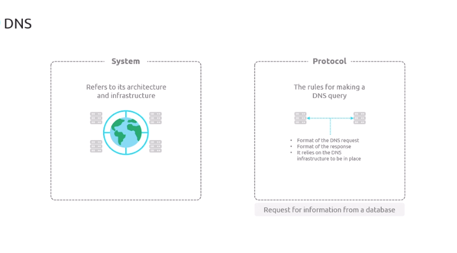  

## DNS - a Distributed System

A system can be defined as a collection of interconnected elements working together with a purpose. An example of a system is an ecosystem, where living and non-living things interact. Nature maintains balance and life persists. 
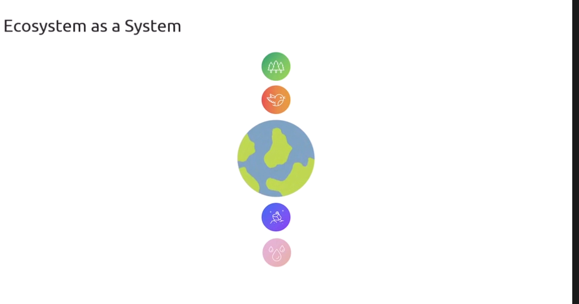  

In the domain name system, we have different types of servers and infrastructure pieces interacting, thanks to which the translation of domain names into IP addresses happens. 
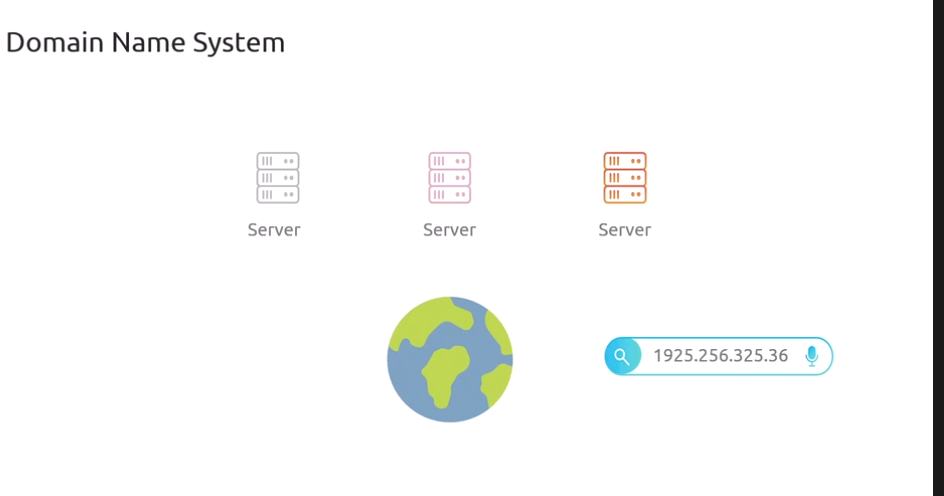  

Now let's take a look at the DNS design. For me, personally, it's remarkable how a system designed in the 80s remains so relevant, even after the exponential internet growth in recent years.

The DNS was designed by smart people that seemed to have predicted that the internet was going to grow. Therefore, the DNS was architected as a distributed system. As a distributed system, the DNS is designed to spread the responsibilities of its various operations in different server types across multiple locations worldwide. It's not just one big computer somewhere that knows all the domain names and IP addresses. Thanks to its design, the DNS is fast, reliable, and scalable.  
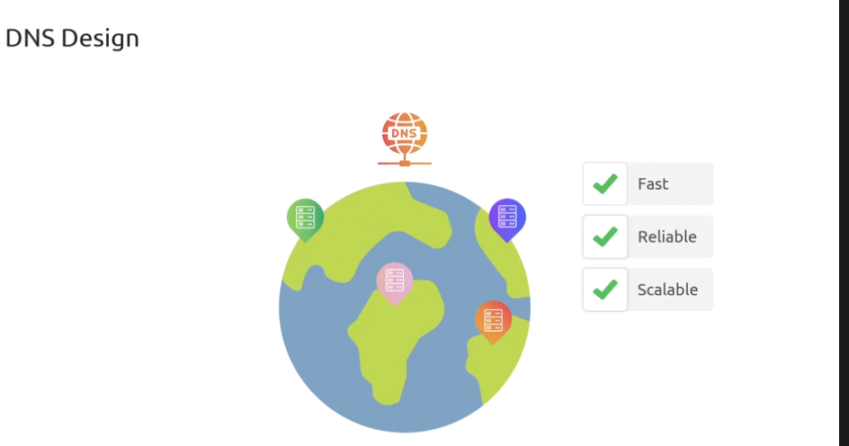  

We want to have speed, as a slow DNS would be a huge bottleneck for internet communication. We want to have reliability, as the DNS needs to be always available. This is achieved by fault tolerance, in other words, the ability of a system to keep operating, even on failure.

Imagine a world where sometimes the DNS is down, so you gotta type the Netflix or YouTube IP address in your browser.

We want to have scalability, because the internet grows, and despite its growth rate, there shouldn’t be a concern for losing speed, or reliability as more people adopt the internet. Let’s talk about how the DNS design helps achieve the performance, reliability, and scalability that it is known for.

For this, we’ll define a simplified way to look into **two major components** in the domain name system. We have a type of server called the **1. recursive resolver**, which will be responsible for asking other servers for information. 
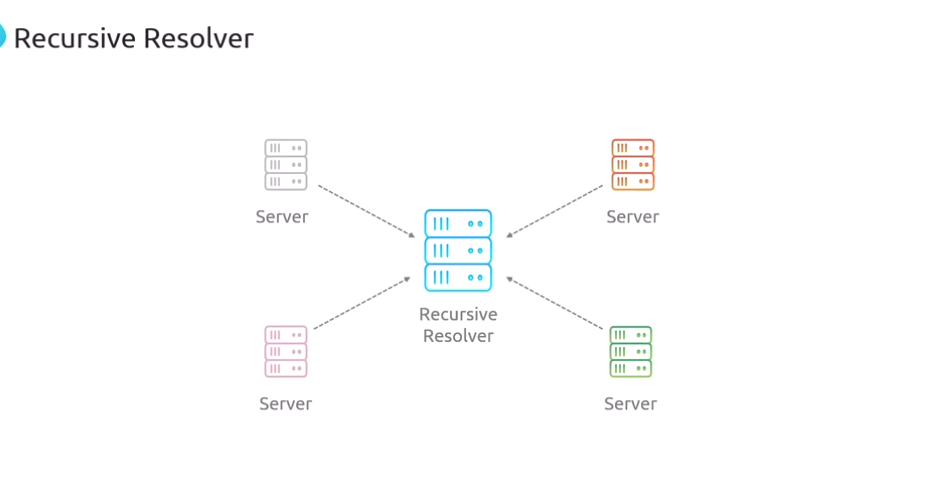  

Then we have a **2. name server**, which is responsible for storing the information of which domain name points to which IP address.  
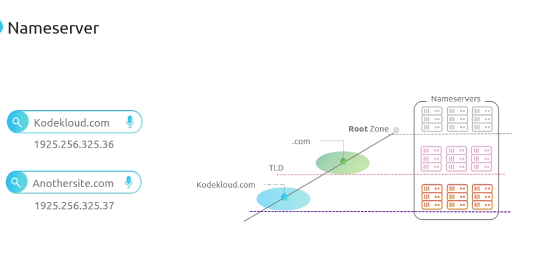  

I like to imagine these two components as detectives, so let's use that analogy to explain the whole process. 
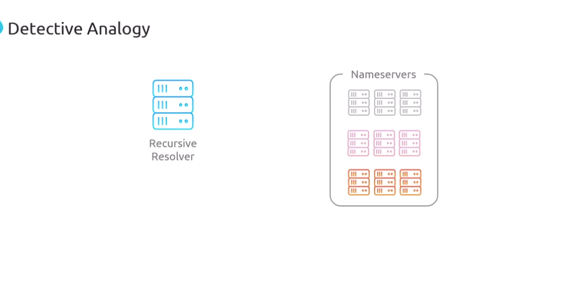  

The recursive resolver is like a seasoned detective who knows how to navigate the complex world of DNS. This detective is skilled at quickly finding the right sources of information and remembering previous cases. The name server acts as a specialized agent with access to the source of truth.  
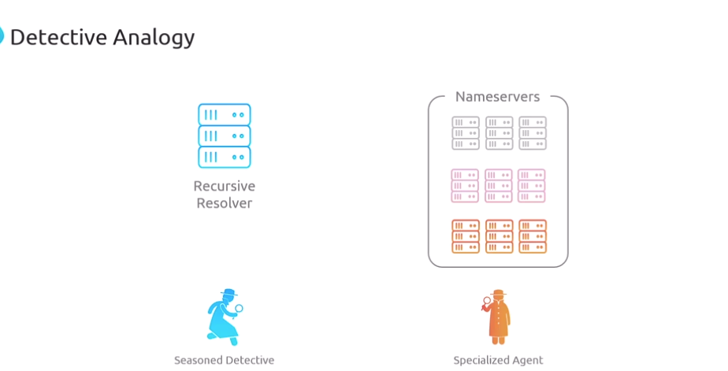  

These agents are strategically positioned around the world, each safeguarding crucial information about domain names and their corresponding IP addresses.  
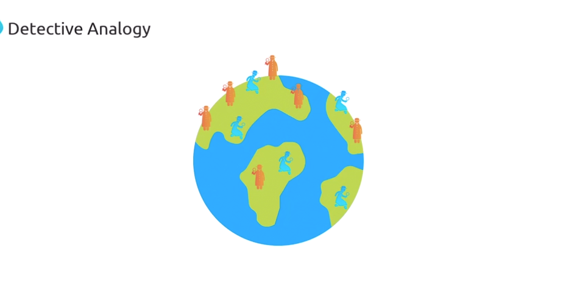  

This speed of DNS is achieves by having multiple detectives and agents working together. When a DNS request comes in, the recursive resolver detective will often attempt to solve the case by referring to notes from previous investigations. This is known as caching, and it's often the first place where the investigation begins.  
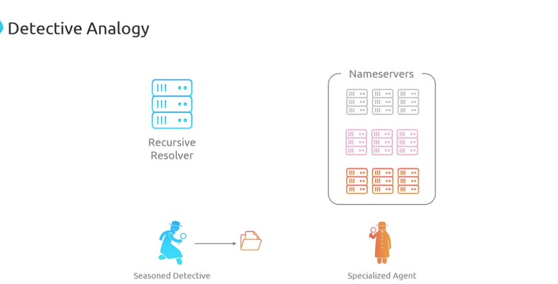  

Later in the course, we will learn about different caching layers that play a role in the speed of the DNS. If the detectives can find anything in cache, AKA their notes, they’ll know exactly which name server agents to contact for the most up-to-date information.  

The reliability of DNS comes from having a vast network of resolvers and agents. If one resolver or agent is unavailable, there are always others ready to take on the case. This redundancy ensures that the DNS investigation process continues smoothly, even if some team members are temporarily out of action.  
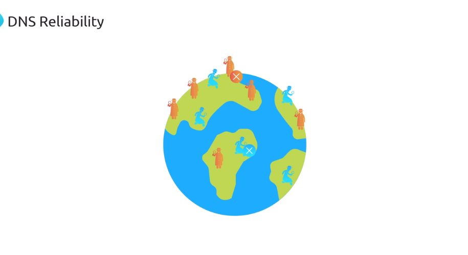  

As for scalability, the DNS is designed to grow its directory as needed. As the Internet expands with more domains and users, new records and agents can be easily added to the network. This flexibility allows the DNS to handle an ever-increasing number of requests without ever compromising on speed or accuracy.  
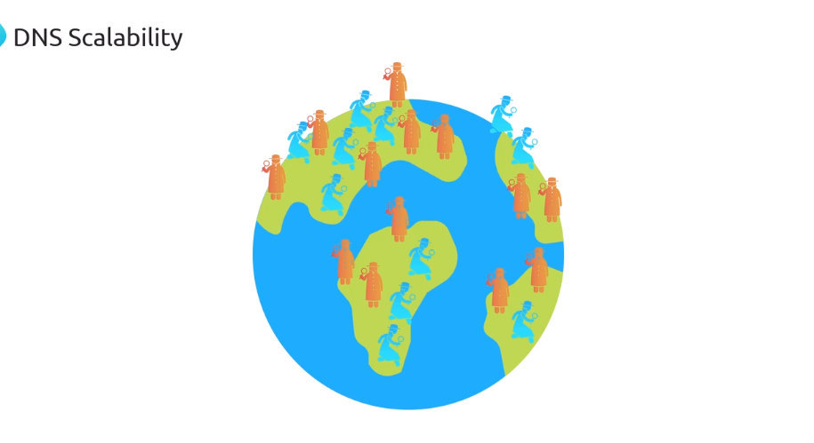  

I want to emphasize the distributed system concept one more time. Why? First, because DNS, as one of the foundations of the Internet, being a distributed system, is why the DNS works so well. But being distributed is also why the DNS is hard for us, engineers, to learn and troubleshoot, because there’s no longer a single point of failure to look for. Second, because building the muscle of defining system designs in a correct category is a very important part of learning, and improving as an engineer, as it gives the ability to see patterns and correlations in other system designs as well.   

## DNS Resolvers
Personally, I find the concept of resolvers as one of those that are simple on the surface but can be very complex when going deeper, and it's no surprise, as we're talking about one of the core mechanisms that make the internet work. 

Because of this complexity, I'm trying to simplify the concept by comparing DNS resolvers to detectives that know their way around the complex DNS world, so they can help us, the end users, browse the World Wide Web using simple domain names we can remember. Remember that the role of DNS resolvers is to receive a DNS query and look for an answer by doing something that people usually refer to as walking the DNS Tree.  
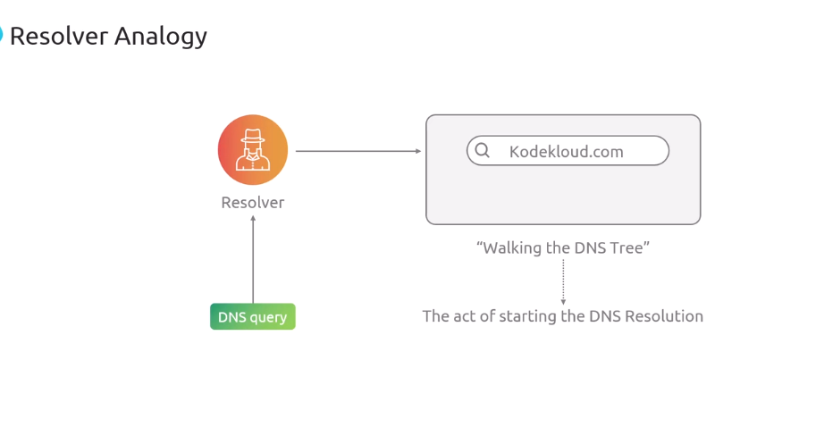  

I'll explain this in detail later in this section, but it basically refers to the act of starting the DNS resolution process at the root of the DNS tree and asking a root zone nameserver for the location of a top-level domain. Then you request the top-level domain for the location of a second-level or third-level domain. 
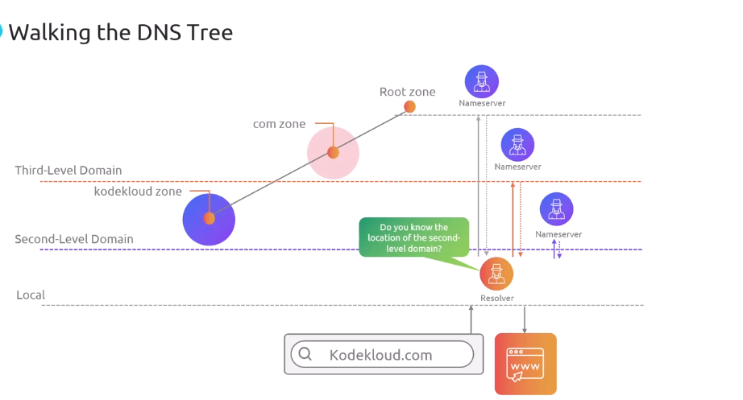  

Domain depending on the zone hierarchy, and so on. We went over nameservers in the previous section. To put it simply, let's say you have a Python application and you want to deploy it so others can access it. You might use DigitalOcean, where you can create a Linux virtual machine, which they call a droplet, and deploy your code there. DigitalOcean will give you a public IP address that anyone can use to reach your application through the Internet.  
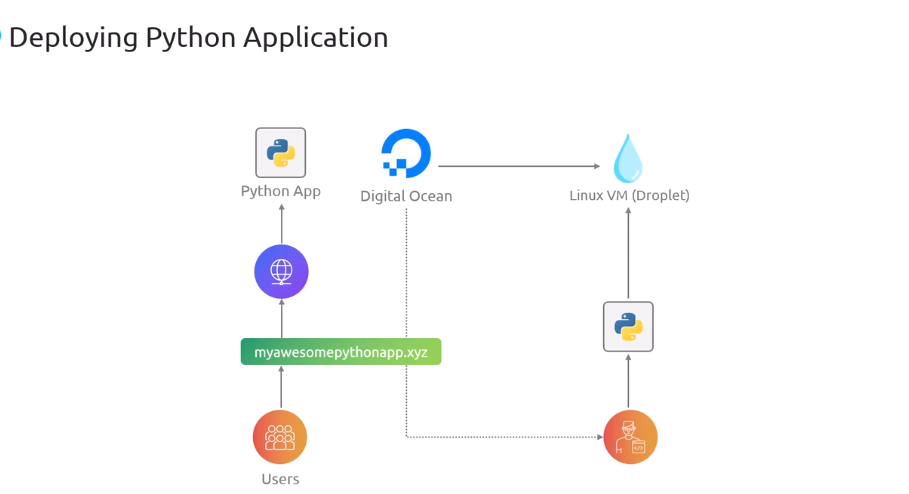  

Now, if you want people to access it using a friendly domain name like `myawesomepythonapp.xyz` instead of that IP address, you just need to add an A record pointing to your application's IP address on the nameservers assigned to your domain. These nameservers are owned by different organizations responsible for each zone. 
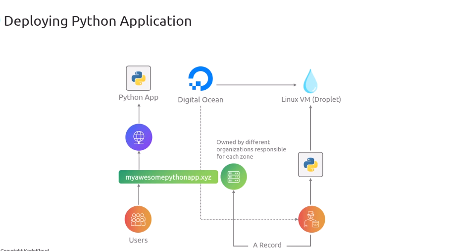  

IANA manages the root zone nameservers, various companies manage TLD zones like COM, being managed by VeriSign, and your domain's nameservers will be managed by whoever you choose as your provider. But who owns the resolvers, which are our DNS detectives?  
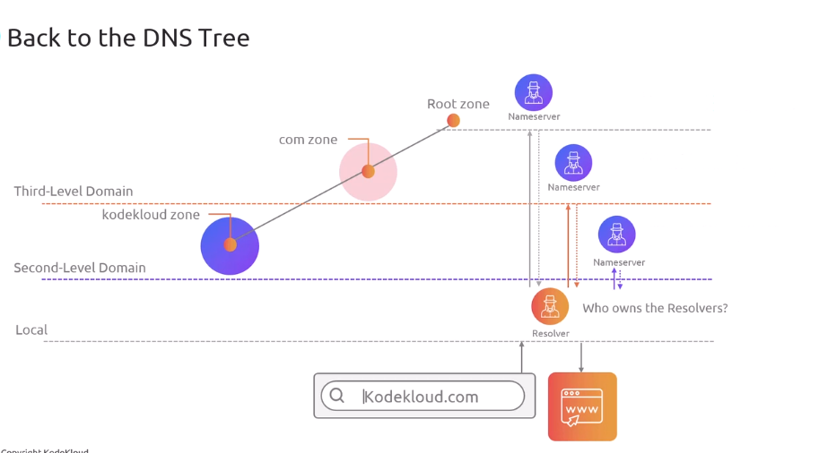  

Well, there are several players in this game. Some big companies provide public resolvers worldwide, like Google, Cloudflare, or others.

Internet providers also run their own resolvers. For example, I'm from Mexico, and when I connect to the Internet, my resolver is automatically assigned to Telmex, which is a major ISP here.  
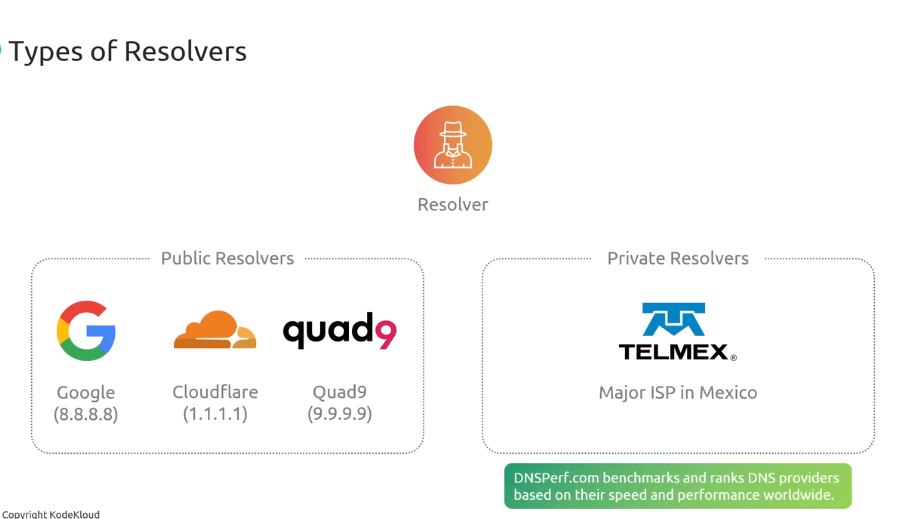  

Looking at this analogy, we can see how there are multiple types of detectives. Some of them are deemed to be faster or slower than others, and this can be benchmarked by using tools like `dnsperf.com`.  

Resolvers can be configured in several ways. Your laptop or phone typically uses the resolver provided by your Internet Service Provider by default, but you can change this in your operating system's network settings to use other resolvers you choose. 
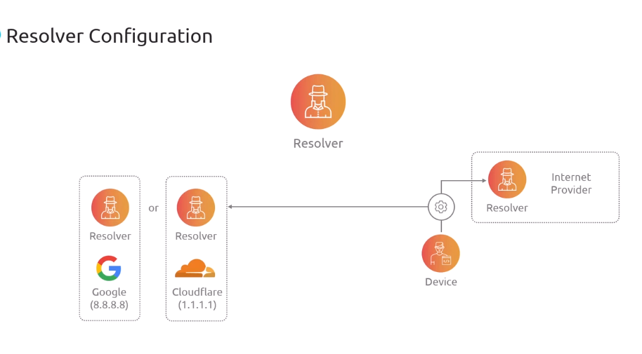  

On Linux systems, for example, these resolver settings live in the `/etc/resolv.conf` file, where you can specify which nameserver to use by adding or modifying the nameserver line. But what if you want to test different resolvers without modifying your system settings? 
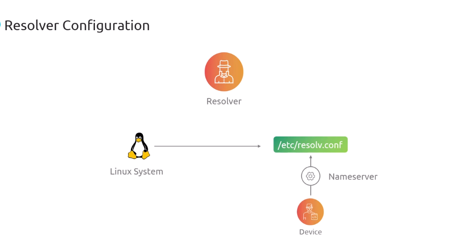  

You can use dig, for example. By using the at symbol, followed by an IP address,  
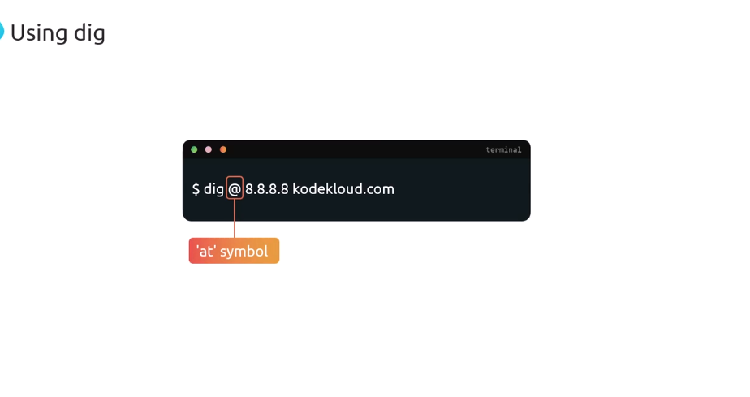  

It's like walking past your neighborhood's assigned detective and asking a different detective to help you instead.
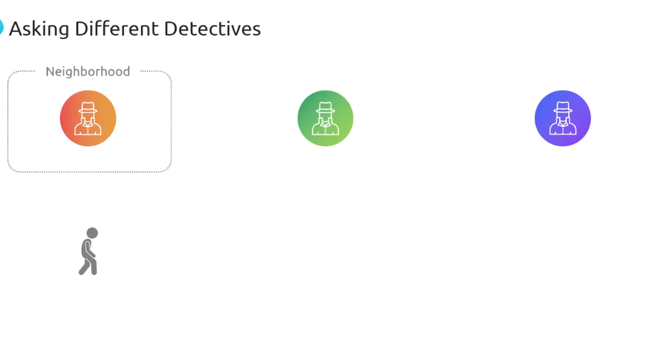  
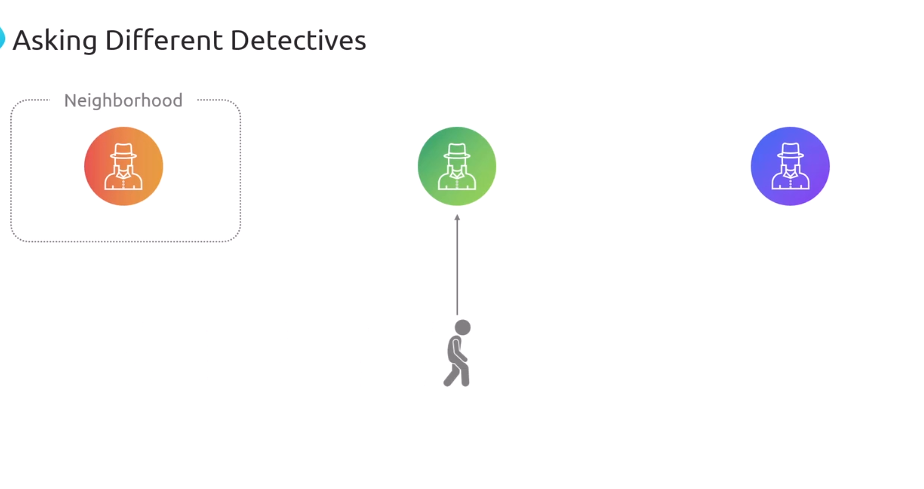  
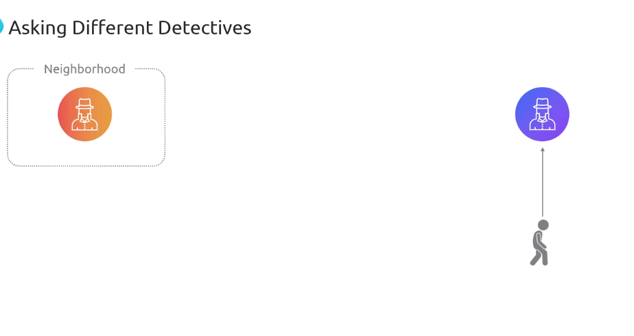  
This way, you can compare how different resolvers respond to the same query,

which can be useful for troubleshooting DNS issues or testing resolver performance. 
  
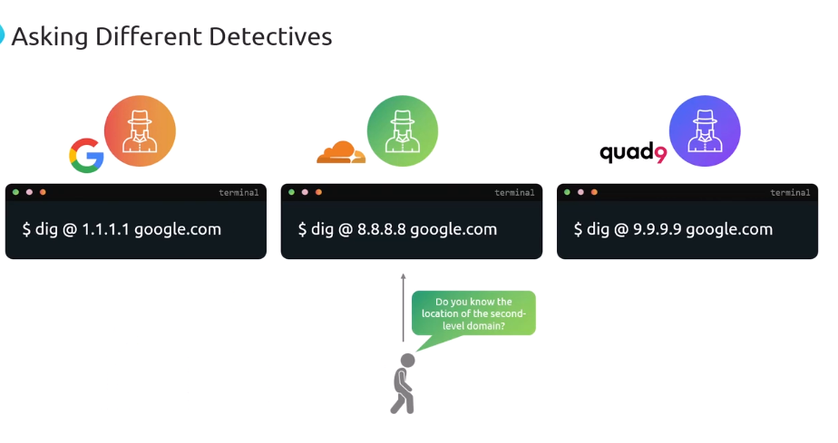  
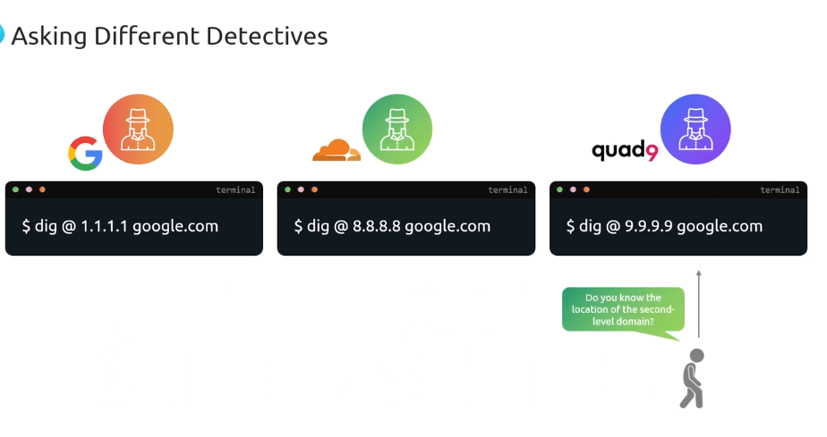  

The purpose of resolvers is to help the DNS be fast. Think of them as detective agencies that help distribute the workload. If every single question about a domain name had to go directly to the authoritative nameservers, these nameservers would be overwhelmed with millions of repeated queries. 
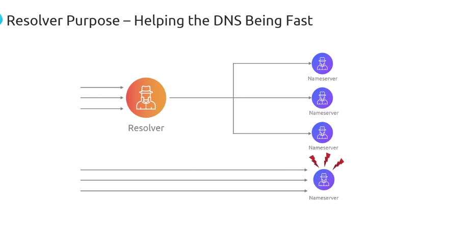  

The resolvers use caching mechanisms to help with DNS speed. Think about this as if the detectives used a notebook where they write common mysteries. When someone asks, where is google.com, and the detective just solved that case 5 minutes ago, they don't need to start a new investigation, they just check their notebook and give you the answer right away. 
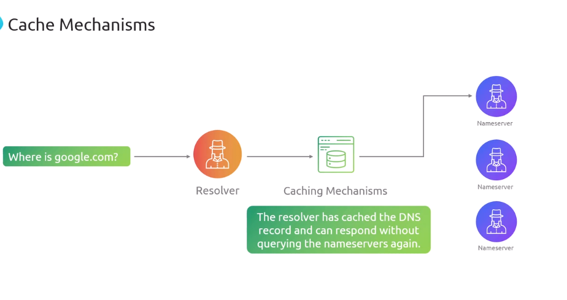  
In technical terms, this means the resolver has cached the DNS record and can respond without querying the authoritative nameservers again. This caching mechanism is crucial because it reduces the load on nameservers across the internet while making responses much faster for users. 

## Nameserver

In our previous lecture, we talked about DNS resolvers working like detectives trying to track down IP addresses. These detectives often need help from special agents who have access to the source of truth about specific domains.
The special agents in this analogy are the authoritative nameservers. 
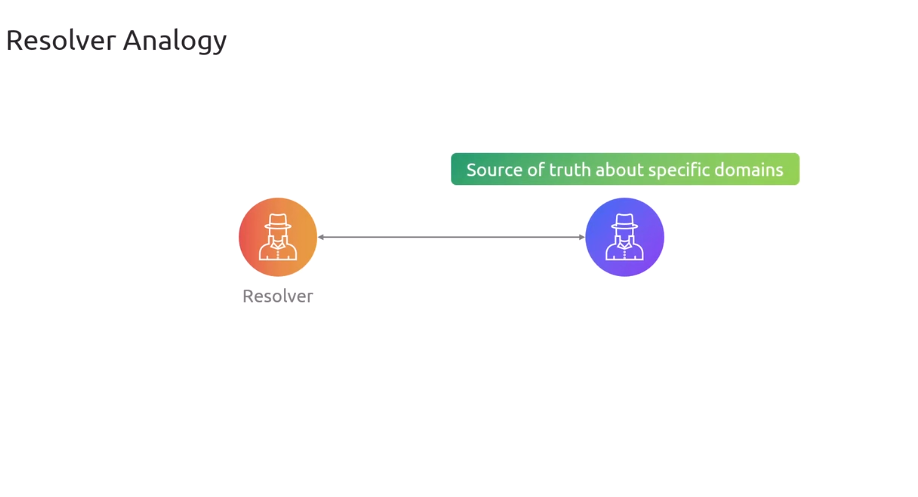  

Remember that the DNS is all about finding the IP address for the infrastructure providing a service by using a friendlier domain name. Without the DNS, the Internet would require the use of IP addresses for everything.  
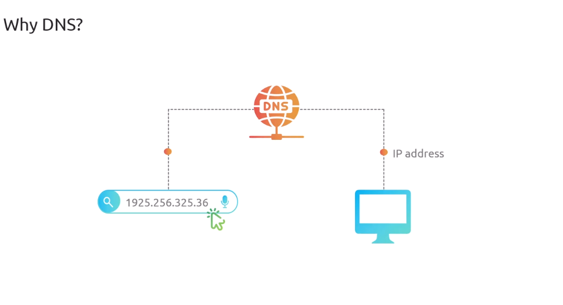  

The nameservers are responsible for maintaining this up-to-date information of a domain name and the IP address of the infrastructure providing the service.  
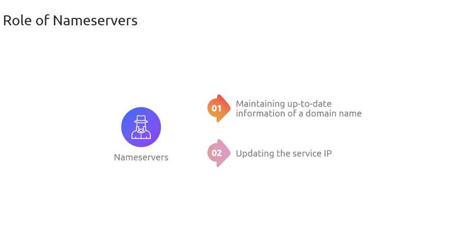  

When we perform a DNS query, for example, by typing a domain name in our browser, the resolver, a.k.a. the detective, begins an investigation to find the IP address associated with that domain name.   

To get accurate information, the detective needs to find and talk to the special agents, or authoritative nameservers, who have the official records for that domain.  
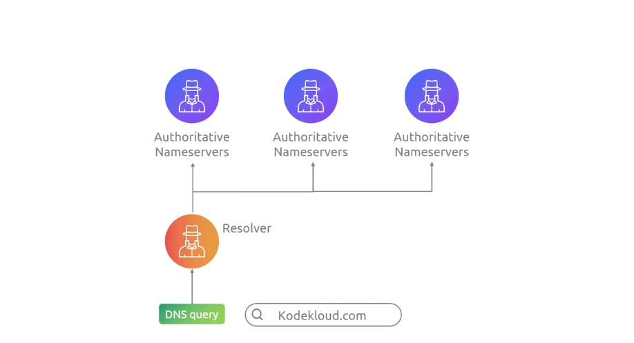  

We previously established that nameservers act similarly to a database. They store and manage all the information about domain names and their IP addresses. This setup follows some important principles we see in database system design principles. 
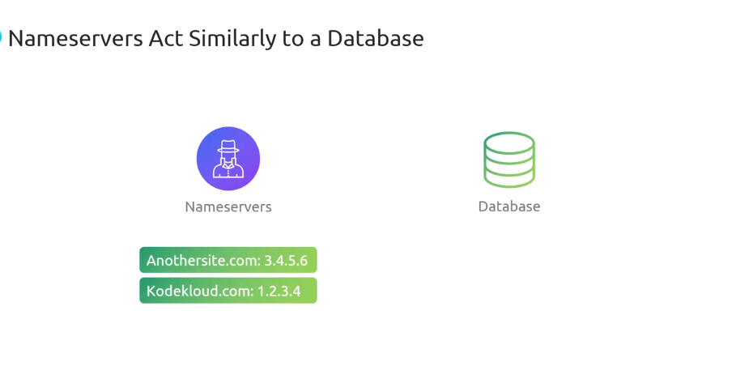  

In the world of databases, when we deal with massive amounts of data, we often need ways to handle it efficiently.
One key concept in database design is called sharding, in other words, splitting up a huge database into smaller pieces that different servers can handle.  
  

This makes everything faster and more reliable because each server only needs to deal with its own piece of the data. 

In the DNS, nameservers are designed with these principles in mind. Instead of having one massive server trying to handle the entire Internet's worth of domain names, 
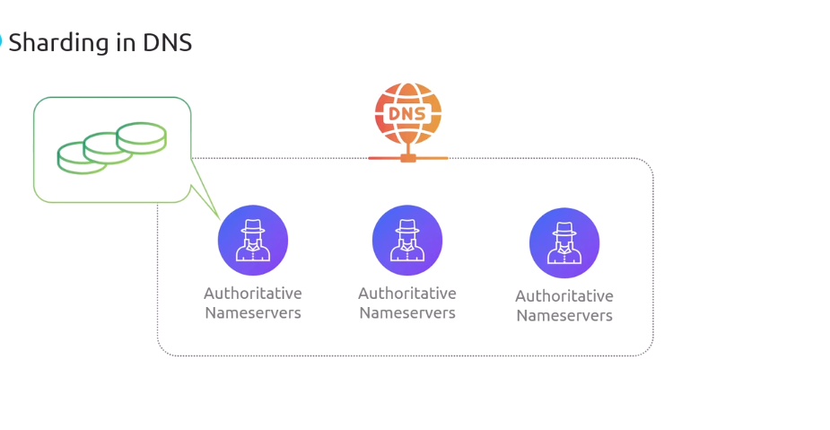  

Different nameservers are responsible for different zones. Some handle com domains, others handle org domains, and some handle country domains like UK. This distributed system approach means that if one part has problems, the rest of the system can still function.  
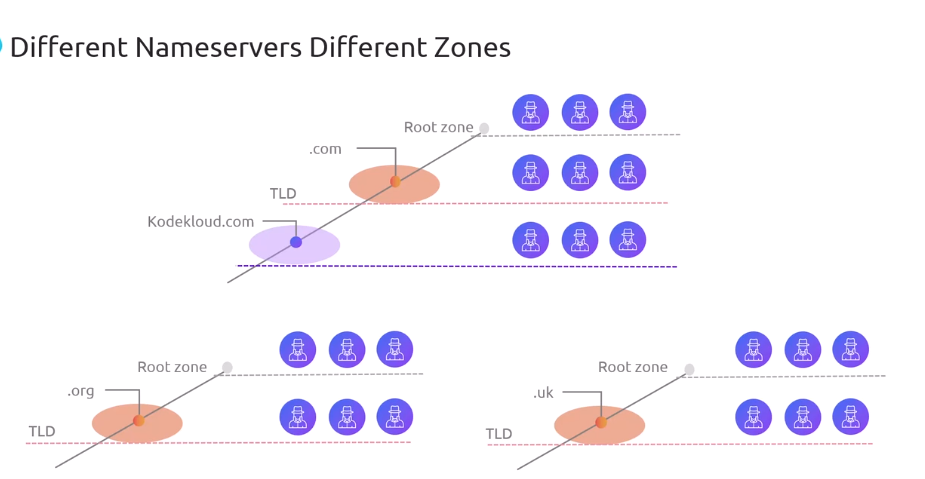  

Each nameserver maintains zone files containing records that follow a specific format. Let me show you what a basic zone file looks like.  
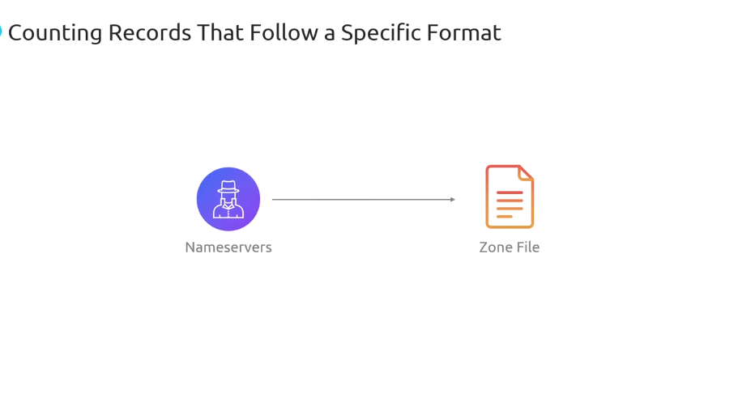  

This zone file contains different types of records. Each line represents a resource record that tells us important information about the domain.  
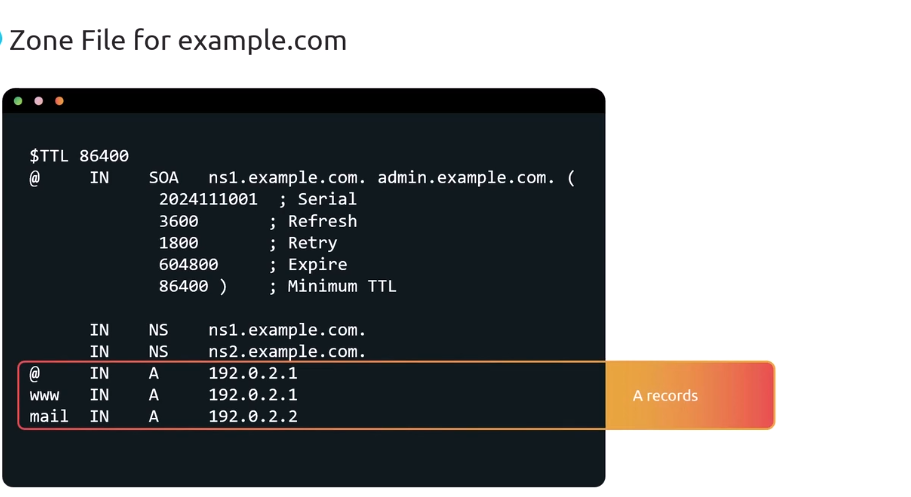  

The A records point to IPv4 addresses, while NS records indicate which nameservers are authoritative for this domain. Every domain must have at least two nameservers for redundancy. 
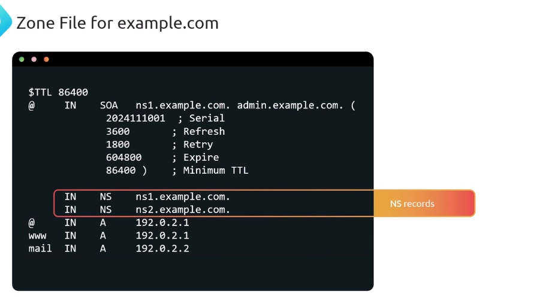  

Looking at a real-world example, let me run a dig command to show you Google's nameservers. On screen, I'm running a dig command to see how many nameservers Google has. Looking at this output, we can see that Google maintains four nameservers. This is quite common for large organizations, though the minimum requirement is two nameservers.  
  

This redundancy **ensures that DNS queries can always be answered**, even if one or more nameservers become unavailable.   Something important to talk about is that, among these nameservers, one is designated as the primary nameserver.

Imagine the primary nameserver as a lead agent who gets the information first, and then it distributes the source of truth among its peers.

We can identify the primary nameserver by looking at something called the SOA record, or **Start of Authority record**. Let me show you what this looks like. On screen, I'm running another dig command, this time by requesting the SOA record by typing `dig google.com SOA`.  

Looking at this SOA record, we can see that `ns1.google.com` is the primary nameserver. This means that this nameserver holds the master copy of all the zone data  
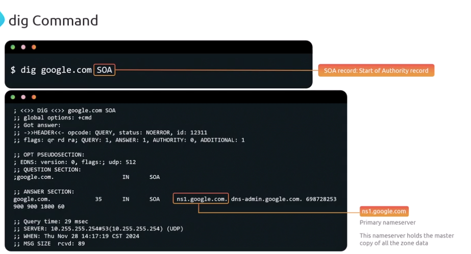  
but, as we've learned, the DNS was designed as a fault-tolerant distributed system.

If there was only one nameserver and it failed, the entire domain would become unreachable. That's why having multiple nameservers is essential for the Internet to run smoothly. 
  

The primary nameserver, `ns1.google.com` in this case, shares its data through a replication process with all the other nameservers listed in the NS Records.  
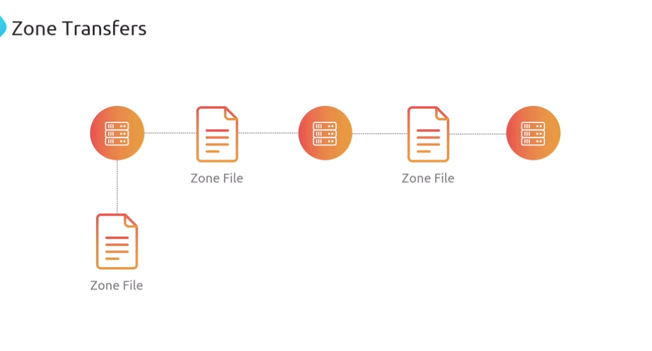  
This distributed database approach ensures that no matter which nameserver our resolver contacts, it will receive the same accurate information from the zone's official records.

There's another lecture dedicated to explaining the concept of zone transfers, in other words, the mechanism that keeps all nameservers synchronized with the same records, which is crucial for keeping the distributed nature of DNS by copying zone data from the primary nameserver to all other nameservers in the zone.

## Walking the DNS Tree
Here is a list of Topics that we will cover in this section: 
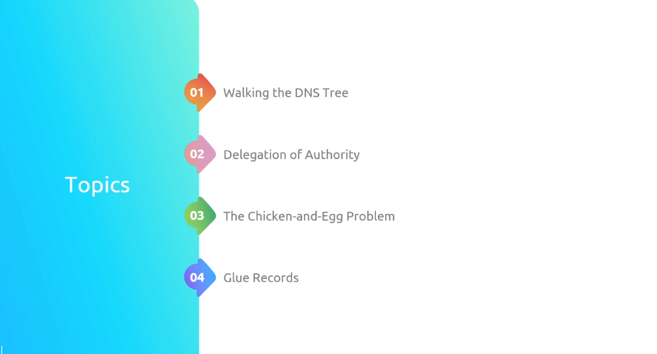  

First, we are going to go over example of the steps that happen when a domain name gets translated into an IP by the DNS, which is often known as walking the DNS tree.  
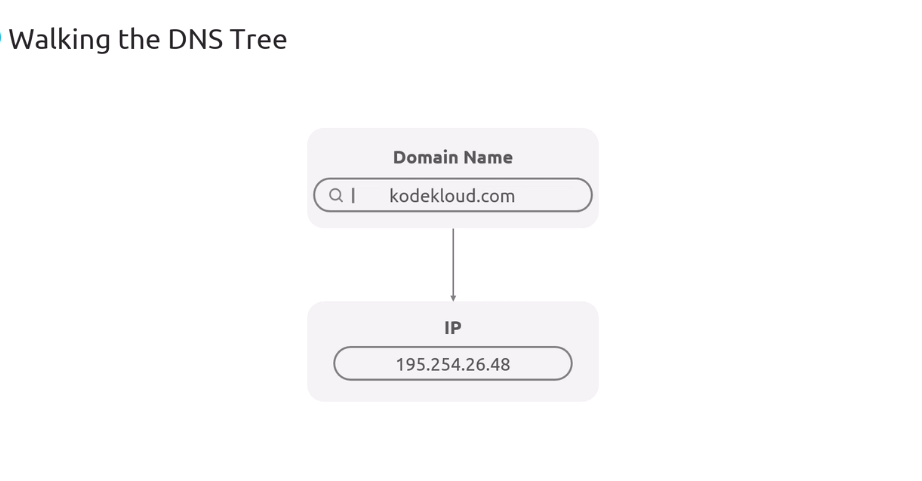  

Then we'll talk about delegation of authority, how DNS zones can delegate control of their subdomains to other name servers, which is a fundamental part of how DNS works as a distributed system.  
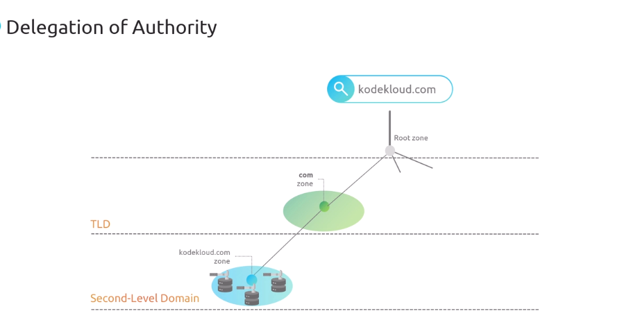  

This will lead us to an interesting problem. If name servers are identified by domain names, how do we resolve these domain names if we need DNS to resolve names in the first place?  
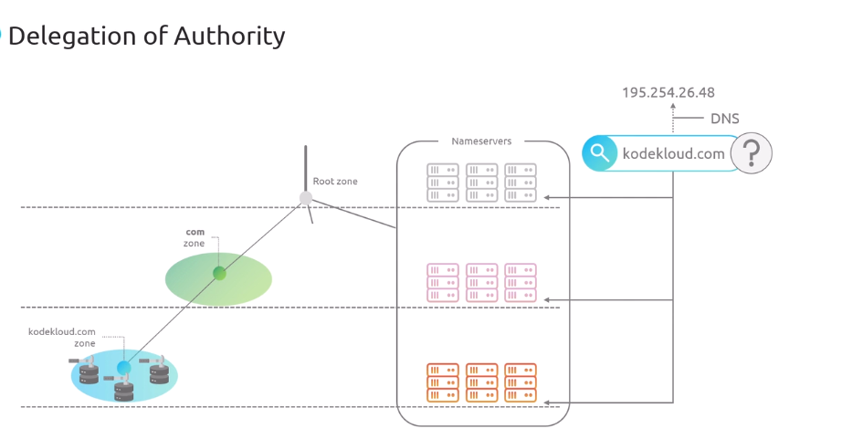  

And even more basic, how do we even reach the root name servers when we don't have any IP addresses to start with?This is what we call the chicken and egg problem in DNS. 
  

Finally, we'll learn about glue records, a special type of record that helps solve this circular dependency and makes the whole DNS system possible.  
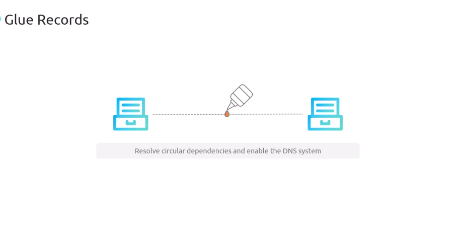  
Alright, so let's get started. Finding an IP address from a domain name works like a detective game with strict rules. 
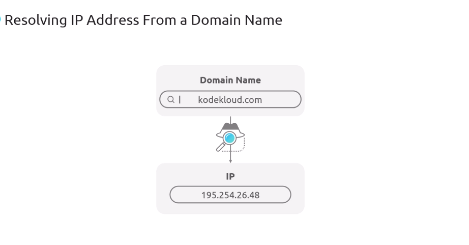  

Domain names have labels separated by dots, and the recursive resolver must start by asking the root zone name servers.  
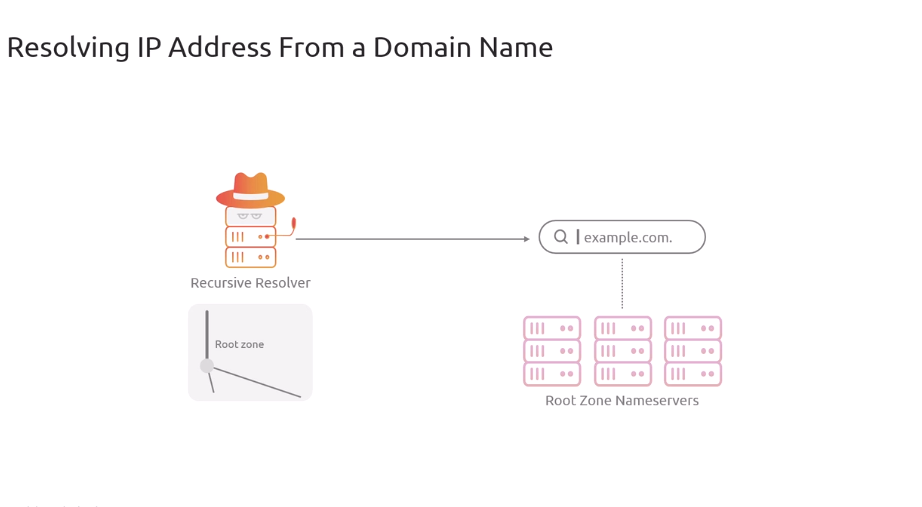  
We always begin at the root zone. Here, we ask for information about the domain name formed by the first immediate label to the left  
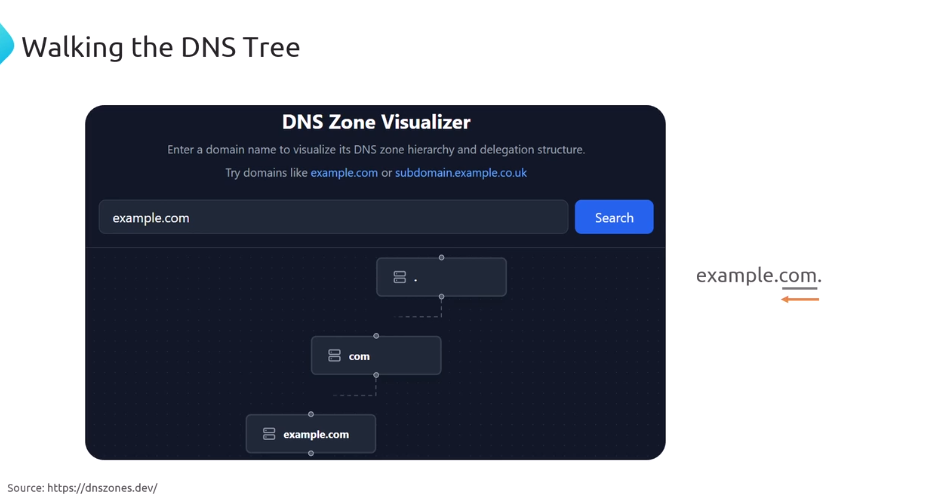  

which, relative to our current position in the DNS hierarchy, represents a subdomain of where we are.

For example, from root, com is a subdomain of root,  
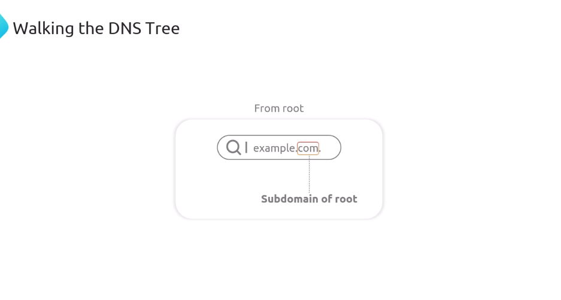  
and from com, example would be a subdomain of com. 
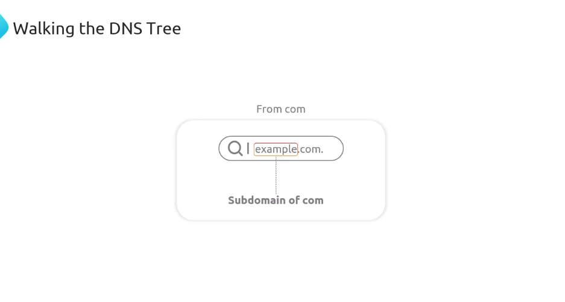  
If the name servers are not the owners of this subdomain, they'll respond with, I don't own this domain, but here are the name servers that do, and by definition, this means we are moving forward to a different zone since ownership determines zone boundaries.  
  
Then we ask these new name servers about the next label to the left, repeating this process of either getting direct information if they own the domain formed by that label, or being directed to different name servers if they don't, which means crossing another zone boundary.
  

This traversal through zones, determined by domain ownership and authority, is why understanding delegation of authority in glue records becomes crucial, which we are going to cover next. 
  
  

But first, let's go over a few exercises of walking the DNS tree together to reinforce these concepts. Let's start with `engineer.kodekloud.com` since we are already familiarized with it.

Starting at the root zone, we ask for information about the domain name formed by the first immediate label to the left, which is `com`. 
  

The root name servers are not the owners of this subdomain, so they respond with, I don't own this domain, but here are the name servers that do, and by definition, this means we are moving to a different zone.  
  

Now we are at the com zone, and we ask for information about the domain name formed by the first immediate label to the left, which is `KodeKloud`. The com name servers are not the owners of this subdomain, so they respond with, I don't own this domain, but here are the name servers that do, and by definition, we are moving to a different zone. 
  
  

Now we are at the kodekloud.com zone, and we ask for information about the domain name formed by the first immediate label to the left, which is engineer. Since this is a subdomain that's part of their zone, they own it, they directly provide us with the IP address with no further zone transitions needed.  
  

Now let's walk through `museum.co.uk`. Starting at the root zone, we ask for information about the domain name formed by the first immediate label to the left, which is uk. The root name servers are not the owners of this domain, so they respond with, I don't own this domain, but here are the name servers that do 
  
and by definition, this means we are moving to a different zone.  
Now we are at the uk zone, and we ask for information about the domain name formed by the first immediate label to the left, which is co. Since co.uk is actually a subdomain that's part of the uk zone, they own it, we continue in the same zone. When we ask about museum, the uk name servers are not the owners of this subdomain, so they respond with, I don't own this domain, but here are the name servers that do.  
  
and by definition, this means we are now moving to a different zone. Now we are at the museum.co.uk zone, and since we've reached our destination and they own it, they directly provide us with the IP address. 
  

Finally, let's examine a domain I created. For this course called `jcroyowaun.io`. Keep in mind that depending on when you are taking this course, the domain may exist or not, but assume the explanations and command outputs were true at the moment of recording this video. For this exercise, we are going to use a subdomain of jcroyowaun.io called `staging.jcroyowaun.io`.  
  

Starting at the root zone, we ask for information about the domain name formed by the first immediate label to the left, which is io. The root name servers are not the owners of this subdomain, so they respond with, I don't own this domain, but here are the name servers that do, and by definition,  
  
this means we are moving to a different zone.  
  
Now we are at the `jcroyowaun.io` zone, and we ask for information about the domain name formed by the first immediate label to the left, which is staging. The `jcroyowaun.io` name servers are not the owners of this subdomain, so they respond with, I don't own this domain, but here are the name servers that do,
  

and by definition, this means we are moving to a different zone,  
  
showing us that even subdomains can be delegated to different zones. Now we are at the staging.jcroyowaun.io zone, and since we've reached our destination, and they own it, they directly provide us with the IP address.  
  

To illustrate these DNS tree traversal exercises, we used an online tool called `dnszones.dev`. 
  
For general use cases, I would recommend using the command line. Running `dig +trace` will produce standard output of the DNS tree walking process. As seen in the animation on screen, running `dig + trace kodekloud.com`,<bt>
  
the query starts by making a request to the root name servers. Our first response comes from `a.root-servers.net`, giving us the list of com name servers. 
  
Then jtld-servers.net from the com zone responds with Cloudflare's name servers for kodekloud.com. 
  
And finally, cheryl.ns.cloudflare.com provides us the actual IP addresses. We can see each response and who provided it right here in the output as we walk through the DNS tree. 
  
**Please run this command multiple times to examine the output.**
  
We may notice that we  get the answers from different name server each time, This is because DNS uses multiple servers at each level for redundancy and load balancing. Picking a different server each time makes sense for spreading the load more evenly to avoid overloading the infrastructure.  
  
  
  

This exercise that we just went over is called walking the DNS tree. By walking the DNS tree, we reinforce the concept of how domain names are separated by an ownership and authority model called DNS zones.  
  

When we see a subdomain with different NS records than its parent domain, we've found a delegation of authority.  
  

Think of the delegation of authority like a ceremony where a subdomain is transferred to its own zone. This process is carried out by assigning new name servers to the subdomain. 
  
while ensuring the parent domain keeps an identical copy of the subdomain NS records. 
  
So we end up with identical NS records in both the parent and child zones. 
  
But wait, this brings up an interesting question. **How can the DNS resolution process involve traversing through zones, when the zones use nameserver records which are formed of domain name?**  
  
Remember that we mentioned earlier how resolving an IP address from a domain name is like a detective game with strict rules? Well, every actor in the DNS must adhere to these rules. 
  

**How do we reach the root name servers in the first place?**  
**How do name servers find each other?**  

This is what we call the chicken-and-egg problem in DNS because it feels that we need DNS to use DNS. To resolve the chicken-and-egg problem, we have two solutions in place, each at a different level of the DNS system.  
  

**Number one**, every recursive resolver comes pre-configured with a list of IP addresses for all the root name servers called root hints. 
  

Since recursive resolvers are publicly accessible on the internet via their IP addresses, any client can send a query to a recursive resolver. 
  

The recursive resolver then uses the root hints to contact the appropriate root name server and begin traversing the DNS hierarchy to resolve the requested domain name.  
  

Number two, name servers from a parent zone may point to the exact location of the delegated child zone's name servers using a special record type called `glue records`. 
  

Glue records are A or quad A records added to the parent zone's zone file to provide the IP addresses of the child zone's name servers. 
  

For example, during the delegation of authority, when we're assigning new name servers to a child zone, we need to ensure that the parent zone maintains a copy of the child zone's NS records. 
   
   
 
We may also include glue records in the parent zone's zone file, providing the IPv4 and/or IPv6 addresses of the child zone's name servers.  
  
This is an example of how the NS records and glue records for KodeKloud.com would look in the com zone file. 

All com name servers must have a copy of these records in their zone files. Now, as end users, we probably have multiple options to check the glue records, but the one that I'm comfortable with is using the dig command by querying an authoritative nameserver directly using the @ symbol and then adding then + additional flag as shown in the output display on screen. 
  

In this command, we're directly querying the a.gtld-servers.net nameserver for the kodekloud.com domain. By using the +additional flag, we can see the additional section highlighted on screen, which shows all the A and AAAA records for the nameservers. These are what we call glue records. 
  

Observe how we can modify dig's behavior and output by using different flags and even querying name servers directly using the @ symbol, basically ignoring the recursive resolver by talking directly to the name server.  
  

I find it interesting to highlight that since we are querying the authoritative name server directly instead of letting the recursive resolver handle the query for us, we have a warning message saying recursion requested but not available.  
  
This is because, as we'll learn in the DNS as a protocol section, DNS requests have a question section with flags and bits enabled that modify its behavior.

There's a recursion bit that's usually enabled, which means please follow the entire chain of DNS queries needed to resolve the name if you don't have the asewer. 
  

But we are querying a nameserver directly. And nameservers are configured to not allow recursion even when asked.   
  
This is a safety measure to prevent the nameservers from being overwhelmed by recursive queries that would force them to perform lookups on behalf of any client that asks, which could lead to resource exhaustion and potential denial of service. 
  
But wait, there is more information I want to give you because we’ve just started the happy path of walking the DNS tree where nameservers have glue records of the delegated nameservers to quickly point their locations.

Sometimes the nameservers of a parent domain won’t have the glue records with the IP addresses of the delegated child domain’s nameservers, as is the case in the command shown on screen. 
  
In these cases, where glue records are not present to point the exact location of the delegated zone nameservers,  
  
the only option to resolve the domain name is to walk the DNS tree all over again, which is a warranted way to complete the domain resolution process. 
  

In a previous lecture, I think I called dig +trace as being a simulation of walking the DNS tree.  
  

And while it may not be entirely accurate to call it a simulation, it's true that DIG + trace will omit some steps when dealing with out-of-the-ordinary circumstances, and the resolver will rely on its cached knowledge to resolve certain DNS queries. 
  
I was very curious and I wanted to demonstrate this in the course when creating these lectures, so I tried using a trace command to examine the system calls made, when using the DIG + trace command. 
  
  
  
  
  
  
  
  
  
This is the exact command that I used. Now, the output of this command is very detailed and verbose, but for simplicity, in this lecture, I'm placing the pieces that matter.

We see that after getting the AWS name server records from IO's name servers, instead of walking the DNS Tree again, the resolver, which is configured as the IP address 8.8.8.8, directly returns the IP address for these name servers from its cache. 
  
From this output, we can infer that the normal DNS Tree walk, starting from the Root Zone and to dot IO name servers, uses the connect function.  
  

This represents a true walk in the tree, where we request information from nameservers. But, When We need AWS name server IPs, it suddenly switches to the send to function, where it directly requests the resolver 8.8.8.8 for information. This shows we're abandoning the tree walk and relying on the resolver's cache, and that DIG plus trace isn't really doing the complete resolution process, as it relies on the resolver's cached knowledge when encountering certain circumstances. This caching mechanism is crucial for DNS performance, as we've learned in the previous lecture.  
  

If you have a Linux machine, you can try this command. I would advise you to look for the connect and receive message and send to system calls when looking at the huge output. 
  
All these command line techniques showcased in this lecture, including the use of the add symbol to communicate directly with the name servers instead of going through the resolvers, are especially useful when debugging and to compare if DNS records match between different name servers. 
  
Because, as we’ll learn in the zone transfer lecture, name servers must maintain exact copies of DNS records. 
  
Replication mechanisms built into DNS handle this synchronization, but common DNS issues can arise when name servers have different records due to failed updates or outdated information. 

So, to finish this lecture, let's close the last subtopic by stating that the A and AAAA records in name servers are called glue records because they're the glue that holds the DNS system together, breaking circular dependencies and making the whole system work.  
  

These concepts, delegation of authority, and glue records are what make DNS a truly distributed system, where no single entity needs to manage the entire namespace and different organizations can manage their zones independently while still maintaining a cohesive global DNS system. 
  

## Time to Live - TTL

One of the design goals of the DNS is that it needs to be fast. But how can it be fast when we have so many systems interacting with each other through network calls?  
  
The answer is that the **DNS uses caching mechanisms** to help with speed. I want to make a quick mention since we haven’t discussed RFCs yet.  
  

RFC 1034 Section 2.2, Design Goals, is where all this foundational information was documented since the 1980s. RFCs, which stands for Requests for Comments, are numbered documents that outline specifications, standards, and best practices related to Internet protocols and technologies.  

  
  

Since DNS is both a distributed system and a protocol, it has its own dedicated RFC. 
  

I highly suggest spending time to get comfortable with these documents or, at the very least, make a habit of fact-checking against these primary resources when learning or researching anything related to DNS or even other protocols with RFC document specifications.
[RFC Link](https://datatracker.ietf.org/doc/rfc1034#section-2.2) 

For those that are not very familiar with the concept of cache and caching, let’s think about it using our previous detective analogy. 

Imagine that every time one of the detectives resolves a case, he writes all the clues in his notebook. So, next time someone hires a detective to resolve a case he has already resolved, a.k.a. resolving a DNS query, 
  
The detective will have readily available information to provide an answer, without having to go through the whole process of walking the DNS Tree, asking the authoritative nameservers for answers. As you can imagine, accessing information from cache significantly reduces the load and traffic that the DNS infrastructure would otherwise go through, which contributes to making the DNS fast. 

Looking at the diagram presented on screen, we have a more accurate technical representation of many of the actors that play a role in the DNS resolution process, which is a way to evolve or elaborate further on our simple detective analogy that we’ve been using so far. 
  

This takes us towards a more technical mental model of how the DNS resolution process actually works. Going over the diagram, from the inside out, and I want you to pay attention to this as **this is very important**. 

Everything starts on our personal device, on the far left. Whether it's our computer, phone, smart TV, etc., any device capable of connecting to the internet will inherently be able to perform DNS queries and get responses.  

Going from left to right, you can see that an application or program within the device will make a DNS request, and then there's a stub resolver, which is a DNS client program that's built into most operating systems. In Linux systems, the stub resolvers can be traced by using the getaddrInfo() system call. 

Its main responsibility is to forward the request to a recursive resolver as it can't perform queries to the name servers directly.

But moving to the right, we have that before talking to any public recursive resolvers, we go through our router's resolver, which is often known as a forwarding resolver.  
  

After leaving our home network towards the internet, we then talk to a recursive resolver, a.k.a. the agents we've been using as examples throughout this section. 
  

And finally, we get to ask questions to the name servers, starting on the Root Zone and then to the Top-Level Domain, and then finally on the second, third, fourth-level domain, or whatever corresponds to the DNS query we are performing.  
  

The DNS is a concept called TTL, or Time-to-Live, which is a number that specifies how long a domain record will remain in cache before checking if there's been any update to the domain name.

A change can be anything from adding records like CNAME records, A records. changing the start of authority information, changing name servers, or even deleting the domain name.

Using a dig command to KodeKloud.com, we can observe a 300 number in the answer section next to the domain name. 
  

That 300 is the number of seconds that the DNS record is meant to be cached. Think about it like an expiration timer on a detective's notebook.

After 300 seconds, which is 5 minutes, the information is considered expired, and the detective needs to go through the process of asking the authoritative nameservers again. 
  
To get current information about the domain name. This TTL mechanism is important because if the TTL is too long, changes to the DNS records might take too long to propagate across the Internet. If it's too short, we may lose the performance benefits of caching, since resolvers need to query the authoritative nameservers more frequently. 
  

In our KodeKloud.com example, all three A records have the same TTL of 300 seconds, but different records for the same domain could have different TTL values, depending on how frequently the administrators expect those records to change.  
  

Now, in previous lectures, we've focused only on what happens on the public side of the DNS, meaning the recursive resolvers and nameservers. Now, we are evolving our mental model of this design by introducing some of the levels of detail of what happens in our private networks when we need to resolve DNS queries.  
  

The reason why we are introducing this evolved design in this lecture is because sometimes the TTL value specified in the DNS records is not honored by some applications. 
  

Caching is a relatively simple concept on the surface, but it can be complex when thinking about how multiple clients that participate in the DNS resolution process have different rules and cache implementations.  
  

Observing the diagram shown on the screen, you can see that within the device section, we have the operating system and then multiple soft classifications of entities, including applications, programs, or services running at the operating system level, 
  

meaning some programs or applications handle their cache independently to the TTL value from a DNS record. If you've ever been through a situation where you're pointing a domain name, for example, while also trying to access the same domain name through a browser and you get different responses, for example, ping response correctly or successfully, but the browser won’t resolve the domain name. This is why they both have their own timing for cache to expire. In one of the last lectures in this course, we discuss more on clearing DNS cache when resolving DNS issues

## Zone Transfer
In this video, I want to talk about a concept known as zone transfer, which is the mechanism that nameservers use to stay in sync.  
  

Throughout this course, we've compared authoritative nameservers to a database in the sense that nameservers store data that can be queried, for which they will return a response. 
  

Turns out that nameservers also follow system design philosophies similar to databases. 

The following concepts are all tied to the DNS design goals of being fast, reliable, fault-tolerant, and scalable. 
  
In database system design, there's a concept called sharding, which can be explained as a way to split a large amount of data across multiple servers. 
  
Instead of having one huge server trying to handle everything, we break the data into smaller pieces, and each server handles its own piece.

In DNS, this means splitting domain records across different zones. 
  
Instead of one server holding all domain records for the entire Internet, the DNS splits domains into zones. 
  
Each zone is managed by different nameservers. 
  
For example, some nameservers only need to know about com domains.

while org nameservers handle org domains. 
  
This sharding continues down. Amazon.com nameservers only need to handle amazon.com records, not walmart.com records. 
  

This way, no single server needs to handle the entire internet's DNS traffic. So in other words, nameservers borrow from databases, not only from their purpose of providing answers to queries, but in their design as well. 
  

When the datasets grow too large, it’s better if we split the data across multiple servers, as we do in the DNS.
  
Each server handles just a portion of the data, making the system more manageable and faster. DNS works the same way, by sharding the domain namespace into zones, each managed by different nameservers.

Also, as we've mentioned earlier, in the DNS, there should be at least two or more nameservers assigned to a zone. This is for redundancy and availability. 
  

Each zone has multiple nameservers, because if there were only one, and it failed, the entire domain would become unreachable. 
  

By having nameservers in different networks and locations, the domain stays available even if an entire network region goes down.

Every zone must have multiple nameservers for redundancy. When a record needs to be updated, it first goes to the primary nameserver. 

Then, a replication mechanism called zone transfer ensures all other nameservers receive these updates. 
  

A quick parenthesis, I recommend taking notes on what zone transfer means, as there is also something called domain transfer, and there’s another concept called delegation of authority, and they all mean different things. 
  

Take notes on each, to keep their meanings well categorized. 
  

Anyway, the nameservers follow a leader-follower architecture, and we can find out which one is the primary nameserver for a zone by checking the start of authority record. Using dig and requesting the NS records reveals all of the nameservers designated for that zone. 
  

When we update a record in our zone, say for example, we change the A records to point our domain to a new IP address,
the data first goes into the primary nameserver. Then, the process of zone transfer will ensure the rest of the secondary nameservers stay in sync. 
  

Modern DNS providers like Cloudflare and AWS Route 53 handle the zone transfer through their own proprietary mechanisms.
 
  
When you update a DNS record, the nameservers quickly get the updated information, usually within seconds, and I would say, nowadays it’s just a given that this mechanism will work fine.

However, many DNS operators, especially those managing top-level domains like .com or .net, use traditional replication methods called AXFR and IXFR.

AXFR copies all zone data to a secondary nameserver. Think of it as the special agents sharing the full authoritative data,  
  

like the complete case files, with other agents in their organization. When a new nameserver is added to the zone, it knows nothing. It needs a complete copy of all records. That’s when AXFR is used.

 In IXFR, the secondary nameserver actively checks with the primary nameserver. to see if anything has changed. It does this by looking at the zone's version number, called a serial number.

If the primary has a higher number, the secondary requests just the changes that happened since its last update. So it's a pull system.

The secondary nameserver requests the changes. The primary doesn't push them automatically. This is more efficient because each secondary can request updates on its own schedule, and only when it needs them. This is similar to how database replicas work. They periodically check the primary database for changes rather than pushing updates to every replica.  
  
This course won't contain more details of AXFR and IXFR for now. But as a summary, remember that zone transfer refers to the process of replicating DNS records across nameservers. First, the records originate on the primary nameserver, and then the data is replicated to the others.

## Root Servers and Anycast

So far in this course, we've established that the domain resolution process starts on the root zone. Another detail we've uncovered through commands like dig +trace is that there are only 13 root name servers. I promise you that we will explore why there are 13 root name servers later in the course, but the focus of this demo is on understanding how these 13 servers manage to handle the entire Internet's DNS traffic without becoming overwhelmed. 

Think about this, 13 servers handling DNS queries from every single device connected to the Internet worldwide. The numbers are massive when you think about all the queries happening every second. So how is it possible that only 13 root name servers are capable of handling so much load? The answer is that this is possible thanks to a network design called Anycast. What Anycast does is it allows multiple physical servers to share the same IP address. To show you exactly what I mean, I am going to open rootservers.org website

and then I'm going to zoom into a random location in the map. Probably Mexico because I'm from Mexico. And so in the central region, we have two locations with root servers, one in Mexico City and the other in Querétaro. If we click on Querétaro, we see that this geographical place hosts root name servers E, C, K, D, and F in a data center.

Clicking on Mexico City, we have E, E, I, F, and D. This is interesting that the E server appears twice in this region, right? Let's click on the server here and check that the IPv4 address begins with 192 and ends with 230.10. The other one over here is the same, and the one in Querétaro has the same exact IP address. If we compare the IPv6, we can see it matches as well. Same is true for the F server, and so on. If we zoom out, we can see that there are many data centers announced in this map. There are many more in the United States, and there are regions with more than a few root servers like this place here close to Washington.

If we check the IPs from any of the A records, they're all the same. Take a look. Now, to understand Anycast, think about it as a distributed system that allows multiple machines with the same IP addresses to share compute resources to help with a huge traffic load by strategically positioning the servers in multiple locations to also help find the nearest location.

We get to interact with a root nameserver based on proximity thanks to a network protocol called BGP, or Border Gateway Protocol, which uses an algorithm to decide the fastest route to an internet location based on multiple considerations. I highly suggest you go check on YouTube.

There are some very interesting videos on BGP that are worth checking as BGP is a very important concept. Anyway, that's it for this demo. In the next lecture, we will take a look at another DNS distributed design called GeoDNS. I want to put forward that Anycast and GeoDNS are different.

Anycast uses the closest proximity method through network routing, while GeoDNS makes routing decisions by looking at information like our subnet location to figure out where you are connceting from.

## GeoDNS
Throughout this section, we've explored the DNS resolution process, from nameservers managing different zones to resolvers acting as our DNS detectives caching results. But being that the Internet is a worldwide system serving billions of users, we're missing a crucial piece known as GeoDNS. GeoDNS is a technology that helps analyze the origin IP address of a DNS request to determine the user's location and route the request to the most appropriate server.

This service is provided by modern DNS providers like Cloudflare or Amazon's Route 53. GeoDNS implementations consider multiple factors, like geographical proximity,but also the status of the service you're being directed to. Let's examine these factors one by one. First, let's talk about geographical distribution. In global distributed systems, there's something called CDN, which means content delivery network. Think of a content delivery network as a McDonald's restaurant chain for a moment.

McDonald's doesn't have just one restaurant serving the entire world from one location. Instead, they have thousands of restaurants worldwide, each serving their local community. Similarly, companies like Akamai provide these content delivery network services, maintaining servers across the globe that store cached copies of frequently accessed content.

This infrastructure enables faster access to popular websites, applications, and services, regardless of where users are located. The second factor is server health and operational status.When you type an address like KodeKloud.com, GeoDNS ensures you won't be directed to a server that's down or malfunctioning, because it constantly performs health checks on all available servers. Even if you have a server physically close to the user, that server might be experiencing issues or could be under heavy load. In these cases, GeoDNS will route traffic to the next best available option.

It's like if your nearest McDonald's is temporarily closed for maintenance, you'd rather drive a bit further to get your meal than arrive at a closed restaurant. This ensures users are always directed to servers that are actually capable of handling their requests, maintaining service reliability and performance. Remember at the beginning of this section we explained that DNS is both a distributed system and a protocol. When we talk about the format of a DNS request or its response,

we're talking about the DNS protocol, and GeoDNS uses the structure of the DNS request to understand how to direct the traffic to the nearest infrastructure thanks to a special value that's included in the DNS requests. I want to make a parenthesis to say that, when DNS was created back in the day, the internet wasn't what it is today, but the people in charge of creating the DNS

decided it may be a good idea to keep some unused bits in its request-response structure in case things evolved. As the internet grew, an extension for the DNS protocol, known as EDNS, was created, and within these extensions, there's a value or field with information about something called the client subnet that tells nameservers where requests are coming from. This is crucial. Without this subnet information, a user in Thailand, for example,

might end up talking to resolvers from someplace in America, thus getting responses that aren’t optimized for his location. We'll examine DNS requests and responses in detail in the next section, but for now, understand that this extension was fundamental in making GeoDNS work effectively. It gives nameservers visibility into where queries truly originate, not just which resolver is asking. We have a lecture that talks about EDNS in the next section, but for now,

Let's imagine a person from Sweden wants to watch Netflix, so they type netflix.com. What happens here is that this request first hits their DNS resolver, which might be their ISP’s resolver, or possibly Google’s resolver, at 8.8.8.8. Thanks to that special value we talked about earlier in the DNS request,

Netflix’s nameservers can see this request is coming from a Swedish network. Now, Netflix has multiple servers across Europe. They might have some in Stockholm, some in Amsterdam, and others in Frankfurt. When their GeoDNS system sees this request coming from Sweden, it doesn’t just automatically pick the Stockholm servers because they’re closest. Instead, it looks at several things. First, it checks which of these European servers currently have capacity to handle more streaming.

Then it looks at which ones have good network conditions. Maybe the Stockholm servers are having some network congestion right now. It also checks which servers already have the most popular Swedish content cached and ready to serve. GeoDNS uses a load balancing strategy to make these decisions of which server may give the best streaming experience at the moment. I wanted to make sure we covered GeoDNS as Its very Import in todays internet.

# DNS as a Protocol

## DNS as a Protocol
DNS as a protocol is about understanding the format of the requests, the responses, and other rules and nuances around the way DNS behaves. A good mental model to learn these concepts is that DNS is a network protocol. As you may know, the word protocol is used to define rules and contracts for an entity to follow. In computer networking, we have multiple protocols like TCP or UDP, which help define standards of how a device should communicate with another device.

It's like establishing a mutual set of rules so network-connected devices can know what type of data to expect and how to respond to said data. For me, it was a big help to understand that. In DNS, everything runs either in TCP or UDP, so keep this in mind when thinking about DNS. Now, in relation to network protocols, in case you’re not very familiar with it, I want to establish that protocols have hierarchies, meaning some can be a lower level

and others can use the previous rules set by another protocol to add an additional functionality or behavior to the communication contract. These higher-level protocols build upon the basic transport mechanisms to provide specialized services for specific use cases. To better understand these protocol hierarchies, let's start with the basics. At the foundation, we have IP for routing data across the Internet. This means that for any Internet communication to happen,

IP addresses need to be involved to know where to send data. IP works with transport protocols like TCP and UDP for actually sending that data. Think of it like different delivery methods. TCP is like sending packets where the delivery service waits for the recipient to sign and confirm they got each packet before sending the next one, whereas UDP is more like throwing all the packets into the recipient's yard at once, not caring if they actually got them all. It's crucial to understand the differences between TCP and UDP, as both are foundational protocols for network communication,

so I’ll elaborate more on the explanation before moving on. The TCP way of doing things is achieved through packet IDs and acknowledgments.

When sending data over the Internet, if the data is larger than what can fit in a single packet, TCP divides it into smaller packets, each with an ID so they can be put back together in the right order. While TCP packets can theoretically be up to 65,535 bytes, in practice they’re usually limited to around 1,500 bytes because of something called MTU, Maximum Transmission Unit, which is basically how much data Ethernet networks can handle in a single frame. If the data is small enough to fit in one packet, it’ll just send it as is, but TCP still uses what we call an ACK, or acknowledgment, to confirm the data made it to its destination. This acknowledgment system is what makes TCP reliable. The sender knows for sure if their data arrived.

Otherwise, the file won't open, as bits of its data may be missing or incorrect. UDP, on the other hand, just sends data packets

without waiting for any confirmation that they arrived. The receiver just processes packets as they arrive, in whatever order they come in.

This makes UDP much faster than TCP but less reliable. UDP is used for live streaming and gaming, for example,

where speed matters more than perfect delivery. If you miss a few frames in a video call or a game, the stream just continues and you might see a brief freeze. But as the transmission is live, it can't really wait for things to be acknowledged. Originally, DNS was designed to use UDP with a strict 512-byte limit for its packets. This limit wasn't random. It was chosen because the IPv4 standard specified that

every host must be able to handle packets of 576 bytes or less. Since IP headers could be up to 60 bytes and UDP headers were 8 bytes, staying under 512 bytes for the actual DNS data meant the total packet would always fit. Remember how in a previous lecture we talked about DNS having exactly 13 root servers? Well, this is exactly why. It's the maximum number that could fit in a single 512-byte response. This is because the server name itself would add about 20 bytes, times 13.

This means 260 bytes just for the names. So considering the rest of the fields displayed on the screen, this makes up for about a total of 512 bytes. These days we have something called extended DNS, which we will cover in another video. But this extended DNS capability enables handling much larger UDP packets, which makes sense since modern networks and computers can easily handle bigger packets now. We're not in the 1980s anymore.

Plus, we needed this capability because of other newer features like DNSSEC, which have been included in the DNS protocol in an attempt to make the DNS more secure. These security features add more information to DNS responses, making them naturally bigger than 512 bytes. We'll go over the basics of DNSSEC in another video in this section.

The only downside is that this ability to send larger responses has made DNS servers attractive for amplification attacks, where bad actors can use DNS to generate a lot of traffic.

But anyway, the key point here is that these basic protocols provide different ways to move information, and other protocols can build on top of them to add their own rules and features. Now, when talking about how protocols stack, or sit on top of each other, think about the following. We just defined that TCP and UDP are two protocols that use IP addressing and routing to operate. As technologies evolve, new requirements emerge for how devices and software need to communicate. I'm going to use HTTP as an example since we interact with it everyday and I'm sure you've seen a 404 error when a page doesn't exist, or a 504 when a server is too busy.

These status codes are part of how HTTP standardizes communication, which will help us understand how DNS also standardizes its own way of handling requests and responses. So, HTTP is a protocol that builds on top of TCP. This means it has all the reliable delivery features of TCP, but adds its own specific rules about how to make requests and receive responses. Think about this as a way to solve new challenges that came up as the web evolved.

For example, a basic TCP packet requires source and destination ports, sequence numbers, and checksums for verification. The response includes acknowledgment numbers and flags to indicate the status of the connection.
HTTP adds more guidelines to follow on top of the existing TCP/IP. For example, it requires headers in the request to tell the server important information.

like what website you're trying to reach, what type of content you'll accept as a response, or what browser you're using.
It also has standardized response codes like the 404 and 504 we talked about earlier. These codes are part of HTTP's standard way of communicating,
so applications, devices, or people using the service know how to send requests and how to interpret a response. DNS works similarly in this hierarchy.

It's also a protocol with its own standards for requests and responses, though, as we mentioned before, it typically uses UDP instead of TCP.
This is because DNS was designed for quick, simple lookups where speed matters more than guaranteed delivery. DNS uses port 53 by default.
There's also port 853, which is used for DNS over TLS. TLS, or Transport Layer Security, is a protocol that adds encryption to network communication.

Think of it like a secure tunnel where data can't be seen or modified by others while it's traveling through the Internet. This is the same technology used when you see HTTPS in your browser, but applied to DNS queries to keep them private and secure. There are actually a couple of ways to do secure DNS.

 DNS over TLS, otherwise known as DoT, and DNS over HTTPS, known as DoH. They both encrypt DNS traffic, but work a bit differently, for which we have a video in this section. So, when using DoT or DoH, DNS uses the TCP protocol. In most other cases, it uses UDP by default, but DNS also falls back to TCP in a couple of interesting situations.

 Remember how we talked about that 512 byte UDP limit? Well, when a DNS response is bigger than that limit, and the client hasn't told the server it can handle bigger responses through extended DNS capabilities in its request, which is done by setting a flag in the DNS query options, the server will send back a truncated response indicating that the answer is too big for UDP. When this happens, the client knows it needs to try again, using TCP instead.
 
  DNS also uses TCP for zone transfers, which we learned in the previous section when explaining how DNS nameservers use a leader-follower architecture, where a primary nameserver replicates domain name updates to secondary servers. If some of these concepts like extended DNS capabilities and flags seem a bit complex right now, don't worry, we're just getting a high-level view. We'll dive into the specifics of DNS requests and responses, their flags, and options later in this section. Now that we're going over DNS as a protocol, and we also talked in the previous section about DNS from a distributed system perspective, I hope you see why DNS is probably more complex than, say, HTTP. DNS is a protocol that requires a complex global distributed system to be in place to operate. It's not just about learning networking basics.

  there's also the system design aspect, global internet routing, and concepts from high-performance databases like sharding to spread data across multiple servers, which is similar to how DNS uses multiple nameservers to distribute the load efficiently. So I hope you feel proud of making it this far in the course, and I hope you're learning a lot from this experience. Quick note about where DNS sits in the OSI model. It operates in layer 7, the application layer, while TCP and UDP are down in layer 4, the transport layer. We won't really go into the OSI model in this course, but thought it was an interesting mention in case you're already familiar. In our next video, we're going to look at how a DNS request and response is formed so we can understand dig outputs better.

  ## DNS Request and Response
  Every time we attempt to resolve a domain name, a DNS request with a query is initiated. We get an answer to the query from one of the components of the DNS system, either from the caching layer or, if needed, by an authoritative nameserver which, as we've learned in previous lectures, is reached by walking the DNS tree, starting at the root zone. The communication around resolving a domain name involves a two-way process. A request with a question initiated by the client. A response with an answer from a DNS system component. Both the question and the response are carried in a standard format called a message, as defined in RFC 1035 section 4.1. The message in the DNS is divided into five sections. The message has the same sections and resource records in both the DNS request and the DNS response. Each will interact with specific sections of the message. For example, a DNS request will populate fields in the question section with information about the desired operation.

  An example of data populated in the question section by a request is a domain name that we are looking to resolve. The DNS response may populate fields in the answer and authority section. The header section and the additional section may be populated by the request and the response to reflect different aspects of the operation and its outcome. Depending on how we perform a DNS query, the message may be transported by UDP, TCP, HTTP, or other protocols. The protocol used to send a query may change how the message is transported to the system responsible for handling the response, but the message will keep the same resource record structure intact regardless. For example, a traditional query using dig may use UDP or TCP to transmit the data in plain text. In most cases, a single UDP packet can fit the entire message containing both the request and response data. A fallback to TCP occurs when the message exceeds the capacity of a single UDP packet.

A large response is the most common cause of this. When the message travels through HTTPS or TLS, it encrypts the data in transit. The data is decrypted by the DoH-DoT resolver to perform the DNS lookup with traditional unencrypted DNS servers. Then it’s re-encrypted for the return trip to the client, where it is finally decrypted back to plaintext. Let's examine the message format starting on the header. Since we're familiarized with dig command's output from the lab exercises, I’m going to have a simple dig output to match each section of the DNS message with the corresponding part of the output when appropriate. The DNS message header is 12 bytes long, comprising the following fields. The ID field is an integer number in the DNS header used to track which response matches to which query. When a client sends a DNS query, it generates this ID, and the server copies the same ID in a response.

This matching mechanism exists because DNS uses UDP primarily, which has no built-in way to track related packets, and messages were meant to fit in a single packet. While TCP and HTTP have their own packet tracking capabilities, DNS continues to use this ID field regardless, since it works effectively and it maintains backwards compatibility with the original design. The row below is known as the flags row. Like other command-line programs, the flags section stores information that modifies how the query will be performed. In the flags row, we first have the QR that indicates whether the DNS request is a query with a number 0 or a response with a number 1. The output of a dig command will have a 1, as this field gets populated last by a response. Opcode is a value that specifies what type of query is included in this message. This value is set by the originator of a query. There are different values that can go in this flag, but the only important one to learn is 0 for standard query.

Number 1 and number 2 are either deprecated or never implemented. Numbers 3 to 15 are reserved for a future use case if someone comes up with a good use case for them. AA stands for authoritative answer. This flag will be populated if the response is sent by an authoritative nameserver. For example, when using dig and the ADD symbol to send a query to a nameserver directly, the flag will be present in the header like the sample shown on screen. TC is a flag that indicates when a DNS message had to be truncated due to its length not fitting in a single UDP packet. When a DNS response is too large for UDP, the server cuts off the response, essentially sending an incomplete answer. Then it sets the TC flag to 1. The client sees that TC equals 1 and knows, hey, I didn’t get a full answer. So the client then makes the exact same query again, but using TCP instead of UDP. Next we have the RD and RA bits, which stand for recursion desired and recursion available.

The client sends a query with a recursion desired to indicate that it wants the resolver to get back to it until it has a response. The client disengages from having to deal with walking the DNS Tree, making multiple queries, handling referrals, or talking to different authoritative nameservers. The resolvers are called recursive resolvers as they're able to perform the entire DNS resolution process on behalf of the client. The resolver first checks its own cache, and if it can't find the answer, it will begin walking the DNS Tree. This process is called an iterative query because the resolver iterates through the DNS hierarchy, making a series of independent queries to different nameservers, similar to a for loop in programming. The RA, or recursion available, is a bit set by the response, and it indicates if performing a recursive query is possible or not. When using the dig command with an add symbol to query an authoritative nameserver directly, the recursion available bit is set to false.

This is a safety measure to prevent the nameservers from being overwhelmed by recursive queries that would force them to perform lookups on behalf of any client that asks, which could lead to resource exhaustion and potential denial of service. The Z flag is reserved for future use. Lastly, the R code is a response code which indicates if the query was successful or not. I think the most important ones to mention are that 0 means success, and 3 is for a non-existent domain. The R code can have a value from 0 to 15. On screen we have samples of why the rest may appear. Now moving down in the header section we have Qd count, which means question count, and it indicates how many questions are in the request section. In most common DNS queries the value will be 1. At first it was thought that the DNS protocol would be able to query multiple domain names in a single request.

For example, in KodeKloud.com we get 3 A records, so the AN count is 3. NS count is a field populated by a response, with a number of nameserver records in the authority section, which we will talk about in a second. This value cannot be seen directly using dig, which shows authority instead. To see the raw NS count value you would need a packet capture tool like TCPDump or Wireshark, which we will learn more about in a future lecture. R count is the additional count, showing how many records are in the additional section. This section often contains supplementary information like Glue Records. The next section of the DNS message is the question section. This section contains data about the query we are sending in a DNS message.

In the resource record structure we first have a QName, which means a query name. When performing a DNS query, the domain name we are requesting to get resolved will be added in the QName field. The QType field indicates what type of DNS records we are querying for. When using dig without specifying a record type, it defaults to querying for an A record, but it can be CNAME, AAAA record, MX record, etc. The QClass field specifies the class for the query, which will almost always be of type 1 or IN for Internet class, which is why when querying for India's top-level domain record, we need to use a fully qualified domain name by including the dot at the end. Moving down to the answer section. The answer section is populated in the message by the component of the DNS system responsible for sending the response. The first resource record we have is a name. This is a domain name that was queried in the question section.

Then we have the type, and the type indicates what type of record has been sent to the response, for example an A record, AAAA record, and so on.

RDLength means resource data length, and it will be different depending on the records contained in the response. For example, an A record will have an RDLength of 4 bytes, and a AAAA record of 16 bytes, because they're longer. TTL is a time-to-live value in seconds that indicates how long this record can be cached. In the class record, we will almost always have type 1 for IN, or Internet class.

It will have the same values in the QClass record from the question section. The authority section contains resource records with the same structure that's in the answer section. We have name, type, class, TTL, RDLength, and RData. This section is typically populated when asking a nameserver to resolve a domain name that they can have a final authoritative answer for, for example, asking root nameservers about the top-level domain, or asking the com nameservers about cultglan.com second-level domain. The additional section contains the same resource record structure as the answer and authority sections.

Despite having the same structure, the additional section populates data differently. As the Internet grew larger, new requirements for the DNS protocol emerged, and the additional section was found to be useful because it had some free bytes capable of storing more data in a DNS message while keeping its structure the same. So, OPT records that help add new functionality to DNS without breaking backwards compatibility were added here. For example, fields like name, type, class, and TTL are already present in the authoritative sections. At first, having them in the additional section seemed like a good idea, but then it was found to be redundant since it didn’t really provide any additional value. In consequence, the designers of the DNS cleverly reused the existing fields for new purposes. Think about this as how you might repurpose a drawer in your closet. While all drawers were originally designed to store folded clothes in the same way, you might realize one drawer could be better used by adding dividers or labels to store socks and accessories differently.

The additional section does provide certain types of records with supplementary information that might be helpful in a DNS response. For example, you may use the +additional flag to see additional records that may be omitted in the default output.

For example, when checking for Glue Records or when querying NS records outside of your current resolution chain. Therefore, the additional section still has basic use cases for the RDATA and RDLENGTH fields. The rdata will contain the key value pairs with data from an additional response, and rdlength will be the length of the data provided in the rdata record.

In the next section, we will elaborate more on the additional section and the OPT records that offer extended DNS capabilities.

## Extended DNS (EDNS)

When EDNS was first created in the 1980s, the original specifications were thought out to work well with the hardware limitations of the era. Some of the limitations were UDP message size limited to 512 bytes, limited response codes, only 4 bits were allocated for this, allowing responses with values from 0 to 15. DNS clients and servers had no way of communicating if either side was operating on their newer capabilities or not. As networks and computers evolved, it made sense to make DNS evolve along to stay relevant. Unfortunately, changing a protocol that’s essentially the backbone of the Internet offers significant challenges, as it risks breaking compatibility with existing systems. This challenge was solved by repurposing the additional section in the DNS message resource record structure by providing a space to store new functionality. The additional section has these resource record types name, type, class, TTL, RD length, RData. To enable extension mechanisms while maintaining compatibility with standard resource records, a new concept called pseudo resource records was introduced, allowing different interpretations of these fields while using the same structure. Taking a look at the additional section of a DNS response, I'll explain how the resource record fields are repurposed despite having the same names. The name field has an empty root domain, whereas in the answer section it contains a domain name that was included in the original request. On the type, this is where the OPT record goes. Its value is 41 and its presence in a DNS request indicates that extended capabilities are being requested. The class field is used to indicate UDP payload size. Now UDP packets can be larger in size, thanks to this part, which I'll explain in a moment.

The TTL field is now repurposed with an EDNS flag and version made to extend DNS functionality. The current version is 0 and it's the only stable version that’s been widely adopted. Higher version numbers are reserved for future use. Extended response codes, numbers 16 and upwards. 
 
Remember we said that R codes are from 0 to 5 and then 6 to 15 are unused. Now we have numbers from 16 and upwards in case they’re ever needed for something. There’s a do bit for DNSSEC, which we’ll talk about in the next video. The R data field contains EDNS options and it will also contain the key value per data if there are records in the additional section of the response. The RD length that contains the length of a response contained in the additional section. By using OPT records, we signal EDNS capabilities. This way DNS can evolve and add new features while staying backwards compatible, all without needing to create a DNS 2.0. Since 2013, EDNS support by the DNS Infrastructure, such as resolvers and nameservers, is now mandatory. So if an OPT record is present in a received request, a compliant responder must include an OPT record in their respective responses. The OPT pseudo section can be spotted in the dig command. When you see additional 1 in the header, this is often the OPT record indicating EDNS support. Some other things that EDNS enables are extended response codes, starting from 16 and upwards. DNS security extensions, such as DNSSEC, which is covered in this section. Client subnet information for CDN optimization. 
 
Remember we talked about this in the GeoDNS section, where we mentioned how there are architectures like content delivery networks that offer multiple edge locations, serving cached data from a service, such as Netflix, with the purpose of helping performance and how these decisions will be made based on a location. Larger UDP.

Messages, up to 4096 bytes commonly. Thanks to EDNS, the UDP packet size limit of 512 bytes can now be negotiated to avoid TCP fallback. In the original DNS implementation, if the server response was larger than the 512 bytes, the DNS message had to be truncated by setting the TC flag to 1, which would force it to retry the exact same query one more time, but the second time using TCP instead of UDP. When EDNS is enabled, the client can say, I support bigger UDP sizes, like 4096 for example, so the server can send bigger UDP responses without TCP fallback, and it will only fall back into TCP if the response exceeds the 4096 size. For instance, when preparing the lab exercises for the core section, I tried looking for a sample where a response would be bigger than the 4096 byte limit to give an example of a TCP fallback, but I couldn't find a reliable option suitable for the lab environment. Something technical to keep in mind is that, for performance reasons, RFC 6891 specifies that the UDP payload size, with values over 512 bytes, must be treated as 512. The 4096 limit is recommended as a good compromise between size and reliability, as allowing higher values could create opportunities for malicious attacks.

 ## DoH, DoT and DNSSEC

DNS queries will carry a message transported through the network, generally with UDP or TCP, but other protocols are available too, such as HTTP. By default, UDP and TCP use port 53 for transporting the message, and both UDP and TCP transmit the data unencrypted. Other common and important DNS transfer protocols are DoH, which is DNS over HTTPS, and DoT, which stands for DNS over TLS.
 
Both these protocols offer mechanisms to encrypt the DNS queries in transit. A DoT or DoH query needs to be sent to a resolver capable of understanding the request in this format. The data is decrypted by the resolver to perform the DNS lookup with traditional, unencrypted DNS servers, then re-encrypted for the return trip to the client, where it is finally decrypted back to plain text. For example, Cloudflare offers a DoH endpoint shown on screen. DNSzones.dev, the web application we use in the Walking the DNS Tree lecture, uses this Cloudflare's resolver endpoint. If we make queries over DoH in the command line, we may use a command line program capable of making HTTP requests, such as cURL.
 
This would be the equivalent of using dig but for DNS over HTTPS instead of plain UDP or TCP. Now, besides the transfer protocols, I want to cover DNSSEC in this lecture as well. DNSSEC stands for Domain Name System Security Extensions, and, while it also incorporates cryptographic mechanisms in the DNS, it's actually a completely different thing than DoT or DoH. When talking about DoT and DoH, we are talking about the transport protocol that will be used to send DNS queries and get the responses across the network. We just saw an example of how DoH use HTTPS, and therefore, it requires HTTP headers in the request.

It will also use HTTPS encryption mechanisms like SSL or TLS to secure the data in transit between the client and the DNS resolver. DNSSEC is about including additional security records in the DNS responses that can only be cryptographically signed by legitimate components in the DNS system, such as a recursive resolver or an authoritative nameserver with the appropriate cryptographic keys. The process goes as follows. A client initiates a DNS query, and the query may include an OPT record in the additional section. The OPT record signals a request for DNSSEC data. If the query domain has DNSSEC enabled, the client sets the DNSSEC OK bits in the OPT record to indicate that it wants DNSSEC data in the response.

The resolvers involved in the query resolution process must have the appropriate public keys to validate DNS signatures in the response. Then, we also have the root and top-level domain key signing ceremonies as part of the process. The public key is used to validate that root and the TLD DNSSEC signatures are managed through a key signing ceremony. These ceremonies are performed by a group of trusted experts who follow strict security measures to generate and store the keys securely. The ceremonies are often recorded and published for transparency. you can find videos of DNS key signing ceremonies on YouTube. 

The purpose of DNSSEC is to prevent attacks where a malicious actor would spoof DNS responses and provide fake or misleading information. This type of attack is known as DNS spoofing or cache poisoning. By implementing DNSSEC, we have a higher level of assurance that the authoritative answer of the query can only be provided by legitimate servers with the appropriate cryptographic keys. DNS messages with DNSSEC enabled will have a larger size due to the extra data involving the keys. When using the DIG command, you can include the PLUS DNSSEC flag. This flag sets a DNSSEC OK bit in the OPT record of the DNS query, indicating that the client is interested in receiving DNSSEC-related records. The flag has a negotiation mechanism. PLOS Node DNSSEC, for example, will perform the query without requesting the DNSSEC records. In AWS Route 53, for example, there is an option to create a hosted zone with DNSSEC enabled when registering a domain. This feature