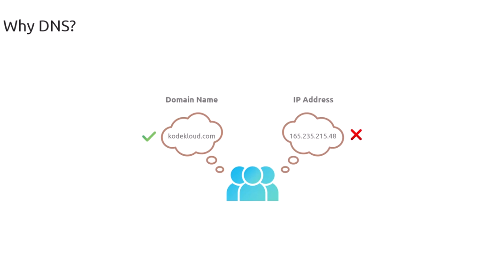

# Why DNS
- DNS is the phonebook of the internet. Humans access information online through domain names, like nytimes.com or espn.com. Web browsers interact through Internet Protocol (IP) addresses. DNS translates domain names to IP addresses so browsers can load Internet resources.
- Each device connected to the Internet has a unique IP address which other machines use to find the device. DNS servers eliminate the need for humans to memorize IP addresses.

  
  
  

Thanks to the DNS, we can use domain names to communicate with computers or their services.

  
Why Can't we Just use IP address instead of domain names?
The simplest reason is that for most humans, it's easier to remember a domain name than remembering an IP address.
  
But There are a couple of technical reasons behind the importance of DNS:
1. **Infracstructure Migration:** One quick example is infrastructure migration. Imagine you come from work, ready to continue your favorite show on Netflix, but instead of simply typing netflix.com in your browser, you'd have to remember the IP address of the site. Then one day, the Netflix folks perform an infrastructure migration, and the IP address of the infrastructure hosting the site changes, rendering you unable to access Netflix that evening. That is, until you figure out what the correct and updated IP address is. Certainly, it would be a nightmare to keep track of these changing numbers for every website you visit, right?  
  
  

2. **Internet is Complex:**
The second technical reason is that the `internet is complex`. Often, when learning DNS, you'll hear or read an explanation, such as, the DNS translates a domain name into the IP of a computer hosting a service, but more often than not, there won't be such a thing as having a single IP for a computer hosting a service. This is because the internet relies on complex architectures, such as **content delivery networks** and **DNS systems**, to keep systems performant and well distributed globally, which means there could be dozens or even hundreds of IP addresses that turn out to be the IP address on duty that serves a given service. Just for this reason alone, using IP addresses is definitely not a great idea. And just to keep 
stacking reasons why DNS is so useful and important, we have that IPv6 addresses are even more difficult to remember, Instead of memorizing numbers, we use domain names to access the internet. Lets look at our earlier example, kodekloud.com.

  
  
  
  
  
## DNS Queries:

#### DNS Resolution process in two different programs:
1. On Browser:
2. DIG Command:

**On Browser:**
  
In the above image, I found this one and we see that there's a portion that says **remote address**, and then we have an IPv6 address that is responding on port 443. This IPv6 is what's known as a **AAAA record**.  

Let's see how we can match this information that the browser is giving us by going to the terminal and trying to get the same result. So now, I'm going here to my terminal, and then I'm going to type `dig kodekloud.com`, and you can see that we have three different IP addresses.  
  

***This means that any of these three IP addresses is capable of serving KodeKloud.com***. 

Now, as you can see, the IP addresses are *version 4*. So, the response that I'm getting is the same as if I was doing `dig KodeKloud.com A`.  
  

You can see that it's the same thing.  
Now, if I happen to do `dig kodekloud.com AAAA`, you'll see that it gives us the IPv6 IP addresses that are the equivalent of the above 3 IP addresses(IPv4) that we got. 
  

we can see that the browser is using the IPv4 `104.26.11.250:443` address to connect to the website and `dig KodeKloud.com A` shows us also `104.26.11.250:443` address.  

The gist of this video is to understand that a domain name can be translated into an A record, otherwise known as an IPv4 IP address, or a AAAA record, which is an IPv6 IP address. Now, if you notice, my browser automatically responded to the IP address in an IPv6 format. This is customizable depending on your resolver, your operating system configuration, or your browser configuration. If any of this is confusing, don't worry. We will go over record types and all the other stuff that we saw in this video as we progress with the course. I just thought it would be a good idea to give an early exposure on how the DNS resolution process happens from two different perspectives.

## Terminology:
The purpose is to define some concepts around domain names. Here we will discuss domain names, URLs and email address and how they are related to each other. 
  

First give an analogy to understand that it will help us to understand these concept better:  
Think of a domain name like a piece of land that you own for a fixed period of time. When you register a domain, like KodeKloud.com, you are essentially buying your own piece of internet real estate for a fixed period of time.  
  

This domain name becomes your base identity on the internet. Now, here's where it gets interesting. When you type KodeKloud.com in your browser, what happens there is that you type a domain name, and given how there's a web server exposing this service, your browser translates this into a URL.  
  

The distinction between a URL and a domain name is important because domain names not only serve web applications, they also serve other types of services like emails, for example. And this is all possible, thanks to the DNS and the existence of domain names. A URL can be identified by the presence of the HTTP prefix and an email by the presence of the @ symbol. 
  

Another interesting perspective on this topic is how, within organizations, such as KodeKloud, for example, servers may be given hostnames, like webserver01.
   

And when you combine this hostname with the organization's domain name, you get what we call a Fully Qualified Domain Name, or FQDN, which in this case will be `webserver01.kodekloud.com`.  
   

You may also notice that many websites use `www`, like in www.kodekloud.com. This *www* is actually a subdomain that is traditionally used to indicate that a web service is being exposed, though it is not required for websites to work. 
  

So breaking down these concepts, a domain name is your base identity on the Internet. It's like a piece of land that you buy or rent.  
  

From this domain name, you can host multiple different services. All these different services, web, email and other can exist on the same domain name. 
  

So owning a public domain name gives you the ability to create services and expose them where people will be able to use them by referencing your domain name. Just like you build different things, like offices or apartments on the same piece of land, the DNS helps direct traffic to the right service, web, email, and all that, based on how you're trying to use the domain name. And we'll learn more about that as we progress through the course. 