# Why DNS
- DNS is the phonebook of the internet. Humans access information online through domain names, like nytimes.com or espn.com. Web browsers interact through Internet Protocol (IP) addresses. DNS translates domain names to IP addresses so browsers can load Internet resources.
- Each device connected to the Internet has a unique IP address which other machines use to find the device. DNS servers eliminate the need for humans to memorize IP addresses.

  
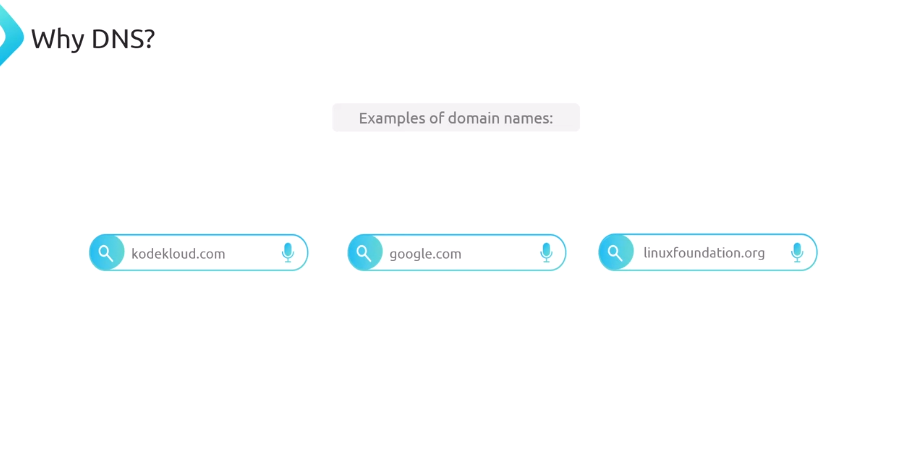  
  

Thanks to the DNS, we can use domain names to communicate with computers or their services.

  
Why Can't we Just use IP address instead of domain names?
The simplest reason is that for most humans, it's easier to remember a domain name than remembering an IP address.
  
But There are a couple of technical reasons behind the importance of DNS:
1. **Infracstructure Migration:** One quick example is infrastructure migration. Imagine you come from work, ready to continue your favorite show on Netflix, but instead of simply typing netflix.com in your browser, you'd have to remember the IP address of the site. Then one day, the Netflix folks perform an infrastructure migration, and the IP address of the infrastructure hosting the site changes, rendering you unable to access Netflix that evening. That is, until you figure out what the correct and updated IP address is. Certainly, it would be a nightmare to keep track of these changing numbers for every website you visit, right?  
  
  

2. **Internet is Complex:**
The second technical reason is that the `internet is complex`. Often, when learning DNS, you'll hear or read an explanation, such as, the DNS translates a domain name into the IP of a computer hosting a service, but more often than not, there won't be such a thing as having a single IP for a computer hosting a service. This is because the internet relies on complex architectures, such as **content delivery networks** and **DNS systems**, to keep systems performant and well distributed globally, which means there could be dozens or even hundreds of IP addresses that turn out to be the IP address on duty that serves a given service. Just for this reason alone, using IP addresses is definitely not a great idea. And just to keep 
stacking reasons why DNS is so useful and important, we have that IPv6 addresses are even more difficult to remember, Instead of memorizing numbers, we use domain names to access the internet. Lets look at our earlier example, kodekloud.com.

  
  
  
  
  
## DNS Queries:

#### DNS Resolution process in two different programs:
1. On Browser:
2. DIG Command:

**On Browser:**
  
In the above image, I found this one and we see that there's a portion that says **remote address**, and then we have an IPv6 address that is responding on port 443. This IPv6 is what's known as a **AAAA record**.  

Let's see how we can match this information that the browser is giving us by going to the terminal and trying to get the same result. So now, I'm going here to my terminal, and then I'm going to type `dig kodekloud.com`, and you can see that we have three different IP addresses.  
  

***This means that any of these three IP addresses is capable of serving KodeKloud.com***. 

Now, as you can see, the IP addresses are *version 4*. So, the response that I'm getting is the same as if I was doing `dig KodeKloud.com A`.  
  

You can see that it's the same thing.  
Now, if I happen to do `dig kodekloud.com AAAA`, you'll see that it gives us the IPv6 IP addresses that are the equivalent of the above 3 IP addresses(IPv4) that we got. 
  

we can see that the browser is using the IPv4 `104.26.11.250:443` address to connect to the website and `dig KodeKloud.com A` shows us also `104.26.11.250:443` address.  

The gist of this video is to understand that a domain name can be translated into an A record, otherwise known as an IPv4 IP address, or a AAAA record, which is an IPv6 IP address. Now, if you notice, my browser automatically responded to the IP address in an IPv6 format. This is customizable depending on your resolver, your operating system configuration, or your browser configuration. If any of this is confusing, don't worry. We will go over record types and all the other stuff that we saw in this video as we progress with the course. I just thought it would be a good idea to give an early exposure on how the DNS resolution process happens from two different perspectives.

## Terminology:
The purpose is to define some concepts around domain names. Here we will discuss domain names, URLs and email address and how they are related to each other. 
  

First give an analogy to understand that it will help us to understand these concept better:  
Think of a domain name like a piece of land that you own for a fixed period of time. When you register a domain, like KodeKloud.com, you are essentially buying your own piece of internet real estate for a fixed period of time.  
  

This domain name becomes your base identity on the internet. Now, here's where it gets interesting. When you type KodeKloud.com in your browser, what happens there is that you type a domain name, and given how there's a web server exposing this service, your browser translates this into a URL.  
  

The distinction between a URL and a domain name is important because domain names not only serve web applications, they also serve other types of services like emails, for example. And this is all possible, thanks to the DNS and the existence of domain names. A URL can be identified by the presence of the HTTP prefix and an email by the presence of the @ symbol. 
  

Another interesting perspective on this topic is how, within organizations, such as KodeKloud, for example, servers may be given hostnames, like webserver01.
   

And when you combine this hostname with the organization's domain name, you get what we call a Fully Qualified Domain Name, or FQDN, which in this case will be `webserver01.kodekloud.com`.  
   

You may also notice that many websites use `www`, like in www.kodekloud.com. This *www* is actually a subdomain that is traditionally used to indicate that a web service is being exposed, though it is not required for websites to work. 
  

So breaking down these concepts, a domain name is your base identity on the Internet. It's like a piece of land that you buy or rent.  
  

From this domain name, you can host multiple different services. All these different services, web, email and other can exist on the same domain name. 
  

So owning a public domain name gives you the ability to create services and expose them where people will be able to use them by referencing your domain name. Just like you build different things, like offices or apartments on the same piece of land, the DNS helps direct traffic to the right service, web, email, and all that, based on how you're trying to use the domain name. And we'll learn more about that as we progress through the course. 

## Domain Name Anatomy:
Domain names are written in this particular format of having words separated by dots to create a clear separation of ownership and responsibility. To understand why domain names use this format, we will use the analogy that compares owning a domain name and owning a piece of land.  
  

First let's understand that domain names are read from right to left, with the rightmost part, like `.com`, being the least specific. This means that when you see a domain name like `kodeKloud.com`, you should think of it as KodeKloud being registered on a huge piece of land called com. 
  

In this analogy, com is a large piece of land that can be subdivided into smaller lands. Think of this as if organizations could rent portions of this land to create their own services, just like registering a domain name with the *`.com`* suffix.  
  
The domain registration process also works as a subdivision, where the owners of the com domain effectively say, we will make you responsible for this domain, as long as you are the owner. Think of this as if a piece of land was assigned to a company, individual or organization.  
  

To keep the domain, they need to pay an annual registration fee through a registrar company capable of fixing all the legal documents for both parties. So following the analogy, when `kodekloud.com` was registered,  
  

a subdivision of the `com land` was given to KodeKloud that they now maintain. This maintenance responsibility gives KodeKloud the authority to create services that can be referenced by using the `kodekloud.com` domain. But not all domains are registered under com, though.

Take linuxfoundation.org, for example. In their registration process, they went to a different land altogether, one with the name of org. They requested org to subdivide a portion of its huge landmass so they could be responsible for it and build their services there. 
  

As a matter of fact, the DNS can be represented by looking at it as an inverted tree. 
  

From now on, I am going to start using this model and hopefully, we can go over the land leasing analogy to try to make sense of it from this tree perspective.  

Let's first talk about the DNS tree by starting at the top. At the top of the DNS tree, we have something called the `root zone`. The root zone is like a central real estate agency that keeps track of all of the huge lands out there, in other words, the rightmost part of a domain name. 
  
These huge territories in our analogy are called top-level domains. This includes common suffixes used for websites such as .com, .org, .net, .io, and others. 
  
Then, below the top-level domains, we have what's known as a second-level domain, with examples such as `linuxfoundation.org` and `kodekloud.com`  
  

Now, in this analogy, we've mentioned so far how the authority of using `KodeKloud.com` domain was given to KodeKloud as an organization by requesting `com` to create a subdivision of their land, so KodeKloud could own the domain and build the services they wanted on this domain, right?  
  

But now, getting a bit technical here, what happens in reality is that KodeKloud went through a domain registration process and when they picked the domain name `kodekloud.com` They probably registered the domain through a company that offers domain registration services such as godaddy.com, Cloudflare, or others.  
  

The domain registration companies are also known as registrars. So in this example, the registrar checked if the domain was available, which it was, I assume. Since the domain ends with com, then a petition to an organization called `Verisign` is made asking them to hand over the ownership and responsibilities, for `KodeKloud.com`. `Verisign` is the organization responsible for .com, and this process of handing over the ownership is what we call delegation of authority. The delegation of authority creates what’s known as a zone, giving KodeKloud control over their domain. But why exactly is Verisign being requested to delegate the authority to KodeKloud and what does this mean?  
  

Well, without delegation of authority, all domains ending in .com would remain under Verisign’s control. Think about it this way. In our land ownership analogy, there's this huge land called .com. When an organization, individual, or company wants to register a domain name, they're asking for their own piece of this land. Without this subdivision process, the entire land would remain as com, meaning Verisign would maintain control over all the non-subdivided portions.  
  

When these subdivisions happen, they create what you see in the DNS Tree diagram displayed on the screen, where we have multiple levels of ownership. Each level on the tree represents a `zone`. A zone is similar to the land being owned. 

  

The domains and subdomains are similar to erecting buildings with different types of functions such as offices, apartments, and more.  
  

In the case of KodeKloud, a subdomain that you may be familiar with is ``engineer.kodekloud.com``. This subdomain is still part of the kodekloud.com zone.  
  

and because of this, KodeKloud could continue to add more subdomains to it, like `example1.engineer.kodekloud.com` and `example2.engineer.kodekloud.com` while still being the owners. 
  
And similarly, `linuxfoundation.org` has subdomains in this same zone, such as `training.linuxfoundation.org`. 
  

Where I'm trying to go here, is that the same rule applies to the top-level domains. The org top-level domain, which is managed by the Public Interest Registry (PIR), and the com top-level domain, which is managed by VeriSign, could create multiple subdomains such as whatever.com or something.org while still being on the same zone, meaning they'd keep full ownership of these domains.  
  

However, this doesn't generally happen, though, as organizations in charge of top-level domains take their role seriously Instead, their primary focus is probably on maintaining their registries and making domains available for organizations, individuals, or companies that wish to register them through authorized registrars.  
  

But let’s tease our brains a little by thinking about what would happen in the fictitious case that KodeKloud decided to sell the `engineer.kodekloud.com` services to another company, but they chose to keep the same ``engineer.kodekloud.com`` domain name.  
  

kodekloud.com and `engineer.kodekloud.com` both belong to the same zone right now, and this can be proven by using the `dig` command to both kodekloud.com domain and to its subdomain `engineer.kodekloud.com`. We can see in the output shown on the screen how both respond with the same set of `A` records, indicating they're in the same zone.  
  

If KodeKloud wished to split the services into two different companies, what would happen here is that `engineer.kodekloud.com` would go through a delegation of authority process so that it'd begin to exist in a new zone similar to the animation shown on the screen.  
  

We will learn the technicalities behind a delegation of authority in another section. For now, just think about it as the process of how a subdomain would be transferred to a new zone.  

Now, I want you to observe how by doing the same dig command to `linuxfoundation.org` and `traning.linuxfoundation.org`, its not immediately visible whether they are in the same zone or not, as both DNS queries may return a different set of `A` records IP Address in the reponse.  
   
We will show a demo that how to safely determine if nested subdomains belong to the same zone or not.  

## The Root Zone:
We are representing the DNS using a diagram of an inverted tree that starts at the Root Zone. 
  
The Root Zone is shown as a dot(.) in the diagram because every domain name actually ends with a dot, even if you cannot see it. You can test this yourself. Try typing a domain name in your browser with a dot at the end, like `youtube.com.` or `wikipedia.org.` and it should resolve just fine. So the dot that represents the root zone is always implicitly part of the domain names, even when we don’t explicitly type it in. 

You can also test this with the dig command. Whether you include the dot or not at the end of a domain name, you will get the same result, as shown in the animation on screen.  
  

The root zone can also be queried by simply typing dig space dot, as demonstrated on the output shown on the screen. 
But what is a root zone and why does it matter?  
  
To understand the root zone, remember what we learned earlier. Domain names are read from right to left, where the rightmost part is the most general. and the leftmost part is the most specific.  
  

DNS queries work the same way. When you look up a domain name, the DNS starts reading from the right side beginning at the Root Zone, then moving to the Top-Level Domain, and so on until it reaches the left-most part of the domain name. Let's use our land analogy to make this clearer.  
 
Remember how we said a domain name like `kodeKloud.com` is like a piece of land within the larger territory of .com, and linuxfoundation.org is like a piece of land within .org. So where does the root zone fit in this picture?  
  

Well, you could say that the root zone is planet Earth or something, because all domain names are a subdivision of planet Earth, which means all possible pieces of land have a relationship with the root zone. I hope you can see how saying that domain names go from least specific on the far right to most specific on the far left matches perfectly with our earth analogy.  
   

For example, looking up facebook.com, a DNS query starts on the Root Zone, then it looks for the Top Level Domain called com, and finally finds a specific area called facebook.  
  
  
  

In technical terms, this means that the root zone needs to know how to find any top-level domain in the world.  
  

Remember we've said in previous lectures that zones in the DNS are a way to delegate authority and responsibility of domain names to an organization, individual, or company, and how VeriSign was responsible for the com top-level domain and all that? Well, the root zone is no exception to this rule. The root zone is managed by **IANA**, which is the Internet Assigned Numbers Authority, and it operates under **ICANN**, Internet Corporation for Assigned Names and Numbers. 
  

Think of ICANN like a global organization that makes sure the internet's naming system works smoothly for everyone. Since the root zone is at the very top, it makes sense that it needs a global organization to manage it. IANA’s job is to keep track of all the top-level domains and make sure that the root zone data is accurate and secure. It’s like having a central authority that everyone trusts to maintain Earth’s address book. 
  

Let me show you how this works in a simple way. Just keep in mind that we’ll cover all the technical details about DNS systems and infrastructure in a later section. From this tree-like diagram, you can think about the DNS like a system that assigns servers that act as a database-like system to each zone that exists in the DNS. These servers that act as databases for each zone are called **name servers**. The name is quite literal. They’re servers that contain information about domain names that belong to their zone.  
  

In the animation displayed on the screen, we have a representation of how this database can be thought about, so you create a mental map for this. Think of it as a simple system where each name server `stores key-value pairs` like this a.gtld-servers.net pointing to 192.5.6.30. This same database-like information is copied to all root zone name servers, ensuring they all have the same information.  
  
  
  
  
Now, elaborating more on the purpose of name servers, remember our land analogy? If the root zone is planet Earth, then name servers are like information offices that know about different pieces of land. When you ask a root name server about facebook.com, it's like asking, where can I find information about this land called com?  
  

And the root name server will point you to the specific name servers that know about all the lands within com.  
  

The root zone name servers have key-value pair entries similar to the table displayed on the screen. These entries help resolve any top-level domain by providing the IP address of the name servers for the next domain in the resolution chain.  
  

An IP address is ultimately needed because it gives the exact location. Think of it like providing exact coordinates instead of just a name. 
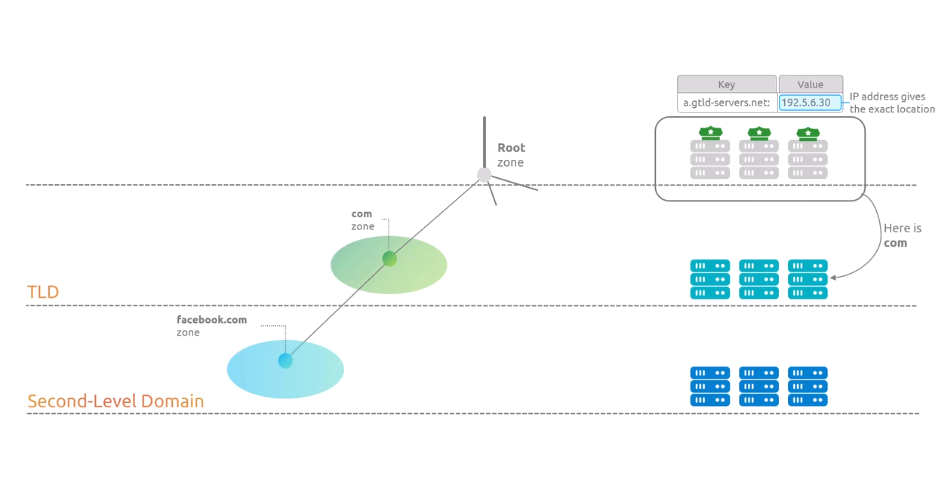  

We can see the name servers associated with a zone by using the dig command. When we type `dig . NS`, where NS stands for name servers, we're basically asking, Hey, which name servers are responsible for the root zone? The response shows that there are 13 of these root name servers labeled from A to M.  
  

By the way, the reason why it’s 13 name servers, it's because that was the maximum number of name servers that could fit into a single 512-byte UDP packet. We'll dive deeper into this when we cover the DNS protocol section.   

So DNS resolution is like a game where you can only ask for information about a zone by consulting its parent zone's name servers. 
  

This is why all DNS queries begin from the root zone. You have to start at the top and work your way down, one zone at a time. So this explains the importance of the root zone. Its name servers know how to direct you to any top-level domain in the world. They don’t need to know about facebook.com specifically. They just need to know which name servers are responsible for the com domains in this example.
  

## Top-Level Domain:
Now that we understand the Root Zone better, let's talk about another fundamental part of the DNS, Top-Level Domains, or TLDs for short. 

We have been comparing top-level domains as big territories on earth; however, top-level domains also have different classifications within themselves that are worth talking about so you understand the DNS better.  
  

I want to focus on **two** of what I believe are the most important top-level domain classifications.

First, we have what we call *generic top-level domains*, or **gTLDs**, such as com, io, net, org, ai, etc. Think of this like international territories that anyone from any country can use. 
  

Then we have *country-code top-level domains*, often abbreviated as **ccTLDs**. These are the two-letter-long labels I'm sure you've seen, which are used to represent specific countries, making it possible to create country-specific versions of services and websites. For example, Amazon has `amazon.com.mx` for its Mexican service.
  
  

Government agencies use their country codes for official websites, and many local services choose their country code domains to indicate they operate specifically in that country.

#### Generic TLDs (gTLDs)
Ok, so let's begin talking about generic top-level domains. Unlike country-code top-level domains that are used for country-specific services, generic top-level domains are commonly used to serve users globally. The best examples are services like youtube.com, google.com, netflix.com, and of course, kodeKloud.com, which use their .com domains to reach users worldwide, regardless of what country they’re in. 
  

The most popular generic TLD is `com`, which was originally meant for commercial organizations, but is now used by pretty much anyone who wants a broad presence on the internet. Others like `org`, which was originally for non-profit organizations, and `net`, for network providers are also widely used. Although these days, the original purpose of each TLD isn't strictly enforced. However,   
  

There is an interesting exception that applies to many United states based Services. Some organzations that originated in the United States often use .com for their US-specific services rather than using .us. Amazon is a perfect example. 
  

Amazon.com primarily serves US customers, while they create specific domains for other countries as is the example I talked about of `amazon.com.mx` for Mexico. 
  

This is partly because historically, many US organizations didn't adopt the US domain like other countries did with their country codes.

The United States is also unique in that they use the `.gov` Top-Level Domain exclusively for its government, while most other countries use their country code TLD for government services which we'll talk about more when we cover country code TLDs.  

The list of generic top-level domains isn't short of just the samples we have displayed on screen. As of 2024, there are over 1,500 of them. Now, we have talked about how registering a domain name, such as kodekloud.com, is like subdividing a piece of the `com` land and how this is a process that happens when a registrar, in other words, a company in charge of providing domain registration services, checks if the desired domain is available for registration, and then it requests com to delegate the authority of `kodekloud.com` to KodeKloud, right?  
  
  

And then we talked about how the Root Zone is the highest level of the DNS hierarchy, containing information about all Top-Level Domains, which is crucial for the DNS resolution process.  
  

Well, theoretically, the generic top-level domains are also domains. So can we just create a domain directly as a subdomain of the root zone, such as `somedomain.`?
  

Well, *the truth is that this is not possible*. First off, because registering a generic top-level domain requires a specific process, you have to pay an application fee of about $185,000 to apply for creating a new top-level domain. And these applications go through IANA, which oversees the approval process. These processes happen in rounds, with the last one being in 2012, according to the information from the website displayed on the screen. 
  
One interesting thing about top-level domains is that some of them support what we call internationalized domain names, or IDNs.

Ever wondered why domain names seem limited in their characters? Well, original DNS was designed to work strictly with ASCII characters, which means standard English alphabet letters. So by default, a domain name only allows characters from A to Z, numbers from 0 to 9, and hyphens.But the hyphen can't be used at the start or end of a label. Domain names are case insensitive, by the way.Now each label in a domain name can be up to 63 characters long, with the total domain name limited to 253 characters.  
  

But the internet is global, right? That's where IDNs come in. Today many top-level domains like com, org, and info allow registration using different writing systems like Arabic, Chinese, or Japanese characters. These get converted into ASCII using a special encoding called Punycode, as in the animation displayed on the screen. 
  

 On screen we have a sample of a German U with two dots above it, and how it gets converted into regular ASCII characters on the right. 
      
 

 **ccTLDs**
 Now let’s talk about country code top-level domains. Unlike generic top-level domains that require a complex application process that happens very infrequently and costs hundreds of thousands of dollars, creating a country code top-level domain, otherwise known as ccTLD, would require you to create your own country and get it officially recognized by some global organization. 
 
 
Living hypothetical scenarios aside, country code top-level domains are always two characters long and each country gets to decide how their country code top-level domain works and where people can register domain names within it. Now understanding country code top-level domains is very important when adhering to the idea that a zone represents authority and responsibility, because they actually make this concept more complex.  
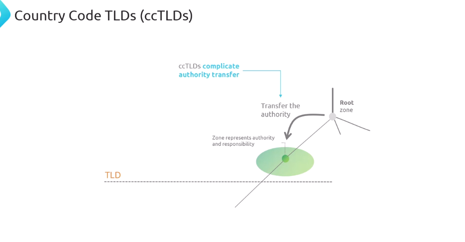  

With generic top-level domains like com, org, or io, it's straightforward. Domains with a simple top-level domain like kodekloud.com can be easily represented in its own zone under the com zone, because it is very straightforward that the com top-level domain had to be subdivided as in the land analogy. But with country code top-level domains, things get trickier.  
  

To explain this, let’s look at a portion of the public suffix list at publicsuffix.org, which is, in other words, a list that documents how different TLDs structure their domain names and where public registration is allowed.

Let’s examine Hong Kong’s country code top-level domain as an example. Their country code is HK, and all these domains below HK, such as com.hk, edu.hk, and gov.hk belong to the same zone, even though they have different labels to their left.  
  

This example shows how a country can organize its namespaces as each country gets to make its own rules. 
  

Some may allow direct registration under their ccTLD, while others may only allow registration after, say for example, `com.hk`.
 
  

For example, Hong Kong allows registration both directly under the HK label, as we can see when querying domain.hk, which, at the moment of recording this video, resolves to an existing domain. But we also have `amazon.com.hk`, for which `com.hk` is represented in the same hk zone, with `amazon.com.hk` being only a zone below hk, as seen in the diagram shown on the screen.
  

So public suffixes are essentially like a checkpoint in a domain where public registration begins to be allowed. It helps define where one registrant's control ends, and another's begins. The public suffix list documents these registration boundaries for different generic top-level domains and country code top-level domains around the world. 
  
The United Kingdom follows a similar pattern with its ccTLD, but with a key difference. While Hong Kong allows registration of domains directly under their two-character label, and the majority of the countries do, I believe, the UK doesn't allow registration directly under UK. Instead, domains must be registered under specific categories that are all part of the UK zone, such as co.uk for companies, ac.uk for academic institutions, and org.uk for organizations.  
  

Now, country code top-level domains can be queried using dig. A quick example is dig.jp, which will display information about Japan’s country code top-level domain. 
  

Some specific cases like Mexico's MX or India's in require you to add a dot at the end. Why? Because without the dot, dig might interpret this differently. For example, MX by itself looks like you're asking about email servers or MX records, and IN is interpreted as the Internet class of DNS records, in both cases resulting in a query to the root zone instead of the intended ccTLD.  
  

Adding the dot explicitly tells dig that you're querying a country code top-level domain and not just a DNS record type. We will learn more about these and other record types throughout the course. Remember that we've already seen the NS record type when learning about the Root Zone when we used `dig . NS`. Keep this in mind when trying the examples of querying MX and IN TLDs to understand what I'm talking about.  
  
 
All these top-level domains, whether generic or country code, need someone to manage them. Remember how we talked about IANA managing the Root Zone? Well, each Top-Level Domain has its own manager too. For example, Verisign manages .com, and each country typically has an organization that manages their country code Top-Level Domain. 
  

Each top-level domain gets to set their own rules and prices for registering domain names. For example, some top-level domains might be really cheap, like .com domains costing around $10 to $15 a year, while others might be super expensive, costing hundreds or even thousands of dollars. It all depends on what that top-level domain's manager decides.  

Now besides generic and country code top-level domains, there are some special categories of top-level domains that serve specific purposes.  
  

*First we have infrastructure top-level domains. The main example is .ARPA, which is used for managing Internet infrastructure. You won't register domains under ARPA. It's reserved for technical purposes that help the internet work. We'll see more about ARPA when we talk about reverse DNS lookups later in this course.*  

But to give a quick overview, when you see something like this `1.0.0.127.in-addr.arpa`, you can assume that this domain name is used for what we call *reverse DNS lookups*. 
  

You can also do the opposite. You can try this by using dig and the -x flag, followed by an IP address.

For example, the command on the screen will perform a reverse DNS lookup for that IP address. What's interesting is that behind the scenes, this command actually queries the in-addr.ARPA zone. But why do we need the ARPA for this? Well, IP addresses and domain names work in opposite directions.  
  

Domain names are read from right to left, like we learned earlier. But IP addresses are typically read from left to right. To make reverse DNS lookups work within the DNS system, IP addresses need to be reversed and have the in-addr.ARPA added at the end.  
  

So when you do dig -x 127.0.0.1, dig automatically converts this into a query for 1.0.0.127.in-addr.arpa. Each number in the IP becomes a label in this special domain name, but in reverse order. 
  

This way, the DNS system can handle IP lookups just like it handles regular domain name queries. This is just one way .ARPA helps manage internet infrastructure. And we will dive deeper into reverse DNS lookups and see exactly how these queries work in another section. But I wanted to give you this overview to understand why infrastructure top-level domains like ARPA are important. Then we have restricted top-level domains, also called generic restricted top-level domains or gTLDs. These are like regular generic top-level domains but with strict rules about who can register domains under them. For example, edu was originally restricted to US educational institutions and mil is exclusively for the United States military.  
  

We also have sponsored TLDs and these are specialized TLDs that have sponsored communities, for example .museum for museums or .post for postal services.  
  

Finally we have test top-level domains which are specifically reserved for testing purposes. The main one you might see is .test which is never used in the real DNS system but it's reserved so developers can safely test DNS-related software without risking conflicts with real domain names.

## Domain and Zones
Before we progress further in the course, I want to make sure that everyone watching can confidently determine if two or more domains belong to the same zone or if they are in different zones. 
  

So far in this course, we've used some analogies comparing domains to pieces of land. We've talked about how registering a new domain name such as KodeKloud.com is similar to getting a piece of land that's part of a larger territory named com.

It's important to highlight that the name of your piece of land will always include in its name, the name of the larger territory that it's part of. 
  

That's why we say kodekloud.com. When you own this piece of land, in other words, your domain, you can build different things in it, like how KodeKloud has built their website, their lab service, and the KodeKloud engineer platform. 
  

It's like having a piece of land where you can build different offices, classrooms, apartments, etc. What I want you to imagine is that, in this analogy, paying for this piece of land that you divide from .com is akin to the act of creating a new zone, in other words, a space where you have the authority over what gets built in there.  
  

Remember that zones are meant to represent authority or ownership that an organization, company, or individual has over a domain name. At first glance, the zone concept may seem pretty straightforward.  
  

You may look at a domain name like `mail.google.com`, separate each label, and quickly assume that each label represents a zone. 

Following this intuition, you might think that this domain name involves these zones, the Root Zone, com zone, and google zone, with mail being part of google.com zone. With this particular example, you'd be correct, but there's a problem with this approach. We're basically relying on our familiarity with Google as a company to guess that google.com is a main domain, and therefore mail must be part of the Google zone. But what happens when we don't know the company, or when the structure isn’t so obvious? This becomes even trickier when we look at country code top-level domains which we learned about in our previous lecture.  

  

Remember how we discussed that some country codes can actually use two labels? Let's look at the example shown on screen. 
  

In Hong Kong's case, the hk country code TLD can also use com.hk, edu.hk, and other public suffixes. How can we represent a zone structure for a domain like yahoo.com.hk?  

Looking at this domain name, we might be tempted to think that the zone structure is formed simply by going from right to left, where we would have the root zone, 
  
and then the HK zone, 
  
and then com.hk zone, 
  
and finally the yahoo.com.hk zone. 
  
But this is incorrect. 
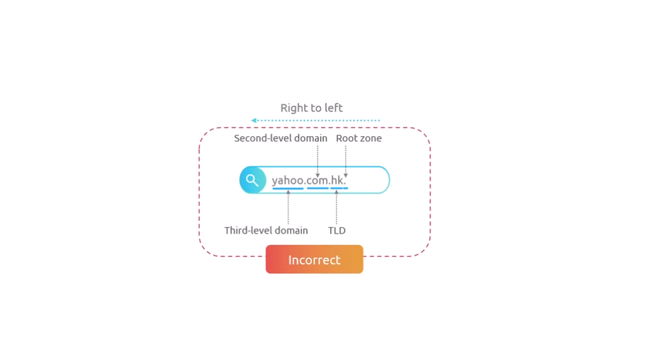  

Remember from our previous lecture that com.hk together forms a single zone. So, to help us solve this problem properly, we first have to be very clear about the different ways we can refer to parts of a domain name. In this course, we've used terms like top-level domain, second-level domain, third- and fourth-level domains, and also subdomains, and so on. 
  

And I want to explain these as I feel, this would make the process of understanding zones much easier. Let's look at this from two different perspectives, what I call the **absolute perspective** and the **relative perspective**.

In the absolute perspective, we always count from right to left, starting from the Root Zone. In the domain name shown on the screen, moving from right to left, we have the Top-Level Domain, the second-level domain, the third-level domain, and so on.  
  

But there's also a relative perspective, which changes depending on where we're looking from. In the animation shown on the screen, if we start from example.com, then `test.example.com` would be the subdomain of `example.com`. And if we move our position to `test.example.com`, then `dev.test.example.com` would be the subdomain of `test.example.com`. So from this relative perspective, we also have the *domain apex*, or what some people call the naked domain.  
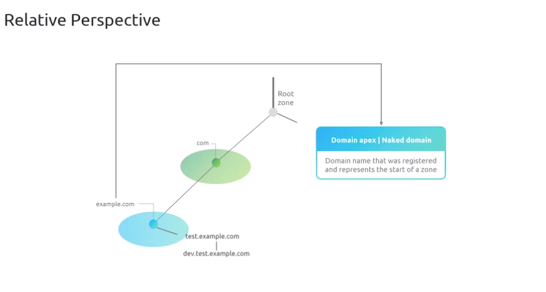  
This is the actual domain name that was registered and represents the start of a zone. Think of it as a main domain that everything else in the zone branches off from.

So going to the `yahoo.com.hk` zone structure, in the tree diagram shown on the screen, I'm showing what many would assume the zones look like. Where we started the Root Zone, then we have an hk zone, then a com zone, and finally, what would be the domain apex of yahoo.com.hk.  

But this assumption about how the zones are structured would be incorrect, like we mentioned previously. This second diagram shows how these zones are actually structured. 

Notice how com.hk global top-level domain is treated as a single unit in the zone hierarchy, with yahoo.com.hk being the domain apex of its zone.

The difference between these two diagrams highlights why we can't just rely on counting labels from right to left to understand zone structures.  
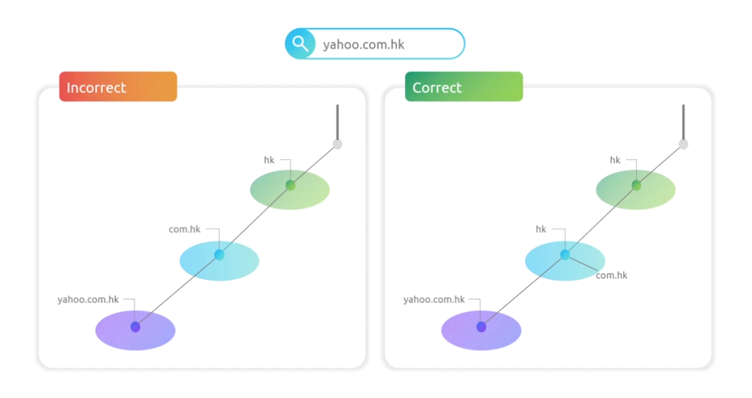  

This can be proven by using a `dig` command with a +trace option against the yahoo.com.hk domain. 
  

Okay, so running the dig command with the +trace option to a domain name, like I'm doing here, will give you a simulation of what happens in the DNS resolution process.
Open Terminal and type `dig +trace yahoo.com.hk` and hit enter.  

we will get lots of information from here.  
we will get the Root Zone name servers: 
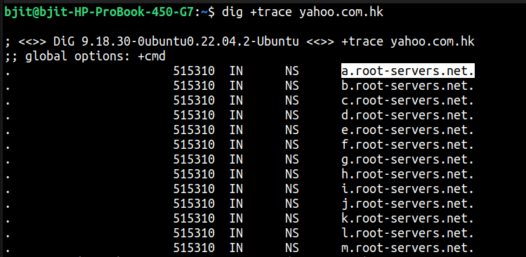  

Then we will get Top level Domain Name server: 
  

Then we have who gave us the information: 
  
  

So this essentially proves that `com.hk` is basically a subdomain of the hk top-level domain. Now, I just mentioned that the `dig + trace` command is a simulation of what happens in the DNS resolution process. And I’m saving this explanation for the next section when we are talking about the DNS infrastructure and its intricacies. 

Okay, so moving on, I’m going to show you a domain that I own that I registered on Route 53 on where I actually registered a subdomain. And then I hosted the subdomain in a different zone. So you can see how it looks like in the cloud and also in `dig`. I have my primary AWS account. So if I go to Route 53, you can see that I have one hosted zone. And this is my domain name, jcroyolaun.io. When I click on this, you can see that I have the NS Records for the apex of the domain, which is jcroyolaun.io. And then I have the Start of Authority record, which indicates that this is the beginning of a zone. And then I also have a subdomain.  
  

But you can see that the name servers are different, right?   
  

These ones are like 171.9. And we don't have that one right here. And so, yeah, you can do the work and see that they're actually different. So `jcroyolaun.io` and `staging.jcroyolaun.io` are different. 
  
And this is actually the other account where I have the staging hosted zone. And so what I did was that I created this zone. 
  

 And then it has different name servers, as you can see, and also a different start of authority. So you can see that this start of authority (SOA) indicates that there is a primary name server for resolving DNS requests for this particular domain. Now, if any of this is a little confusing, this is one of those things that we are going to explain more in depth in the next section. So just follow along and hopefully everything will be clear by then. All right, so I'm going to go back to the terminal. And then I'm going to show you that if I do `dig +trace jcroyolaun.io`, and you'll see that in this case we have the Root Zone and then the IO zone.

  

Example: 
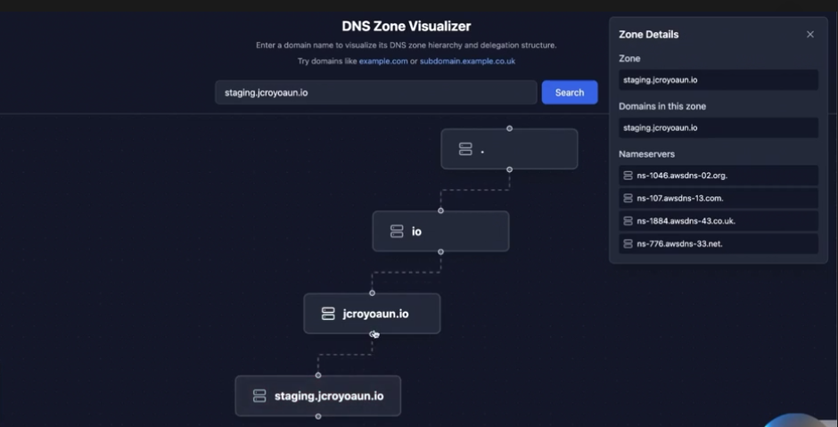  
KodeKloud.com decided to migrate the engineering service to a different company, but they want to keep the same domain. What they would do is basically do this process of delegation of authority so that the `engineer.kodekloud.com` would end up being in its own separate zone. 
  
So you can see here, if I type it in, it is not in a different zone, right? It’s in the same zone as KodeKloud.com, same as labs and so on and so forth. For them to be in different zones, just to finalize this demo lecture, I want to show you what the process would be, at least from the Route 53 perspective. What they would need to do is like right now, they probably have the `engineer.kodekloud.com` as a subdomain record. And then they’ll probably have some A records pointing to it. Yeah, so it’ll be something similar to this just to play around with it. They’ll have something like engineer@kodekloud.com. I’m obviously not going to save this right now, but it’ll be like adding an A record and then they’ll be basically pointing. 

## DNS as a System:

## DNS - System or Protocol?
DNS is not only a System but also a Protocol. Translating domain names into IP addresses happens through a complex process involving servers placed around the world working together in a hierarchical structure. The DNS as a protocol is about the rules for making a DNS query. It covers the format of the DNS request and the format of the response as well, and it relies on the DNS infrastructure to be in place.  
  

## DNS - a Distributed System

A system can be defined as a collection of interconnected elements working together with a purpose. An example of a system is an ecosystem, where living and non-living things interact. Nature maintains balance and life persists. 
  

In the domain name system, we have different types of servers and infrastructure pieces interacting, thanks to which the translation of domain names into IP addresses happens. 
  

Now let's take a look at the DNS design. For me, personally, it's remarkable how a system designed in the 80s remains so relevant, even after the exponential internet growth in recent years.

The DNS was designed by smart people that seemed to have predicted that the internet was going to grow. Therefore, the DNS was architected as a distributed system. As a distributed system, the DNS is designed to spread the responsibilities of its various operations in different server types across multiple locations worldwide. It's not just one big computer somewhere that knows all the domain names and IP addresses. Thanks to its design, the DNS is fast, reliable, and scalable.  
  

We want to have speed, as a slow DNS would be a huge bottleneck for internet communication. We want to have reliability, as the DNS needs to be always available. This is achieved by fault tolerance, in other words, the ability of a system to keep operating, even on failure.

Imagine a world where sometimes the DNS is down, so you gotta type the Netflix or YouTube IP address in your browser.

We want to have scalability, because the internet grows, and despite its growth rate, there shouldn’t be a concern for losing speed, or reliability as more people adopt the internet. Let’s talk about how the DNS design helps achieve the performance, reliability, and scalability that it is known for.

For this, we’ll define a simplified way to look into **two major components** in the domain name system. We have a type of server called the **1. recursive resolver**, which will be responsible for asking other servers for information. 
  

Then we have a **2. name server**, which is responsible for storing the information of which domain name points to which IP address.  
  

I like to imagine these two components as detectives, so let's use that analogy to explain the whole process. 
  

The recursive resolver is like a seasoned detective who knows how to navigate the complex world of DNS. This detective is skilled at quickly finding the right sources of information and remembering previous cases. The name server acts as a specialized agent with access to the source of truth.  
  

These agents are strategically positioned around the world, each safeguarding crucial information about domain names and their corresponding IP addresses.  
  

This speed of DNS is achieves by having multiple detectives and agents working together. When a DNS request comes in, the recursive resolver detective will often attempt to solve the case by referring to notes from previous investigations. This is known as caching, and it's often the first place where the investigation begins.  
  

Later in the course, we will learn about different caching layers that play a role in the speed of the DNS. If the detectives can find anything in cache, AKA their notes, they’ll know exactly which name server agents to contact for the most up-to-date information.  

The reliability of DNS comes from having a vast network of resolvers and agents. If one resolver or agent is unavailable, there are always others ready to take on the case. This redundancy ensures that the DNS investigation process continues smoothly, even if some team members are temporarily out of action.  
  

As for scalability, the DNS is designed to grow its directory as needed. As the Internet expands with more domains and users, new records and agents can be easily added to the network. This flexibility allows the DNS to handle an ever-increasing number of requests without ever compromising on speed or accuracy.  
  

I want to emphasize the distributed system concept one more time. Why? First, because DNS, as one of the foundations of the Internet, being a distributed system, is why the DNS works so well. But being distributed is also why the DNS is hard for us, engineers, to learn and troubleshoot, because there’s no longer a single point of failure to look for. Second, because building the muscle of defining system designs in a correct category is a very important part of learning, and improving as an engineer, as it gives the ability to see patterns and correlations in other system designs as well.   

## DNS Resolvers
Personally, I find the concept of resolvers as one of those that are simple on the surface but can be very complex when going deeper, and it's no surprise, as we're talking about one of the core mechanisms that make the internet work. 

Because of this complexity, I'm trying to simplify the concept by comparing DNS resolvers to detectives that know their way around the complex DNS world, so they can help us, the end users, browse the World Wide Web using simple domain names we can remember. Remember that the role of DNS resolvers is to receive a DNS query and look for an answer by doing something that people usually refer to as walking the DNS Tree.  
  

I'll explain this in detail later in this section, but it basically refers to the act of starting the DNS resolution process at the root of the DNS tree and asking a root zone nameserver for the location of a top-level domain. Then you request the top-level domain for the location of a second-level or third-level domain. 
  

Domain depending on the zone hierarchy, and so on. We went over nameservers in the previous section. To put it simply, let's say you have a Python application and you want to deploy it so others can access it. You might use DigitalOcean, where you can create a Linux virtual machine, which they call a droplet, and deploy your code there. DigitalOcean will give you a public IP address that anyone can use to reach your application through the Internet.  
  

Now, if you want people to access it using a friendly domain name like `myawesomepythonapp.xyz` instead of that IP address, you just need to add an A record pointing to your application's IP address on the nameservers assigned to your domain. These nameservers are owned by different organizations responsible for each zone. 
  

IANA manages the root zone nameservers, various companies manage TLD zones like COM, being managed by VeriSign, and your domain's nameservers will be managed by whoever you choose as your provider. But who owns the resolvers, which are our DNS detectives?  
  

Well, there are several players in this game. Some big companies provide public resolvers worldwide, like Google, Cloudflare, or others.

Internet providers also run their own resolvers. For example, I'm from Mexico, and when I connect to the Internet, my resolver is automatically assigned to Telmex, which is a major ISP here.  
  

Looking at this analogy, we can see how there are multiple types of detectives. Some of them are deemed to be faster or slower than others, and this can be benchmarked by using tools like `dnsperf.com`.  

Resolvers can be configured in several ways. Your laptop or phone typically uses the resolver provided by your Internet Service Provider by default, but you can change this in your operating system's network settings to use other resolvers you choose. 
  

On Linux systems, for example, these resolver settings live in the `/etc/resolv.conf` file, where you can specify which nameserver to use by adding or modifying the nameserver line. But what if you want to test different resolvers without modifying your system settings? 
  

You can use dig, for example. By using the at symbol, followed by an IP address,  
  

It's like walking past your neighborhood's assigned detective and asking a different detective to help you instead.
  
  
  
This way, you can compare how different resolvers respond to the same query,

which can be useful for troubleshooting DNS issues or testing resolver performance. 
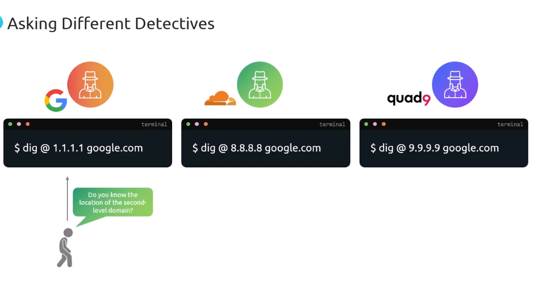  
  
  

The purpose of resolvers is to help the DNS be fast. Think of them as detective agencies that help distribute the workload. If every single question about a domain name had to go directly to the authoritative nameservers, these nameservers would be overwhelmed with millions of repeated queries. 
  

The resolvers use caching mechanisms to help with DNS speed. Think about this as if the detectives used a notebook where they write common mysteries. When someone asks, where is google.com, and the detective just solved that case 5 minutes ago, they don't need to start a new investigation, they just check their notebook and give you the answer right away. 
  
In technical terms, this means the resolver has cached the DNS record and can respond without querying the authoritative nameservers again. This caching mechanism is crucial because it reduces the load on nameservers across the internet while making responses much faster for users. 

## Nameserver

In our previous lecture, we talked about DNS resolvers working like detectives trying to track down IP addresses. These detectives often need help from special agents who have access to the source of truth about specific domains.
The special agents in this analogy are the authoritative nameservers. 
  

Remember that the DNS is all about finding the IP address for the infrastructure providing a service by using a friendlier domain name. Without the DNS, the Internet would require the use of IP addresses for everything.  
  

The nameservers are responsible for maintaining this up-to-date information of a domain name and the IP address of the infrastructure providing the service.  
  

When we perform a DNS query, for example, by typing a domain name in our browser, the resolver, a.k.a. the detective, begins an investigation to find the IP address associated with that domain name.   

To get accurate information, the detective needs to find and talk to the special agents, or authoritative nameservers, who have the official records for that domain.  
  

We previously established that nameservers act similarly to a database. They store and manage all the information about domain names and their IP addresses. This setup follows some important principles we see in database system design principles. 
  

In the world of databases, when we deal with massive amounts of data, we often need ways to handle it efficiently.
One key concept in database design is called sharding, in other words, splitting up a huge database into smaller pieces that different servers can handle.  
  

This makes everything faster and more reliable because each server only needs to deal with its own piece of the data. 

In the DNS, nameservers are designed with these principles in mind. Instead of having one massive server trying to handle the entire Internet's worth of domain names, 
  

Different nameservers are responsible for different zones. Some handle com domains, others handle org domains, and some handle country domains like UK. This distributed system approach means that if one part has problems, the rest of the system can still function.  
  

Each nameserver maintains zone files containing records that follow a specific format. Let me show you what a basic zone file looks like.  
  

This zone file contains different types of records. Each line represents a resource record that tells us important information about the domain.  
  

The A records point to IPv4 addresses, while NS records indicate which nameservers are authoritative for this domain. Every domain must have at least two nameservers for redundancy. 
  

Looking at a real-world example, let me run a dig command to show you Google's nameservers. On screen, I'm running a dig command to see how many nameservers Google has. Looking at this output, we can see that Google maintains four nameservers. This is quite common for large organizations, though the minimum requirement is two nameservers.  
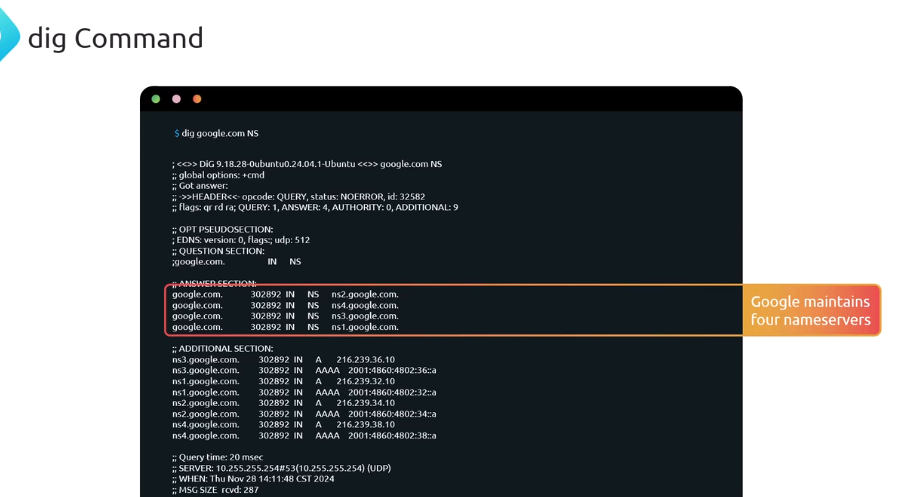  

This redundancy **ensures that DNS queries can always be answered**, even if one or more nameservers become unavailable.   Something important to talk about is that, among these nameservers, one is designated as the primary nameserver.

Imagine the primary nameserver as a lead agent who gets the information first, and then it distributes the source of truth among its peers.

We can identify the primary nameserver by looking at something called the SOA record, or **Start of Authority record**. Let me show you what this looks like. On screen, I'm running another dig command, this time by requesting the SOA record by typing `dig google.com SOA`.  

Looking at this SOA record, we can see that `ns1.google.com` is the primary nameserver. This means that this nameserver holds the master copy of all the zone data  
  
but, as we've learned, the DNS was designed as a fault-tolerant distributed system.

If there was only one nameserver and it failed, the entire domain would become unreachable. That's why having multiple nameservers is essential for the Internet to run smoothly. 
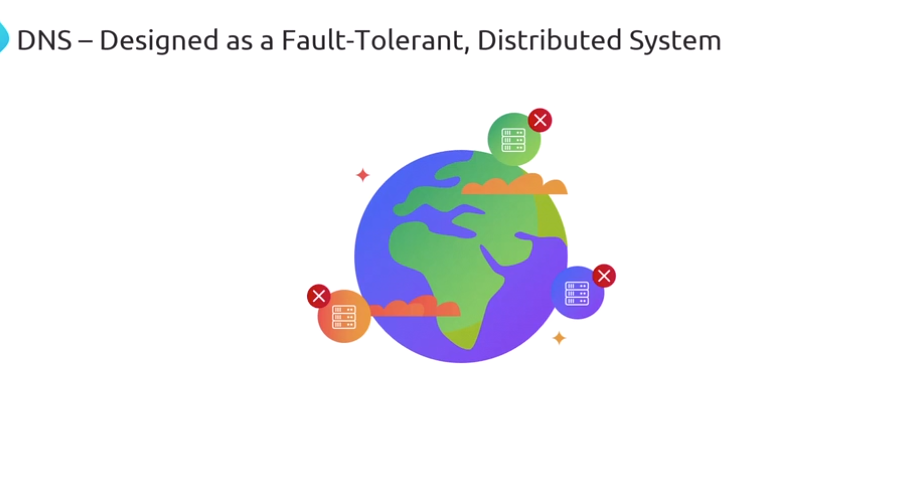  

The primary nameserver, `ns1.google.com` in this case, shares its data through a replication process with all the other nameservers listed in the NS Records.  
  
This distributed database approach ensures that no matter which nameserver our resolver contacts, it will receive the same accurate information from the zone's official records.

There's another lecture dedicated to explaining the concept of zone transfers, in other words, the mechanism that keeps all nameservers synchronized with the same records, which is crucial for keeping the distributed nature of DNS by copying zone data from the primary nameserver to all other nameservers in the zone.

## Walking the DNS Tree
Here is a list of Topics that we will cover in this section: 
  

First, we are going to go over example of the steps that happen when a domain name gets translated into an IP by the DNS, which is often known as walking the DNS tree.  
  

Then we'll talk about delegation of authority, how DNS zones can delegate control of their subdomains to other name servers, which is a fundamental part of how DNS works as a distributed system.  
  

This will lead us to an interesting problem. If name servers are identified by domain names, how do we resolve these domain names if we need DNS to resolve names in the first place?  
  

And even more basic, how do we even reach the root name servers when we don't have any IP addresses to start with?This is what we call the chicken and egg problem in DNS. 
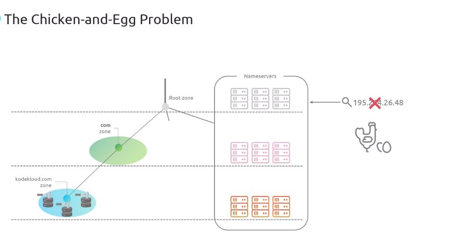  

Finally, we'll learn about glue records, a special type of record that helps solve this circular dependency and makes the whole DNS system possible.  
  
Alright, so let's get started. Finding an IP address from a domain name works like a detective game with strict rules. 
  

Domain names have labels separated by dots, and the recursive resolver must start by asking the root zone name servers.  
  
We always begin at the root zone. Here, we ask for information about the domain name formed by the first immediate label to the left  
  

which, relative to our current position in the DNS hierarchy, represents a subdomain of where we are.

For example, from root, com is a subdomain of root,  
  
and from com, example would be a subdomain of com. 
  
If the name servers are not the owners of this subdomain, they'll respond with, I don't own this domain, but here are the name servers that do, and by definition, this means we are moving forward to a different zone since ownership determines zone boundaries.  
  
Then we ask these new name servers about the next label to the left, repeating this process of either getting direct information if they own the domain formed by that label, or being directed to different name servers if they don't, which means crossing another zone boundary.
  

This traversal through zones, determined by domain ownership and authority, is why understanding delegation of authority in glue records becomes crucial, which we are going to cover next. 
  
  

But first, let's go over a few exercises of walking the DNS tree together to reinforce these concepts. Let's start with `engineer.kodekloud.com` since we are already familiarized with it.

Starting at the root zone, we ask for information about the domain name formed by the first immediate label to the left, which is `com`. 
  

The root name servers are not the owners of this subdomain, so they respond with, I don't own this domain, but here are the name servers that do, and by definition, this means we are moving to a different zone.  
  

Now we are at the com zone, and we ask for information about the domain name formed by the first immediate label to the left, which is `KodeKloud`. The com name servers are not the owners of this subdomain, so they respond with, I don't own this domain, but here are the name servers that do, and by definition, we are moving to a different zone. 
  
  

Now we are at the kodekloud.com zone, and we ask for information about the domain name formed by the first immediate label to the left, which is engineer. Since this is a subdomain that's part of their zone, they own it, they directly provide us with the IP address with no further zone transitions needed.  
  

Now let's walk through `museum.co.uk`. Starting at the root zone, we ask for information about the domain name formed by the first immediate label to the left, which is uk. The root name servers are not the owners of this domain, so they respond with, I don't own this domain, but here are the name servers that do 
  
and by definition, this means we are moving to a different zone.  
Now we are at the uk zone, and we ask for information about the domain name formed by the first immediate label to the left, which is co. Since co.uk is actually a subdomain that's part of the uk zone, they own it, we continue in the same zone. When we ask about museum, the uk name servers are not the owners of this subdomain, so they respond with, I don't own this domain, but here are the name servers that do.  
  
and by definition, this means we are now moving to a different zone. Now we are at the museum.co.uk zone, and since we've reached our destination and they own it, they directly provide us with the IP address. 
  

Finally, let's examine a domain I created. For this course called `jcroyowaun.io`. Keep in mind that depending on when you are taking this course, the domain may exist or not, but assume the explanations and command outputs were true at the moment of recording this video. For this exercise, we are going to use a subdomain of jcroyowaun.io called `staging.jcroyowaun.io`.  
  

Starting at the root zone, we ask for information about the domain name formed by the first immediate label to the left, which is io. The root name servers are not the owners of this subdomain, so they respond with, I don't own this domain, but here are the name servers that do, and by definition, this means we are moving to a different zone. Now we are at the io zone, and we ask for information about the domain name formed by the first immediate label to the left, which is jcroyowaun. The io name servers are not the