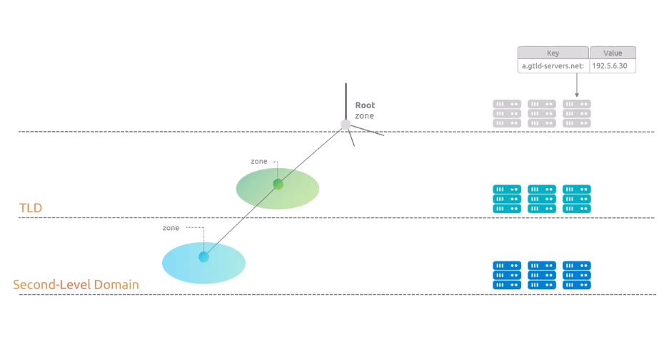

# Why DNS
- DNS is the phonebook of the internet. Humans access information online through domain names, like nytimes.com or espn.com. Web browsers interact through Internet Protocol (IP) addresses. DNS translates domain names to IP addresses so browsers can load Internet resources.
- Each device connected to the Internet has a unique IP address which other machines use to find the device. DNS servers eliminate the need for humans to memorize IP addresses.

  
  
  

Thanks to the DNS, we can use domain names to communicate with computers or their services.

  
Why Can't we Just use IP address instead of domain names?
The simplest reason is that for most humans, it's easier to remember a domain name than remembering an IP address.
  
But There are a couple of technical reasons behind the importance of DNS:
1. **Infracstructure Migration:** One quick example is infrastructure migration. Imagine you come from work, ready to continue your favorite show on Netflix, but instead of simply typing netflix.com in your browser, you'd have to remember the IP address of the site. Then one day, the Netflix folks perform an infrastructure migration, and the IP address of the infrastructure hosting the site changes, rendering you unable to access Netflix that evening. That is, until you figure out what the correct and updated IP address is. Certainly, it would be a nightmare to keep track of these changing numbers for every website you visit, right?  
  
  

2. **Internet is Complex:**
The second technical reason is that the `internet is complex`. Often, when learning DNS, you'll hear or read an explanation, such as, the DNS translates a domain name into the IP of a computer hosting a service, but more often than not, there won't be such a thing as having a single IP for a computer hosting a service. This is because the internet relies on complex architectures, such as **content delivery networks** and **DNS systems**, to keep systems performant and well distributed globally, which means there could be dozens or even hundreds of IP addresses that turn out to be the IP address on duty that serves a given service. Just for this reason alone, using IP addresses is definitely not a great idea. And just to keep 
stacking reasons why DNS is so useful and important, we have that IPv6 addresses are even more difficult to remember, Instead of memorizing numbers, we use domain names to access the internet. Lets look at our earlier example, kodekloud.com.

  
  
  
  
  
## DNS Queries:

#### DNS Resolution process in two different programs:
1. On Browser:
2. DIG Command:

**On Browser:**
  
In the above image, I found this one and we see that there's a portion that says **remote address**, and then we have an IPv6 address that is responding on port 443. This IPv6 is what's known as a **AAAA record**.  

Let's see how we can match this information that the browser is giving us by going to the terminal and trying to get the same result. So now, I'm going here to my terminal, and then I'm going to type `dig kodekloud.com`, and you can see that we have three different IP addresses.  
  

***This means that any of these three IP addresses is capable of serving KodeKloud.com***. 

Now, as you can see, the IP addresses are *version 4*. So, the response that I'm getting is the same as if I was doing `dig KodeKloud.com A`.  
  

You can see that it's the same thing.  
Now, if I happen to do `dig kodekloud.com AAAA`, you'll see that it gives us the IPv6 IP addresses that are the equivalent of the above 3 IP addresses(IPv4) that we got. 
  

we can see that the browser is using the IPv4 `104.26.11.250:443` address to connect to the website and `dig KodeKloud.com A` shows us also `104.26.11.250:443` address.  

The gist of this video is to understand that a domain name can be translated into an A record, otherwise known as an IPv4 IP address, or a AAAA record, which is an IPv6 IP address. Now, if you notice, my browser automatically responded to the IP address in an IPv6 format. This is customizable depending on your resolver, your operating system configuration, or your browser configuration. If any of this is confusing, don't worry. We will go over record types and all the other stuff that we saw in this video as we progress with the course. I just thought it would be a good idea to give an early exposure on how the DNS resolution process happens from two different perspectives.

## Terminology:
The purpose is to define some concepts around domain names. Here we will discuss domain names, URLs and email address and how they are related to each other. 
  

First give an analogy to understand that it will help us to understand these concept better:  
Think of a domain name like a piece of land that you own for a fixed period of time. When you register a domain, like KodeKloud.com, you are essentially buying your own piece of internet real estate for a fixed period of time.  
  

This domain name becomes your base identity on the internet. Now, here's where it gets interesting. When you type KodeKloud.com in your browser, what happens there is that you type a domain name, and given how there's a web server exposing this service, your browser translates this into a URL.  
  

The distinction between a URL and a domain name is important because domain names not only serve web applications, they also serve other types of services like emails, for example. And this is all possible, thanks to the DNS and the existence of domain names. A URL can be identified by the presence of the HTTP prefix and an email by the presence of the @ symbol. 
  

Another interesting perspective on this topic is how, within organizations, such as KodeKloud, for example, servers may be given hostnames, like webserver01.
   

And when you combine this hostname with the organization's domain name, you get what we call a Fully Qualified Domain Name, or FQDN, which in this case will be `webserver01.kodekloud.com`.  
   

You may also notice that many websites use `www`, like in www.kodekloud.com. This *www* is actually a subdomain that is traditionally used to indicate that a web service is being exposed, though it is not required for websites to work. 
  

So breaking down these concepts, a domain name is your base identity on the Internet. It's like a piece of land that you buy or rent.  
  

From this domain name, you can host multiple different services. All these different services, web, email and other can exist on the same domain name. 
  

So owning a public domain name gives you the ability to create services and expose them where people will be able to use them by referencing your domain name. Just like you build different things, like offices or apartments on the same piece of land, the DNS helps direct traffic to the right service, web, email, and all that, based on how you're trying to use the domain name. And we'll learn more about that as we progress through the course. 

## Domain Name Anatomy:
Domain names are written in this particular format of having words separated by dots to create a clear separation of ownership and responsibility. To understand why domain names use this format, we will use the analogy that compares owning a domain name and owning a piece of land.  
  

First let's understand that domain names are read from right to left, with the rightmost part, like `.com`, being the least specific. This means that when you see a domain name like `kodeKloud.com`, you should think of it as KodeKloud being registered on a huge piece of land called com. 
  

In this analogy, com is a large piece of land that can be subdivided into smaller lands. Think of this as if organizations could rent portions of this land to create their own services, just like registering a domain name with the *`.com`* suffix.  
  
The domain registration process also works as a subdivision, where the owners of the com domain effectively say, we will make you responsible for this domain, as long as you are the owner. Think of this as if a piece of land was assigned to a company, individual or organization.  
  

To keep the domain, they need to pay an annual registration fee through a registrar company capable of fixing all the legal documents for both parties. So following the analogy, when `kodekloud.com` was registered,  
  

a subdivision of the `com land` was given to KodeKloud that they now maintain. This maintenance responsibility gives KodeKloud the authority to create services that can be referenced by using the `kodekloud.com` domain. But not all domains are registered under com, though.

Take linuxfoundation.org, for example. In their registration process, they went to a different land altogether, one with the name of org. They requested org to subdivide a portion of its huge landmass so they could be responsible for it and build their services there. 
  

As a matter of fact, the DNS can be represented by looking at it as an inverted tree. 
  

From now on, I am going to start using this model and hopefully, we can go over the land leasing analogy to try to make sense of it from this tree perspective.  

Let's first talk about the DNS tree by starting at the top. At the top of the DNS tree, we have something called the `root zone`. The root zone is like a central real estate agency that keeps track of all of the huge lands out there, in other words, the rightmost part of a domain name. 
  
These huge territories in our analogy are called top-level domains. This includes common suffixes used for websites such as .com, .org, .net, .io, and others. 
  
Then, below the top-level domains, we have what's known as a second-level domain, with examples such as `linuxfoundation.org` and `kodekloud.com`  
  

Now, in this analogy, we've mentioned so far how the authority of using `KodeKloud.com` domain was given to KodeKloud as an organization by requesting `com` to create a subdivision of their land, so KodeKloud could own the domain and build the services they wanted on this domain, right?  
  

But now, getting a bit technical here, what happens in reality is that KodeKloud went through a domain registration process and when they picked the domain name `kodekloud.com` They probably registered the domain through a company that offers domain registration services such as godaddy.com, Cloudflare, or others.  
  

The domain registration companies are also known as registrars. So in this example, the registrar checked if the domain was available, which it was, I assume. Since the domain ends with com, then a petition to an organization called `Verisign` is made asking them to hand over the ownership and responsibilities, for `KodeKloud.com`. `Verisign` is the organization responsible for .com, and this process of handing over the ownership is what we call delegation of authority. The delegation of authority creates what’s known as a zone, giving KodeKloud control over their domain. But why exactly is Verisign being requested to delegate the authority to KodeKloud and what does this mean?  
  

Well, without delegation of authority, all domains ending in .com would remain under Verisign’s control. Think about it this way. In our land ownership analogy, there's this huge land called .com. When an organization, individual, or company wants to register a domain name, they're asking for their own piece of this land. Without this subdivision process, the entire land would remain as com, meaning Verisign would maintain control over all the non-subdivided portions.  
  

When these subdivisions happen, they create what you see in the DNS Tree diagram displayed on the screen, where we have multiple levels of ownership. Each level on the tree represents a `zone`. A zone is similar to the land being owned. 

  

The domains and subdomains are similar to erecting buildings with different types of functions such as offices, apartments, and more.  
  

In the case of KodeKloud, a subdomain that you may be familiar with is ``engineer.kodekloud.com``. This subdomain is still part of the kodekloud.com zone.  
  

and because of this, KodeKloud could continue to add more subdomains to it, like `example1.engineer.kodekloud.com` and `example2.engineer.kodekloud.com` while still being the owners. 
  
And similarly, `linuxfoundation.org` has subdomains in this same zone, such as `training.linuxfoundation.org`. 
  

Where I'm trying to go here, is that the same rule applies to the top-level domains. The org top-level domain, which is managed by the Public Interest Registry (PIR), and the com top-level domain, which is managed by VeriSign, could create multiple subdomains such as whatever.com or something.org while still being on the same zone, meaning they'd keep full ownership of these domains.  
  

However, this doesn't generally happen, though, as organizations in charge of top-level domains take their role seriously Instead, their primary focus is probably on maintaining their registries and making domains available for organizations, individuals, or companies that wish to register them through authorized registrars.  
  

But let’s tease our brains a little by thinking about what would happen in the fictitious case that KodeKloud decided to sell the `engineer.kodekloud.com` services to another company, but they chose to keep the same ``engineer.kodekloud.com`` domain name.  
  

kodekloud.com and `engineer.kodekloud.com` both belong to the same zone right now, and this can be proven by using the `dig` command to both kodekloud.com domain and to its subdomain `engineer.kodekloud.com`. We can see in the output shown on the screen how both respond with the same set of `A` records, indicating they're in the same zone.  
  

If KodeKloud wished to split the services into two different companies, what would happen here is that `engineer.kodekloud.com` would go through a delegation of authority process so that it'd begin to exist in a new zone similar to the animation shown on the screen.  
  

We will learn the technicalities behind a delegation of authority in another section. For now, just think about it as the process of how a subdomain would be transferred to a new zone.  

Now, I want you to observe how by doing the same dig command to `linuxfoundation.org` and `traning.linuxfoundation.org`, its not immediately visible whether they are in the same zone or not, as both DNS queries may return a different set of `A` records IP Address in the reponse.  
   
We will show a demo that how to safely determine if nested subdomains belong to the same zone or not.  

## The Root Zone:
We are representing the DNS using a diagram of an inverted tree that starts at the Root Zone. 
  
The Root Zone is shown as a dot(.) in the diagram because every domain name actually ends with a dot, even if you cannot see it. You can test this yourself. Try typing a domain name in your browser with a dot at the end, like `youtube.com.` or `wikipedia.org.` and it should resolve just fine. So the dot that represents the root zone is always implicitly part of the domain names, even when we don’t explicitly type it in. 

You can also test this with the dig command. Whether you include the dot or not at the end of a domain name, you will get the same result, as shown in the animation on screen.  
  

The root zone can also be queried by simply typing dig space dot, as demonstrated on the output shown on the screen. 
But what is a root zone and why does it matter?  
  
To understand the root zone, remember what we learned earlier. Domain names are read from right to left, where the rightmost part is the most general. and the leftmost part is the most specific.  
  

DNS queries work the same way. When you look up a domain name, the DNS starts reading from the right side beginning at the Root Zone, then moving to the Top-Level Domain, and so on until it reaches the left-most part of the domain name. Let's use our land analogy to make this clearer.  
 
Remember how we said a domain name like `kodeKloud.com` is like a piece of land within the larger territory of .com, and linuxfoundation.org is like a piece of land within .org. So where does the root zone fit in this picture?  
  

Well, you could say that the root zone is planet Earth or something, because all domain names are a subdivision of planet Earth, which means all possible pieces of land have a relationship with the root zone. I hope you can see how saying that domain names go from least specific on the far right to most specific on the far left matches perfectly with our earth analogy.  
   

For example, looking up facebook.com, a DNS query starts on the Root Zone, then it looks for the Top Level Domain called com, and finally finds a specific area called facebook.  
  
  
  

In technical terms, this means that the root zone needs to know how to find any top-level domain in the world.  
  

Remember we've said in previous lectures that zones in the DNS are a way to delegate authority and responsibility of domain names to an organization, individual, or company, and how VeriSign was responsible for the com top-level domain and all that? Well, the root zone is no exception to this rule. The root zone is managed by **IANA**, which is the Internet Assigned Numbers Authority, and it operates under **ICANN**, Internet Corporation for Assigned Names and Numbers. 
  

Think of ICANN like a global organization that makes sure the internet's naming system works smoothly for everyone. Since the root zone is at the very top, it makes sense that it needs a global organization to manage it. IANA’s job is to keep track of all the top-level domains and make sure that the root zone data is accurate and secure. It’s like having a central authority that everyone trusts to maintain Earth’s address book. 
  

Let me show you how this works in a simple way. Just keep in mind that we’ll cover all the technical details about DNS systems and infrastructure in a later section. From this tree-like diagram, you can think about the DNS like a system that assigns servers that act as a database-like system to each zone that exists in the DNS. These servers that act as databases for each zone are called **name servers**. The name is quite literal. They’re servers that contain information about domain names that belong to their zone.  
  

In the animation displayed on the screen, we have a representation of how this database can be thought about, so you create a mental map for this. Think of it as a simple system where each name server `stores key-value pairs` like this a.gtld-servers.net pointing to 192.5.6.30. This same database-like information is copied to all root zone name servers, ensuring they all have the same information.  
  
  
  
  
Now, elaborating more on the purpose of name servers, remember our land analogy? If the root zone is planet Earth, then name servers are like information offices that know about different pieces of land. When you ask a root name server about facebook.com, it's like asking, where can I find information about this land called com?  
  

And the root name server will point you to the specific name servers that know about all the lands within com.  
  

The root zone name servers have key-value pair entries similar to the table displayed on the screen. These entries help resolve any top-level domain by providing the IP address of the name servers for the next domain in the resolution chain.  
  

An IP address is ultimately needed because it gives the exact location. Think of it like providing exact coordinates instead of just a name. 
  

We can see the name servers associated with a zone by using the dig command. When we type `dig . NS`, where NS stands for name servers, we're basically asking, Hey, which name servers are responsible for the root zone? The response shows that there are 13 of these root name servers labeled from A to M.  
  

By the way, the reason why it’s 13 name servers, it's because that was the maximum number of name servers that could fit into a single 512-byte UDP packet. We'll dive deeper into this when we cover the DNS protocol section.   

So DNS resolution is like a game where you can only ask for information about a zone by consulting its parent zone's name servers. 
  

This is why all DNS queries begin from the root zone. You have to start at the top and work your way down, one zone at a time. So this explains the importance of the root zone. Its name servers know how to direct you to any top-level domain in the world. They don’t need to know about facebook.com specifically. They just need to know which name servers are responsible for the com domains in this example.
  