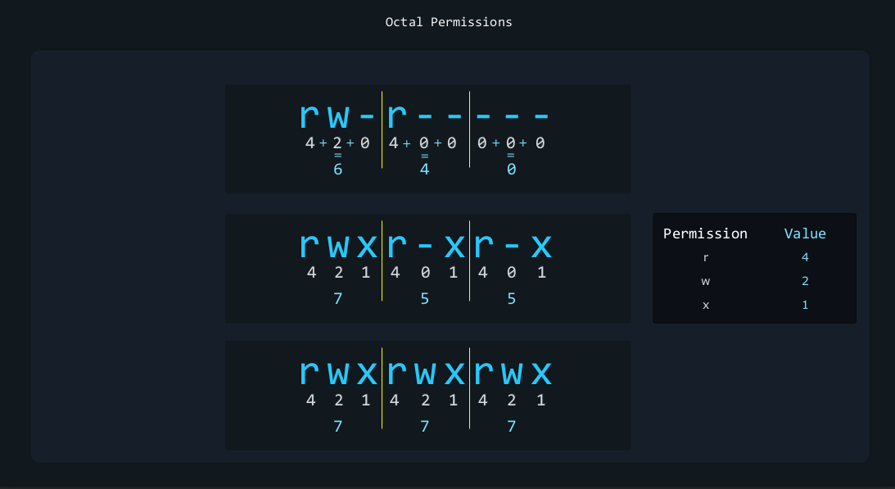

### Login to Local, Remote Graphical and Text Mode:

SSH: Secure Shell (SSH) is a cryptographic network protocol for operating network services securely over an unsecured network. The best known example application is for remote login to computer systems by users.

Telnet: Telnet is a network protocol used on the Internet or local area networks to provide a bidirectional interactive text-oriented communication facility using a virtual terminal connection.

but SSH is more secure than Telnet because it uses encrypted communication.
`$ ip link` - is used to check the network interfaces.
`$ ip addr` - is used to check the IP address of the network interfaces.
`$ ssh username@ipaddress` - is used to login to the remote machine.
`$ telnet ipaddress` - is used to login to the remote machine.
`$ ip a` - is used to check the IP address of the network interfaces.

Computer(SSH Client) -> Server(SSH Daemon)

## Essentials Commands:
* **Create, Delete, Copy and Move files and directories:**

`$ ls -la `  #**l**ist **a**ll files and directories in the current directory.
`$ ls -lah` # h for human redable i.e 6238 to 6.2KB

1  2     3    4     5  6                 7                    8    9  10  11   12 
d**rwx**r-x**r-x**  2 root              root                 4096 Feb  5 07:02 cups
1 # disk type / entry type
  
2 # permissions for the owner
3 # permissions for the group
4 # permissions for everyone else
  

5 # number of hard links
6 # owner
7 # group
  
  
  
  
  
  
8 # size
9 # date and time of last modification
10 # name
11 # -> link
12 # 

**File and directory access:**

To access a file or directory on our command line and specify its file path or its directory path. 
1. **Absolute path:** The absolute path is the full path to a file or directory starting from the root directory. Its starts with root directory that represented by a forward slash (/) .
2. **Relative path:** The relative path is the path to a file or directory starting from the current directory. 
To understand a relative path we must explore what the current directory means. this also means the working directory.
now to see our working directory, we can type `pwd` command. 

* `$ cd /etc` # Change directory to /etc  
* `$ cd ..` # Change directory to the parent directory  
* `$ cd ~` # Change directory to the home directory  
* `$ cd -` # Change directory to the previous directory  
* `$ pwd` # Print the current working directory  
* `$ cd ..` #always refer to parent directory of our current directory  
* `$ cd /` # Go to root directory  
* `$ touch file.txt` # Create a new file  
* `$ mkdir directory` # Create a new directory  
* `$ cp file.txt file2.txt` # Copy a file  
* `$ cp -r directory directory2` # Copy a directory  
* `$ mv file.txt file2.txt` # Move a file  
* `$ mv directory directory2` # Move a directory  
* `$ rm file.txt` # Remove a file  
* `$ rm -r directory` # Remove a directory  
* `$ ls -lrt` # List files and directories in reverse order of modification time  
* `$ ls -l | grep file` # List files and directories and filter the output with grep  
* `$ cat file.txt` # Display the content of a file  
* `$ less file.txt` # Display the content of a file with a pager  
* `$ head file.txt` # Display the first lines of a file  
* `$ tail file.txt` # Display the last lines of a file  
* `$ wc file.txt` # Count the number of lines, words, and characters in a file  
* `$ chmod 755 file.txt` # Change the permissions of a file  
* `$ chown user:group file.txt` # Change the owner and group of a file  
* `$ ln -s file.txt link.txt` # Create a symbolic link to a file  
* `$ ln -s directory link` # Create a symbolic link to a directory  
* `$ find / -name file.txt` # Find a file in the filesystem  
* `$ grep pattern file.txt` # Search for a pattern in a file  
* `$ ps` # Display the processes running on the system  
* `$ top` # Display the processes running on the system with a pager  
* `$ kill PID` # Terminate a process by its process ID  
* `$ killall process` # Terminate a process by its name  
* `$ shutdown -h now` # Shutdown the system immediately  
* `$ reboot` # Reboot the system  
* `$ df -h` # Display the disk usage  
* `$ du -h` # Display the disk usage of a directory  
* `$ free -h` # Display the memory usage  
* `$ uname -a` # Display the system information  
* `$ date` # Display the current date and time  
* `$ cal` # Display the calendar  
* `$ history` # Display the command  

**Create and Manage Hard Link:**

File system like XFS, ext4 and other keep track of data with the help of inodes.
Inodes are data structures that store metadata about files and directories, such as their permissions, size, and location on the disk.
When we create a file or directory, the file system allocates an inode to it and stores the file or directory data in blocks on the disk.
suppose my *dummy.pdf* might have blocks of data scattered all over the disk, but inode remembers where all the blocks are stored.

  

File Point to the Inode -. Inodes points to the all of the blocks of data we required.
example: `stat dummy.pdf` 

  

  

If aaron delelte the image:

  

Limitations of Hard Links:
1. Hard links for files, not directories.
2. Only Hard links within the same file system.
3. External mounted drive (/mnt/Backups/files) can't be hard linked from (/ssd/home/file)

Considerations when hard link:
1. Make sure you have the proper permissions to create the link file at the destination.
2. Make sure that all users involved have the proper permissions to access the file.
i.e for two user *John* and *Aaron*, this might mean that we need to add both their username to the same group for example family group then we would use a command to let the group family read anf write to this file.
remember you only need to change permission on of the hard links. That's because you are actually changing permission stored y the INode

* `$ useradd -a -G family John` # Add a user to a group  
* `$ useradd -a -G family Aaron` # Add a user to a group  
* `$ chown :family file.txt` # Change the group of a file  
* `$ chmod 660 /home/aaron/Pictures/family_dog.jpg` # Change the permissions of a file  

**Create and Manage Soft Link:**
* computer shortcuts  
* Softlink is nothing more than a file that points to a path.  
* Symbolic link  

`$ ln file.txt link.txt` # Create a hard link to a file
`$ ln directory link` # Create a hard link to a directory
`$ ls -i file.txt link.txt` # Display the inode number of a file
`$ find / -inum inode_number` # Find a file by its inode number
`$ rm file.txt` # Remove a file
`$ rm link.txt` # Remove a hard link
`$ rm -i file.txt` # Remove a file with confirmation
`$ rm -f file.txt` # Remove a file without confirmation
`$ rm -r directory` # Remove a directory
`$ rm -rf directory` # Remove a directory without confirmation
`$ rm -i link.txt` # Remove a hard link with confirmation
`$ rm -f link.txt` # Remove a hard link without confirmation
`$ rm -i directory` # Remove a directory with confirmation
`$ rm -rf directory` # Remove a directory without confirmation
`$ ls -l` # List files and directories
`$ ls -lh` # List files and directories with human-readable sizes
`$ ls -lS` # List files and directories by size
`$ ls -lt` # List files and directories by modification time
`$ ls -lR` # List files and directories recursively
`$ ls -la` # List all files and directories
`$ ls -l | grep file` # List files and directories and filter the output with grep
`$ ls -l | sort -k 5` # List files and directories and sort the output by the fifth column
`$ ls -l | sort -k 5 -r` # List files and directories and sort the output by the fifth column in reverse order
`$ ls -l | sort -k 5 -n` # List files and directories and sort the output by the fifth column numerically
`$ ls -l | sort -k 5 -nr` # List files and directories and sort the output by the fifth column numerically in reverse order
`$ ls -l | sort -k 5 -n | head -n 5` # List files and directories and sort the output by the fifth column numerically and display the first five lines
`$ ls -l | sort -k 5 -n | tail -n 5` # List files and directories and sort the output by the fifth column numerically and display the last five lines
`$ ls -l | sort -k 5 -n | head -n 5 | tail -n 3` # List files and directories and sort the output by the fifth column numerically and display the first five lines and the last three lines
`$ ls -l | sort -k 5 -n | head -n 5 | tail -n 3 | wc -l` # List files and directories and sort the output by the fifth column numerically and display the first five lines and the last three lines and count the number of lines
`$ ls -l | sort -k 5 -n

**18. List, Set and Change Standard File Permission:**
* Only the Owner of a file or directory can change permission 
* Root user can change permission of any file or directory
* To change the group of a fileor directory we can use the `chgrp` command
* To change the owner of a file or directory we can use the `chown` command

**19. SUID, SGID and Sticky Bit:**
SUID A special permission that allows `users` to run an **executable** with the permission of the executable owner.  
SGID is a similar permission, but it applies to both **executables** and **directories**.  
Sticky Bit is a special persmission that can be set on **directories**, It restricts file deletion in that directory. 
SUID - Set User ID  
SGID - Set Group ID  
**SUID** - when this is set on a file, it means that whenever the file is executed, it going to be executed as the User IDof the owner of the file Instead of the User ID of the person who is running the file. 
Capital **S** in the permission means that the file has the SUID permission but it is not executable.  
Small **s** in the permission means that the file has the SUID permission and it is executable.  
`$ chmod 4664 testsuidfile`  
`$ chmod 4764 testsuidfile`  
  

`$ touch testsuidfile`  
`$ chmod 2664 testsuidfile`  
`$ chmod 4664 testsuidfile`  
`$ chmod 4764 testsuidfile`  

**SGID** 
Capital **S** in the permission means that the file has the SGID permission but it is not executable.
Small **s** in the permission means that the file has the SGID permission and it is executable.
`$ touch testsgidfile`
`$ chmod 2664 testsgidfile`
`$ chmod 2674 testsgidfile`

Important: sometimes you might ask to find that have the SUID bit or the SGID bit set. 
`$ find . -perm /4000` # Find files with the SUID bit set
`$ find . -perm /2000` # Find files with the SGID bit set
`$ find . -perm /6000` # Find files with the Both(SUID+SGID) bit set
`$ find . -perm /1000` # Find files with the sticky bit set

**Sticky Bit**
The sticky bit is a permission that can be set on directories. 
When the sticky bit is set on a directory, it means that only the owner of the file can delete the file.
* `$ mkdir teststickyfile` # Create a new directory  
* `$ ls -ld stickydir/` # List the directory  
* `$ chmod +t stickydir/` # Set the sticky bit on the directory  
* `$ chmod 1777 stickydir/`   
* `$ chmod 1666 stickydir/`  
* `$ chmod 1775 teststickyfile`  

**Search for File:**
* / (slash mode): Matches **any** of the specified permissions.  
* - (dash mode): Matches **all** of the specified permissions.  
* = (exact mode): Matches **exactly** the specified permissions.  

* `find / -perm -o=rw`	# Finds files where **others have both** r **and** w. 
* `find / -perm /o=rw`	# Finds files where **others have either** r **or** w **or both**.  
* `find / -perm =o=rw`	# Finds files where **others have exactly** rw (**and nothing else**).

* `$ find / -name file.txt` # Find a file in the filesystem  
* `$ find -mmin +5` # Find files modified more than 5 minutes ago  
* `$ find -mmin -5` # Find files modified less than 5 minutes ago  
* `$ find -mmin 5` # Find files modified exactly 5 minutes ago  
* `$ find -cmin +5` # Find files created more than 5 minutes ago  
* `$ find -cmin -5` # Find files created less than 5 minutes ago  
* `$ find -cmin 5` # Find files created exactly 5 minutes ago  
* `$ find -amin +5` # Find files accessed more than 5 minutes ago  
* `$ find -amin -5` # Find files accessed less than 5 minutes ago  
* `$ find -amin 5` # Find files accessed exactly 5 minutes ago  
* `$ find / -type f -name file.txt` # Find a file in the filesystem  
* `$ find / -type d -name directory` # Find a directory in the filesystem  
* `$ find / -user user` # Find files owned by a user in the filesystem  
* `$ find / -group group` # Find files owned by a group in the filesystem  
* `$ find / -size +1G` # Find files larger than 1GB in the filesystem  
* `$ find / -size -1G` # Find files smaller than 1GB in the filesystem  
* `$ find / -size 1G` # Find files exactly 1GB in the filesystem  
* `$ find / -mtime +5` # Find files modified more than 5 days ago in the filesystem  
* `$ find / -mtime -5` # Find files modified less than 5 days ago in the filesystem  
* `$ find / -mtime 5` # Find files modified exactly 5 days ago in the filesystem  
* `$ find / -ctime +5` # Find files created more than 5 days ago in the filesystem  
* `$ find / -ctime -5` # Find files created less than 5 days ago in the filesystem  
* `$ find / -ctime 5` # Find files created exactly 5 days ago in the filesystem  
* `$ find / -atime +5` # Find files accessed more than 5 days ago in the filesystem  
* `$ find / -atime -5` # Find files accessed less than 5 days ago in the filesystem  
* `$ find / -atime 5` # Find files accessed exactly 5 days ago in the filesystem  
* `$ find / -name file.txt` # Find a file in the filesystem  
* `$ grep pattern file.txt` # Search for a pattern in a file  
* `$ ps` # Display the processes running on the system  
* `$ top` # Display the processes running on the system with a pager  
* `$ kill PID` # Terminate a process by its process ID  
* `$ killall process` # Terminate a process by its name  
* `$ shutdown -h now` # Shutdown the system immediately  
* `$ reboot` # Reboot the system  
* `$ df -h` # Display the disk usage  
* `$ du -h` # Display the disk usage of a directory  
* `$ free -h` # Display the memory usage  
* `$ uname -a` # Display the system information  
* `$ date` # Display the current date and time  
* `$ cal` # Display the calendar  
* `$ history` # Display the command history  
* `$ find / -name file.txt` # Find a file in the filesystem  
* `$ grep pattern file.txt` # Search for a pattern in a file  
* `$ ps` # Display the processes running on the system  
* `$ top` # Display the processes running on the system with a pager  
* `$ find -size [size]`  
* `$ find -size 512k]` # Find files exactly 512KB [k for kilobytes, M for megabytes, G for gigabytes]  
* `$ find -size +512k]` # Find files larger than 512KB  
* `$ find -size -512k]` # Find files smaller than 512KB\  
* `$ find -name "f*" -size 512k`       #AND Operator  
* `$ find -name -o "f*" -size 512k`       #OR Operator  
* `$ find -not -name -o "f*"` # NOT Operator  
* `$ find \! -name -o "f*"` # alternate NOT Operator, here \ meaning to tell bash to ignore the special meaning of this characted and just consider it a regular character
* `$ find -perm 664` # find files with **exactly** 664 permission  
* `$ find -perm -664` # find files with **at least** 664 permission  
* `$ find -perm /664` # find files with **any of these** permission  
* `$ find -perm 600` # find owner can read and write with no other permission  
* `$ find -perm -100` # Find files that the owner can execute **at least** but the rest of the permission can be anything  
* `$ find \! -perm -o=r` # Nobody else can read these files except the user and group that own them   
* `$ find -perm /u=r,g=r,o=r` # Find files that can only be read either by the user, the group, or others, It doesn't matter who it is, but at least  one of them should be able to read it.