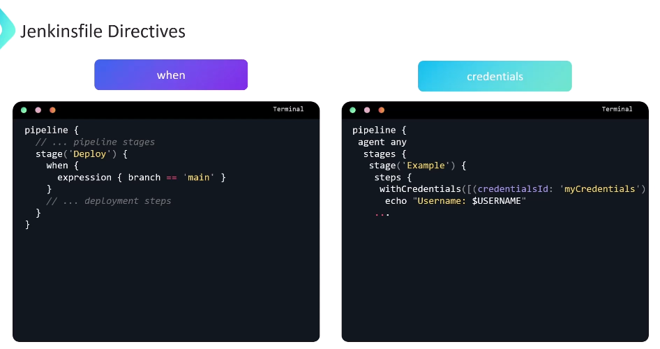
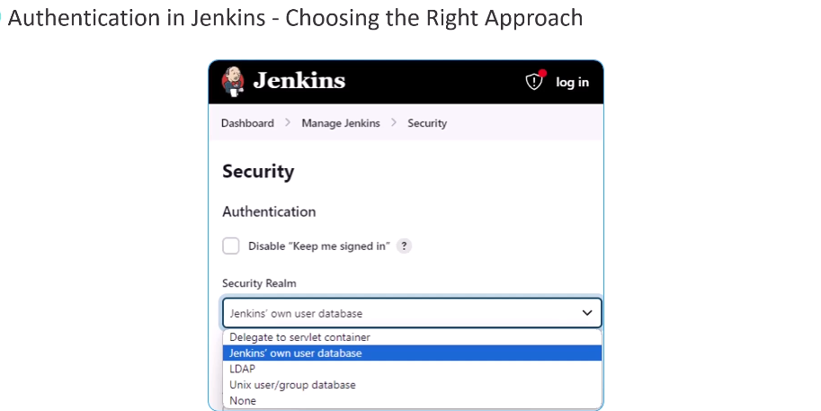

# Jenkins for Beginners Course:
### 1. Basics of CICD:

#### Understanding CICD:
 <br>
In real time scenarios, you will often find multiple developers working on different feature branches, each focusing on a new enhancement. Performing multiple mergers without the implementation of continuous integration in a software development workflow can lead to several significant problems and challenges, such as delayed testing. So without CI testing typically occurs late in the development cycle, often after multiple mergers have taken place. This delay in testing can make it harder to identify and rectify issues early in the development process.
<br>
Challenges:<br>

 <br>

The CI pipeline proceeds through several stages, including unit testing, dependency scanning, artifact building, and vulnerability code scanning. All these assessments are performed on both the newly added code and the existing code from the main branch. If any of this test fails, the developer is asked to make necessary adjustments and commit the changes to the same old request. This action triggers the CI pipeline once again. <br>

 <br>


Following the successful merge, The main branch now contains the code changes from both feature branch A and feature branch B and as mentioned earlier , any branch chanfe merge into the main branch automatically triggers a CI pipeline. It once afain runs all the tests including uni testing, dependency scanning, artifact building and vulnerability  scans.<br>

This ensures that the code changes from both feature branch B and A work seamlessly together. This entire process, which enables multiple developers to work on the same application, while ensuring that these new changes integrate smoothly without introducing any new issues, is known as continuous integration. <br>

 <br>

### Continuous Deployment/Delivery:
Even after a rigorous CI and testing procedures, It is always advisable to deploy the modified application to a non production environment that closely resembles the live environemnt. This allows for live testinf before proceeding with production deployment.<br><br>

Within the feature branch. Following a successful CI pipeline run, we can establish another continuous deployment pipeline. This pipeline is responsible for deploying the modified code to a staging or, you know, development environment. Following deployment, a series of tests are executed to ensure the quality of the application. Upon successful completion of CD, the pull request is approved and merged back into the main branch.<br>

 <br>

Within the main branch, the CA pipeline is triggered assessing the newly merged changes. If successful, it automatically initiates the CD pipeline resulting in the deployment of the application to the production environment. This automatic deployment process following successful continuous integration is referred to as continuous deployment. <br>
<br>
In certain instances, a manual approval step before production deployment is a critical aspect of the deployment process. This step ensures that it minimizes the risks, ensuring quality, adhering to the compliance requirements, and effectively coordinating changes. It basically offers a safety net, which allows for human judgment and oversight within an otherwise automated process. In this scenario, the following successful completion of the CI pipeline, The CT pipeline always awaits a human approval before proceeding with the production deployment. This process of manual approval prior to production deployment is known as  **continuous delivery** . <br>

## Jenkins Architecture:
**Intro:** Jenkins leverages a distributed architecture, which allows for the distribution of work across multiple machines. This architecture is composed of a master and multiple agents. The master is responsible for managing the entire Jenkins environment, including the configuration of jobs, security, and the distribution of work to the agents. The agents are responsible for executing the jobs assigned to them by the master. The agents can be configured to run on the same machine as the master or on a separate machine. This distributed architecture allows for the parallel execution of jobs, which can significantly reduce the time required to complete the build and test process. <br><br>

**1. Jenkins Controller**
The first component in the architecture is the Jenkins Controller. It is the central Hub of our jenkins setup, often referred to as the Jenkins Server. It has various responsiblities like management tasks such as user authentication, authorization, It can also manage jobs and pipelines like defining scheduling and monitoring the execution, it also provides web interface for configuration , setting up plugins, onboarding users, monitoring and managing the builds within the Jenkins. <br>
 <br>
 <br>
1. Prevent accidental damamge by keeping our controller configurations safe from potential job related changes.<br>
2. Boosts Perfomance by distributing build task across multipke machines, improving speed and effeciency for complex projects.<br>
3. Scaling up  the jenkins server by adding more nodes as a project and automation need increase,

**2. Node:** 
Node are also formarly known as Jenkins Slaved, so notes play a crucial role in your CID workflow by serving as the worker machine that execute our build jobs. Node are basically dedicated Linux, Windows or other machines that handle build execution, allowing for parallel processing and increased performance for large project.<br>
 <br>
<br>
Node has a configurable number of **Executors**, which is the next component, which we will be talking about, which are essentially slots for running build jobs concurrently, and executor is a thread for execution of tasks. More executors allow for parallel processing of multiple jobs, which will help you to speed up the build process. 

<br>The number of executors assigned to a node is basically determined by the nodes available resources such as CPU and memory and the requirement of your build task. Ideally speaking, we allocate one executor for each note, which is the most secure setup. And if the task to be executed are small, assigning one executor per CPU core could be an effective approach as well.
<br><br>

**3. Agents** Agents act as an extension of Jenkins. Managing the task execution by using executors on a remote node. An agent represents a specific way a node connects to the controller. It defines the communication protocol and the authentication mechanism used.
For example, you might have a Java agent connecting, using JNLP or a SSH agent connecting,
using the secure shell protocol. Any tools required for the build and the test processes are installed on the node
where the agent runs. We can also leverage docker containers as build agents instead of installing tools and dependencies directly on a dedicated worker node. You can define a Docker image containing all the necessary software for your build jobs. And this is well suited for scenarios where build job requires specific software versions or have complex dependencies. Finally, when you're using a Docker agent, each build job runs in a clean, isolated container Ensuring consistent environments and preventing conflicts between multiple projects. Similarly, we can also utilize Kubernetes clusters to dynamically provision and manage build agents as ports. This allows for on demand scaling and efficient resource utilization. <br> <br>
 <br>

So let's put it all together. Assume we have a Jenkins controller node connected to two worker nodes. You define jobs and pipelines within the controller using its UI, CLI or REST APIs.<br>
 <br>
 The controller identifies available executors on connected nodes And then schedules and distributes jobs to the available executors on nodes.<br>
  <br>
The nodes execute the jobs using the allocated resources.<br>
 <br>
 Once the execution completes, the controller receives results and feedback from the nodes, providing the build status, the logs, and the artifacts. <br>
  <br>
 This distributed architecture allows you to scale your Jenkins setup by adding more nodes with additional executors. This way you can handle complex workflows. and large project efficiently and ensuirng smooth and automated CICD pipelines. <br>

 ## Types of Jenkins Projects:
 Jenkins offer various project types also known as Jobs to automate different workflows.
 **Fressstyle Project:**
 It allows us to define custom builds steps and configurations for any project. It is the most flexible project type and can be used to create simple or complex build pipelines. <br>

**Pipeline Project:** It is a powerful approach, uses a specific code to define the entire build pipeline. It includes stages, steps and condition for complex build process and continuous delivery workflows. <br>

**Multibranch Pipeline:** 
Multi-branch pipelines build upon the pipeline projects by allowing you to manage builds from multiple branched in a single code repository. It's ideal for handling project with frequent branching and development activities. <br>

**Maven Project:**
Maven project  streamlined building projects that use Maven, a popular build automation tool for Java projects. It allows you to define Maven goals and options for building, testing and deploying your Java applications. Jenkins automatically detects and executes maven commands based on th POM.xml file<br>

**Multi Configuration Project:**
Multi configuration projects lets you run the same build process with different configurations. It's useful for testing your application across multiple environments, platforms, or versions. <br>

**Organizational Folder:** This aren't a project type themeselves, but rather a way to organize your Jenkins project into a hierarchical structure for better management, especially when dealing with a large number of project in addition ot the core types. It allows you to organize your Jenkins jobs into folders based on your organizational structure. It's useful for managing large number of jobs and pipelines. <br>
 <br>

### FreeStyle Project:
It allows you to define a series fo steps to be executed in a sequential order for automating tasks like building testing and deploying your project. The project often **chained** together. <br>
 <br>

So imagine building a mobile application. A freestyle project in Jenkins would be like a simple tool list for the build process. So you can have a project for cloning your code on running the unit test cases. You can have another project for building a docker image and publishing it to a container repository, and you can have a third project for Deploying the application. So it's like a simple to-do list with straightforward, basic tasks. <br><br>
 <br>
**Limitations:** 

1. Project can only define steps in a simple sequence, even though they can be linked together via upstream and downstream jobs.
2. Configuration happens entirely through the graphical user interface, making it less flexible and centrally manageable. 
3. Modern continuous delivery pipelines often involve complex workflows that FreeStyle projects struggle to handle. Even achievable task might result in heavy, hard to maintain and unclear configurations. 

4. Many continuous delivery and deployment goals are simply not possible or become overtly complex with freestyle projects. 
5. **FreeStyle projects cannot be resumed after a Jenkins controller failure.**

In essence, freestyle projects are a **legacy approach**. While they might work for basic cases, they lack the flexibility and maintainability needed for most modern continuous delivery or deployments pipelines.

**Working with FreeStyle Job:**
1. **Creating a FreeStyle Job:** 
    - Click on **New Item** on the Jenkins dashboard.
    - Enter a name for the job and select **Freestyle Project**.
    - Click **OK** to create the job.
    - Configure the job by adding build steps, post build actions, and other settings.
    - Click **Save** to save the job configuration.
    - Click **Build Now** to run the job.

**Plugins:**
Jenkins Pligin are essentially JAR files. They come in s afile with **hpi and jpi** extensions.

 <br>
 <br>
 <br>

**Working with a FreeStyle Job:**

**Lab: create 3 jobs and chain them together.**
1. ascii-build-job: 
    * Create a new freestyle project.
    * Add a build step to execute a shell command that prints an ASCII art message.
    * Save the job.
    * configure ascii-test-job to run after (post build) ascii-build-job.
    * Give the 'Copy Artifact' permission to ascii-test-job.
    * post build action to Archive artifacts from ascii-build-job.
2. ascii-test-job:
    * Create a new freestyle project.
    * Add a build step to execute a shell command that tests the ASCII art message.
    * Save the job.
    * build step 'Copy Artifact' from ascii-build-job.


3. ascii-deploy-job:
    * 


```
#Build 
curl -s https://api.adviceslip.com/advice > advice.json
cat advice.json

#Test to make sure the advice message has more than 5 words.
cat advice.json | jq -r .slip.advice > advice.message
[ $(wc -w < advice.message) -gt 5 ] && echo "Advice has more than 5 words" || (echo "Advice - $(cat advice.message) has 5 words or less. Exiting" && exit 1)

#Deploy
sudo apt-get install cowsay -y
echo $PATH
export PATH="$PATH:/usr/games:/usr/local/game"
cat advice.message | cowsay -f $(ls /usr/share/cowsay/cows | shuf -n 1)
```


**Controller Failure - Freestyle Project:**
slee 3600 command used to simulate a controller failure. 

stop the jenkins server, and then restart it. 
```sudo systemctl stop jenkins``` <br>
```sudo systemctl start jenkins``` <br>

**Jenkins Fingerprints:**
It is used to track file usage across the Jenkins Jobs. When a file is archived as an artifact, Jenkins creates a fingerprint for the file. This fingerprint is then used to track the file across all jobs that use it. This allows Jenkins to keep track of which jobs are using which files and to ensure that the correct version of the file is used in each job. <br>
The fingerprint of a file is simply a MD5 checksum. Jenkins keeps a record of which builds used each checksum. This helps us to see which projects depends on which file versions. <br>

Finally Jenkins doesn't store the actual file to save the space. It only store the checksum and usage information. <br>
`$ JENKINS_HOME/fingerprints/` directory contains the fingerprint information. <br>

1. /var/lib/jenkins/plugins/ e jeye `direct` link use kore download kore
2. web upload Advance Jenkins -> Advanced Settings -> Upload Plugin

Different way of installing plugins in Jenkins:
* **Using the Jenkins UI:** 
    - Navigate to the Jenkins dashboard.
    - Click on Manage Jenkins.
    - Click on Manage Plugins.
    - Click on the Available tab.
    - Search for the plugin you want to install.
    - Select the plugin and click on Install without restart.
    - Click on the checkbox to restart Jenkins after installation.
    - Click on the Restart Jenkins when installation is complete and no jobs are running checkbox.
    - Click on the Install button.
* **Using the Jenkins CLI:** 
    - Download the plugin HPI file.
    - Run the following command to install the plugin:
    - java -jar jenkins-cli.jar -s http://localhost:8080/ install-plugin /path/to/plugin.hpi
    - Restart Jenkins after installing the plugin.
* **Using the Jenkins REST API:**

# Pipeline and Jenkinsfile:

Jenkins Pipeline projects often simply called pipelines.

 <br>
Pipelines are defined using a script called Jenkins file. This script is typically written in groovy lag. this is the basic jenkins file below: <br>
 <br>

**Types of Pipeline Projects:**

 <br>

**Freestyle vs Pipeline:**
Pipeline projects offer stages with parallel processing of task within each stage, detailed control and easier version control. Pipelines excels at handling complex workflows with their scripting capabilities and staged based structure<br>
Freestyle have a rigid sequnential order of the steps. It rely on the web interface for configuration, making it less flexible and harder to track changes. suitable for basic automation.<br>
 <br>
<br><br>
**Benefits of Pipeline Projects:**

1. Pipelines are defined in a Jenkins file configuration file, which can be stored alongside your project code. This enables version control, collaborative editing, and easier tracking of changes. 
2. Pipelines are resilient by design and can survive unexpected restart of the Jenkins controller, ensuring your workflow doesn't stall due to technical hiccups, 
3. Pipelines can be paused at specific points, allowing for manual intervention or approval before continuing the build process.
4. Pipelines excel at handling complex CICD requirements features like working, joinig stages looping parallel execution enable efficient orchestration of complex workflows.
5. The pipeline plugin allows for custom extensions to its domain specific language, providing flexibility to tailor it to your specific needs.<br><br>
Additionally It integrates seamlessly with numerous Jenkins Plugins further expanding its capability and finally Pipelines promotes efficient build management by reducing the number of jobs needed comapred to the project..<br><br>

 <br>

### Additional Pipekine configuration:
**Jenkinsfile:**
Jenkinsfile is a text file that contains the definition of a Jenkins Pipeline and is checked into source control. It is written in Groovy and allows you to define the stages, steps, and other configurations for your pipeline. Jenkins reads the Jenkinsfile from your source control repository and uses it to create and run the pipeline. <br>

Jenkins file serves as the cornerstone of you CICD pipelines. It is text-based script return a groovy domain specific language that defines the entire build process. It is stored in the source code repository alongside the application code, allowing for version control and collaborative editing. <br>
It is designed for defining and automating the various stages of our software delivery process.<br>

Jenkins file is structured in distinct stages, each representing a specifiec phase in th CICD pipeline. Common stage Includes source code management for checking out code from VCS like Github, Gitlab.

**Build Stage:** for compiling, building and packaging our application. 
**Test Stage:** for running unit tests, integration tests, and other types of testing.
**Deploy Stage:** forpush our build artifacts to staging all production environment.

**Essential Syntax and Components of Jenkinsfile**
### Directives in Jenkinsfile:
1. **Pipeline Block:** The pipeline block is the main block in the Jenkinsfile and defines the entire pipeline. It contains all the stages, steps, and other configurations for the pipeline. The pipeline block is defined using the pipeline keyword.

```
pipeline{

}
```
2. **Agent Block:** (specifies the execution environemnt by pipeline stages.) The agent block is used to specify where the pipeline will run. It defines the node or label on which the pipeline will execute. The agent block is optional, and if not specified, the pipeline will run on the Jenkins controller.

```
pipeline{
    agent any // docker {image 'ubuntu:alpine'}
}
```
3. **Stages Block:** The stages block is used to define the stages of the pipeline. Each stage represents a specific phase in the pipeline, such as build, test, or deploy. The stages block contains one or more stage blocks. <br>

Stages refers to the entire concept of structuring your pipeline into different phases. It is a general term encomapssing the idea of breaking down our workflow into meaningful steps. Within Stages, we can have one or more steps. The step block within stage list the individual commands or actions to be executed in that stage. Step can involve shell commands.

```pipeline{
    agent any // docker {image 'ubuntu:alpine'} 
    stages{
        stage('Build'){
            agent {docker 'ubuntu:alpine'} //this stage is going to run on a docker container with the image ubuntu:alpine. This ensures that the environement has the necessary tool for building our project. 
            steps{
                sh 'mvn clean package'
            }
        }
        stage('Unit Test'){
            steps{
                script{
                    junit 'target/surefire-reports/*.xml'
                }
            }
        }
        stage('Deployment'){
            //optional deploy stage, which copies the build jar or WAR file to a production server using a shell script.
            when{
                expression{branch == 'main'}
            }
            steps{
                sh 'deploy.sh'
            }
        }
    }
}
```

In this example the Pipelines runs on any available Jenkins agent because we have provided agent any at the root level.
 <br>


### Jenkinsfile Directives:
**Environment Directives:** Its defines key value pairs to set environment variables for all stages or for a specific stage or for specific stages depending on the placement. <br>

```
pipeline{
    agent any
    environment{
        JAVA_HOME = '/usr/lib/jvm/java-11-openjdk-amd64'
        MAVEN_HOME = '/usr/share/maven'
    }
    stages{
        stage('Build'){
            steps{
                sh 'mvn clean package'
            }
        }
    }
}
```
<br><br>

 <br>

**Post:**
The post block is used to define post-build actions for the pipeline. It allows you to specify actions to be taken after the pipeline has completed, such as sending notifications, archiving artifacts, or cleaning up resources. The post block contains one or more post conditions, such as always, success, failure, unstable, and changed. Each post condition can contain one or more post actions, such as email, archive, junit, and slack. <br>
The Post directive  which executes one or more steps after a pipeline run finishes. Regardless of the success or failure of the pipeline status. Common use cases includes *sending notifications* or *cleaning up temporary files* after the pipeline has completed. <br>

```
pipeline{
    agent any
    stages{
        stage('Build'){
            steps{
                sh 'mvn clean package'
            }
        }
    }
    post{
        always{
            echo 'This will always run'
        }
        success{
            echo 'This will run only if the build is successful'
        }
        failure{
            echo 'This will run only if the build fails'
        }
    }
}
```
 <br>


**Notification** can be sent to the team members using the email directive. After the pipeline has completed, we can also senf notification by integrating with plugin slack, slack notifier to sent notification to various Slac channel. <br>

**Script Block** is used to execute groovy code within the pipeline. It is used to define custom logic or to perform complex operations that cannot be achieved using the predefined steps. <br>

The Script directive can be used to encapsulate a block of groovy code for more complex logic within a stage step. It provides access to pipeline variables, method and Jenkins functionalities.In this example, The Script block is used to loop through a list of files.<br>
 <br>

**When** directive defines a condition that must be met for a stage to run. It allows you to control the execution of a stage based on the result of a previous stage, the branch being built, or other conditions. The when directive can be used to skip a stage, run a stage only on specific branches, or run a stage based on the result of a previous stage. <br>


When directive defines condition under which, a stage should be executed. It can commonly be used for conditional branching, based on factors like branch name or the build result.

**Credentials directive** provide access to predefined credentials stored in Jenkins like the API Case, password or any secret files. It can be used with tools or script that require authentication.
<br>  It allows you to securely access sensitive information such as passwords, API keys, and SSH keys within your pipeline. The credentials directive can be used to retrieve credentials from the Jenkins credential store and use them in your pipeline. <br>

 <br>


**Input Directive:** The input directive is used to pause the pipeline and wait for user input. It allows you to prompt the user for input before proceeding with the pipeline. The input directive can be used to request approval, provide additional information, or trigger manual intervention. <br>

It allows users to provide input during pipeline execution through a UI. it requires plugins lag, the pipeline utility steps plugin. <br><br>

Parameter Directives:
The parameters directive is used to define parameters for the pipeline. It allows you to prompt the user for input when the pipeline is run. The parameters directive can be used to pass values to the pipeline, such as branch names, build numbers, or other variables. <br>

Parameter sirective which can be used for defining parameters that can be passed to the pipeline during execution, allowing synamic configuration of the pipeline. <br> <br>

 <br>

**Stash and Unstash directive:** can store and retrieve the artifacts. It could be files, well outputs between pipeline stages or jobs runnig on different nodes. It is usefull for caching build results or sharing data across Jobs. <br>
in the image example, we are stashing build artifacts and using them in the deploy stage, which might rn on different Node. <br>

**Parallel Stage:** The parallel directive is used to run multiple stages in parallel. It allows you to execute multiple tasks concurrently, which can help speed up the build process. The parallel directive can be used to run tasks that are independent of each other, such as running tests in different environments or building different components of an application. <br>
It executes multiple stages concurrently to optimize pipeline execution time, which can help speed up the build process. It is useful for running tasks that are independent of each other, such as running tests in different environments or building different components of an application. <br>

It requres stages to be independent and not relyon ouptut from each other. <br>

 <br>

**Timeout Directive:** The timeout directive is used to set a time limit for a stage to complete. It allows you to specify a maximum duration for a stage to run, after which the stage will be aborted. The timeout directive can be used to prevent long-running stages from blocking the pipeline. <br>

### Simple Pipeline Job:

Lab-1:
1. Create a new pipeline job(Github + Maven). 
2. add Maven installation in Jenkins tools configuration.(Version 3.9.8)
3.

 ```
pipeline {
    agent any

    tools {
        // Install the Maven version configured as "M3" and add it to the path.
        maven "M398"
    }

    stages {
        stage('Echo Version'){
            steps{
                sh 'echo Print Maven Version'
                sh 'mvn -version'
            }
        }
        
    }
}

```

### Build and Test via Pipeline:
Lab: create Pipeline for small spring boot application.
```
pipeline {
    agent any

    tools {
        // Install the Maven version configured as "M3" and add it to the path.
        maven "M398"
    }

    stages {
        stage('Echo Version'){
            steps{
                sh 'echo Print Maven Version'
                sh 'mvn -version'
            }
        }
        stage('Build'){
            steps {
                // get some code from github repository
                git branch: 'main', url: 'https://github.com/jenkins-kk-demo/parameterized-pipeline-job-init.git'
                
                //Run Maven Package SMD
                sh "mvn clean package -DskipTests=true"
            }
        }
        stage('Unit Test'){
            steps{
                sh "mvn test"
            }
        }
    }
}
```
### Labs:
ref: https://github.com/jenkins-kk-demo/parameterized-pipeline-job-init
1. Create a new pipeline using script: https://github.com/sidd-harth/jenkins-hello-world
2. Pipeline with SCM: https://github.com/sidd-harth/jenkins-hello-world
3. Blue Ocean Plugin:
4. Parameterize Pipeline Job:

## Jenkins Security Overview:

 <br>
 <br>
Authentication is the process of verifying someone's identity, provide credentials like username, password and API Token. and the system checks if tehy are valid and belong to real user. Authorization is the process of determining what a user is allowed to perform after they have been authenticated. Based on the provided Identity and asigned permissions, the system determines what actions you can perform such as read, write, delete. <br>
 <br>
 <br>
 <br>
 <br>

### Jenkins Authentication:


Lab- Create a free style job for a simple shell command.
Hints: you may need to install NodeJS plugin in Jenkins and set Nodejs gloabl environeent from Jenkins Manage -> Tools
and then update Job configuration 'Provide Node & npm bin/ folder to PATH' in environment section. 

Lab-2: follow git repo: https://github.com/sidd-harth/solar-system-gitea for Jenkins Oraganization Folder Project. This is for Solar-system project.

```
pipeline {
    agent any
    tools {
        nodejs 'nodejs-22-6-0' // Name from "Global Tool Configuration"
    }
    stages {
        stage('VM Node Version') {
            steps {
                sh '''
                    node -v
                    npm -v
                '''
            }
        }
    }
}
```

Second Step:

```
pipeline {
    agent any
    tools {
        nodejs 'nodejs-22-6-0' // Name from "Global Tool Configuration"
    }
    stages {
        stage('Installing Dependecies') {
            steps {
                sh 'npm install --no-audit'
            }
        }
    }
}

```