Docker Container Lifecycle: A container is a self-contained, isolated environment that encapsulates a set of processes and their dependencies. Containers only lives as long as the process is running. Once the process stops, the container automatically stops.

1. Container Creation: docker run <image>
2. Container Start: docker start <container>
3. Container Stop: docker stop <container>
4. Container Pause: docker pause <container>
5. Container Unpause: docker unpause <container>
6. Container Kill: docker kill <container>
7. Container Delete: docker rm <container>
8. Container Run: docker run -d -p 80:80 --name my-nginx nginx 
9. Container Exec: docker exec -it my-nginx bash
docker exec container_id cat /etc/hosts : to print the hosts file content 

run attached mode: docker run -d -p 80:80 --name my-nginx nginx
run detached mode: docker run -d -p 80:80 --name my-nginx nginx

Ports Mapping:
1. Host to Container: docker run -d -p 80:80 --name my-nginx nginx
2. Container to Host: docker run -d -p 80:80 --name my-nginx nginx
3. Container to Container: docker run -d --name my-nginx1 nginx


Volume Mapping:
Volume Mapping: Volume mapping is a mechanism to mount a host directory into a container. It allows you to share files between the host and the container. This is useful when you want to share data between the host and the container, such as configuration files or data files. 

Volume mapping read only mode: docker run -d -p 80:80 -v /var/www/html:/var/www/html:ro --name my-nginx nginx

1. Host to Container: docker run -d -p 80:80 -v /var/www/html:/var/www/html --name my-nginx nginx
2. Container to Host: docker run -d -p 80:80 -v /var/www/html:/var/www/html --name my-nginx nginx
3. Container to Container: docker run -d -v /var/www/html:/var/www/html --name my-nginx1 nginx

Docker Image Lifecycle:
1. Image Creation
2. Image Push
3. Image Pull
4. Image Delete

Docker Volume Lifecycle:
1. Volume Creation
2. Volume Mount
3. Volume Unmount
4. Volume Delete

Docker Network Lifecycle:
1. Network Creation
2. Network Connect
3. Network Disconnect
4. Network Delete

Docker Service Lifecycle:
1. Service Creation
2. Service Start
3. Service Stop
4. Service Delete

Docker Swarm Lifecycle:
1. Swarm Init
2. Swarm Join
3. Swarm Leave
4. Swarm Unlock
5. Swarm Lock
6. Swarm Unlock
7. Swarm Unlock
8. Swarm Unlock

Docker Compose Lifecycle:
1. Compose Create
2. Compose Start
3. Compose Stop
4. Compose Remove

Docker Registry Lifecycle:
1. Registry Creation
2. Registry Push
3. Registry Pull
4. Registry Delete

Docker Stack Lifecycle:
1. Stack Create
2. Stack Start
3. Stack Stop
4. Stack Remove

Docker Machine Lifecycle:
1. Machine Create
2. Machine Start
3. Machine Stop
4. Machine Remove

Docker Plugin Lifecycle:
1. Plugin Install
2. Plugin Uninstall

Docker Secret Lifecycle:
1. Secret Create
2. Secret Remove

Docker Config Lifecycle:
1. Config Create
2. Config Remove

Docker Network Driver Lifecycle:
1. Network Driver Create
2. Network Driver Remove

Docker Volume Driver Lifecycle:
1. Volume Driver Create
2. Volume Driver Remove


2. Network Driver Remove

Docker Volume Driver Lifecycle:
1. Volume Driver Create
2. Volume Driver Remove


### Docker Engine

Docker Engine is the core component of Docker, responsible for creating and running containers. It consists of three main components:
1. **Docker Daemon**: The background service running on the host that manages Docker containers.
2. **Docker Client**: The command-line interface (CLI) that allows users to interact with the Docker Daemon.
3. **REST API**: An API that allows programs to communicate with the Docker Daemon.

### Docker Service configuration

Check docker

### Docker Service configuration

Check docker service status: `systemctl status docker` <br>

when a docker daemon run its listen on a **Unix Socket**. The default location for the Unix socket is `/var/run/docker.sock`. <br>
Uinix Socket is an IPC (Inter-Process Communication) mechanism that allows communication between processes on the same host. <br> Docker daemon is accessible only from the host where it is running. <br> becuase it is only listening on the Unix socket. <br> we could make docker daemon listen on a TCP Interface on the docker host by adding host opttion.

`
dockerd --debug \ 
        --host tcp://192.168.1.10:2375 \
`

now the docker daemon is accessible from the remote host using the IP  192.168.1.10<br>

Other host can connect to the docker daemon by setting an environment variable: <br>
export DOCKER_HOST="tcp://192.168.1.10:2375" <br>

you must be extreamly careful when exposing the docker daemon over the network because the default configuration does not have any **authentication or encryption**
By default docker daemon serve unencrypted traffic over the network. <br>

Question: what if we need to establish a connection to the Docker daemon from a remote host? <br>
Ans: **TCP Socket** : To allow remote connections to the Docker daemon, you need to enable the TCP socket. This can be done by modifying the Docker daemon configuration file. <br>


**TLS Encryption:** To secure the communication between the Docker client and the Docker daemon, you can enable TLS encryption. This requires generating TLS certificates and configuring the Docker daemon to use them. <br>

To enable TLS encryption, you must first create a pair of TLS certificate and the TLS flag true, pass in the path to the certificate and key files. To enable TLS, the standard port is 2376 instead of 2375. <br>

```docker --debug \
       --host=tcp://192.168.1.10:2376 \
       --tls=true \
       --tlscert=/var/docker/tls/server-cert.pem \
       --tlskey=/var/docker/tls/server-key.pem \
```

as of now, this command could be moved to configuration file `/etc/docker.daemon.json` <br>

`{
    "debug": true,
    "hosts": ["tcp://192.168.1.10:2376"], // support multiple listeners
    "tls": true,
    "tlscert": "/var/docker/tls/server-cert.pem",
    "tlskey": "/var/docker/tls/server-key.pem"
}
`

#### Basic contianer operations


`$ docker <docker-object> <subcommand> <options> <arguments/Commands>`

all images and container exist in the docker host `/var/lib/docker/` 

#### Docker container basic operations
 * Create a container: `docker create <image>`
    * Start a container: `docker start <container>`
    * Stop a container: `docker stop <container>`
    * Pause a container: `docker pause <container>`
    * Unpause a container: `docker unpause <container>`
    * Kill a container: `docker kill <container>`
    * Delete a container: `docker rm <container>`
    * Run a container: `docker run <image>`
    * Execute a command in a running container: `docker exec <container> <command>`
    * Attach to a running container: `docker attach <container>`
    * Inspect a container: `docker inspect <container>`
    * List running containers: `docker ps`
    * List all containers: `docker ps -a`
    * List container logs: `docker logs <container>`
    * List container processes: `docker top <container>`
    * Copy files to/from a container: `docker cp <source> <destination>`
    * Export a container: `docker export <container>`
    * Import a container: `docker import <file>`
    * Rename a container: `docker rename <container> <new-name>`
    * Update a container: `docker update <container>`
    * Wait for a container to exit: `docker wait <container>`
    * Resize a container's TTY: `docker resize <container>`
    * Inspect changes to a container's filesystem: `docker diff <container>`

    
#### Container Inspect:
`docker inspect <container>` // resource consumption of the container <br>
docker logs <container> // logs of the container <br>

docker container logs -f <container> // follow the logs of the container <br>

#### Stopping and removing containers
 **Linux Signals:**
    1. SIGTERM: This signal is used to request a process to terminate. It allows the process to perform cleanup operations before exiting.
    2. SIGKILL: This signal is used to forcefully terminate a process. It does not allow the process to perform any cleanup operations.
    3. SIGINT: This signal is used to interrupt a process. It is typically sent by pressing Ctrl+C in the terminal.
    4. SIGQUIT: This signal is used to request a process to quit. It is similar to SIGINT but produces a core dump when the process exits.
    5. SIGHUP: This signal is used to hang up a process. It is typically used to reload configuration files or restart daemons.
    6. SIGUSR1: This signal is a user-defined signal that can be used by applications to perform custom actions.
    7. SIGUSR2: This signal is another user-defined signal that can be used by applications to perform custom actions.
    8. SIGWINCH: This signal is used to notify a process that the terminal window size has changed.
    9. SIGSTOP: This signal is used to stop a process. It suspends the process and can be resumed later using the SIGCONT signal.
    10. SIGCONT: This signal is used to resume a process that has been stopped using the SIGSTOP signal.
    `$ kill -SIGSTOP $(pgrep nginx)` // stop the nginx process
    `$ docker container kill --signal=9 web` // kill the container with the signal 9
    `$ ls -lrt /var/lib/docker/containers/` // list all the containers in the docker host
    `$ docker container ls -q` // list all the containers in the docker host
    `$ docker container stop $(docker container ls -q)` // stop all the containers in the docker host
    `$ docker container rm -f $(docker container ls -aq)` // remove all the containers in the docker host

ifter loging in container with interactive terminal mode, using `ps -ef` command to list all the process in the container. <br>
`$ docker exec -it <container> bash` <br>
`$ ps -ef` <br>
`$ tty` - print the file name of the terminal connected to standard input <br>
`$ exit` - exit the container <br>
`$ Ctrl+P+Q` - exit the container without stopping the container <br>
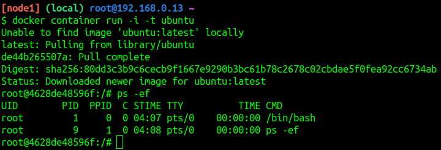 <br>

`$ docker exec -it <container> hostname` <br> // print the hostname of the container <br>
`$ docker exec -it <container> cat /etc/hosts` <br> // print the hosts file content <br>
`$ docker exec -it d7 cat /etc/lsb-release` <br> // print the os version of the container <br>

`$ docker exec -it <container> cat /etc/os-release` <br> // print the os version of the container <br>
`$ docker exec -it <container> cat /etc/issue` <br> // print the os version of the container <br>
`$ docker exec -it <container> cat /etc/lsb-release` <br> // print the os version of the container <br>
`$ docker exec -it <container> cat /etc/redhat-release` <br> // print the os version of the container <br>
`$ docker exec -it <container> cat /etc/debian_version` <br> // print the os version of the container <br>

`$ docker exec -it <container> cat /etc/issue` <br> // print the os version of the container <br>
`$ docker exec -it <container> cat /etc/lsb-release` <br> // print the os version of the container <br>
`$ docker exec -it <container> cat /etc/redhat-release` <br> // print the os version of the container <br>
`$ docker exec -it <container> cat /etc/debian_version` <br> // print the os version of the container <br>

`$ docker exec -it <container> cat /etc/issue` <br> // print the os version of the container <br>
`$ docker exec -it <container> cat /etc/lsb-release` <br> // print the os version of the container <br>
`$ docker exec -it <container> cat /etc/redhat-release` <br> // print the os version of the container <br>
`$ docker exec -it <container> cat /etc/debian_version` <br> // print the os version of the container <br>

`$ docker exec -it <container> cat /etc/issue` <br> // print the os version of the container <br>
`$ docker exec -it <container> cat /etc/lsb-release` <br> // print the os version of the container <br>
`$ docker exec -it <container> cat /etc/redhat-release` <br> // print the os version of the container <br>
`$ docker exec -it <container> cat /etc/debian_version` <br> //

`$ docker container log -f <container>` // follow the live-logs of the container <br>

#### Set hostname
`$ docker run -d --name my-nginx --hostname my-nginx nginx` <br>
`$ docker exec -it my-nginx hostname` <br>

#### Restart policy
`$ docker run -d --name my-nginx --restart always nginx` <br>
`$ docker run -d --name my-nginx --restart unless-stopped nginx` <br>
`docker run -d --name my-nginx --restart on-failure:5 nginx` <br>
Catch: It does not restart the container if the container is stopped manually. it restart if the daemon is restarted. <br>
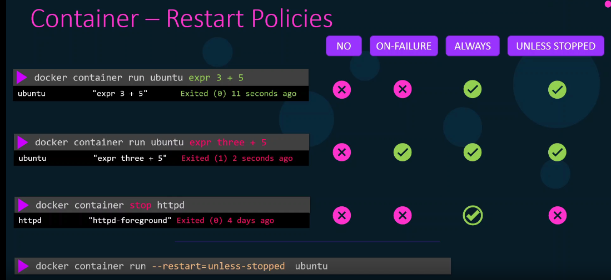


**Live Restore in Docker:** Live restore is a feature that allows Docker to restore containers that were running when the Docker daemon was stopped or restarted. This feature is useful for maintaining the state of containers across daemon restarts (for unless-stopped). <br>
`$ docker run -d --name my-nginx --live-restore nginx` <br>
docker live restore is configured in the docker daemon configuration file. <br>
`/etc/docker/daemon.json` <br>
`{
    "live-restore": true
}` <br>
and then restart the docker service
`systemctl restart docker` <br>
`systemctl start docker` <br>


Copying files to and from a container: <br>
* Container cp-- from **host to container** <br>
`$ docker container cp <source> <destination>` <br>
example: `docker container cp /etc/hosts my-nginx:/tmp/hosts` <br>

* Container cp-- from **container to host** <br>
`$ docker container cp <container>:<source> <destination>` <br>

`$ docker cp /etc/hosts my-nginx:/tmp/hosts` <br>
`$ docker exec -it my-nginx cat /tmp/hosts` <br>
`$ docker cp my-nginx:/tmp/hosts /tmp/hosts` <br>

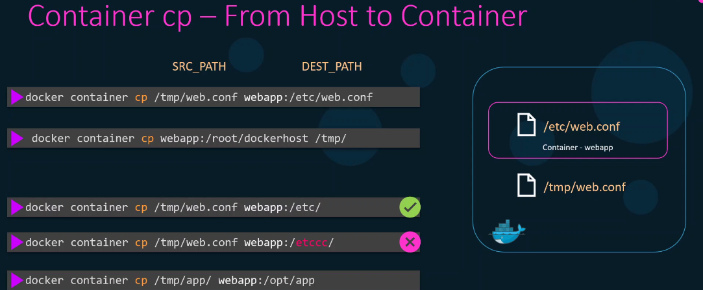 <br>

#### Publishing port and port mapping:
1. **Host to Container**: `docker run -d -p 80:80 --name my-nginx nginx` <br>
2. **Container to Host**: `docker run -d -p 80:80 --name my-nginx nginx` <br>
3. **Multiple Network Interfaces**: 
Suppose our host hase 3 different network interfaces, and we want to bind the container to a specific network interface. <br>
`$ docker run -d -p 192.168.1.5:80:80 --name my-nginx nginx` <br>
`$ docker run -d -p 127.0.0.1:80:80 --name my-nginx nginx` <br>
`$ docker run -d -p 5000:80 --name my-nginx nginx`  //omit the host ip  and port<br>
ephemeral port range: 32765 - 60999
these ports are defined in:  <br>
`$ cat /proc/sys/net/ipv4/ip_local_port_range` <br>
Ephemeral port range is used by the kernel to assign the port to the application. Ephemeral port range is a set of temporary ports used by networking protocol software for establishing outgoing connections

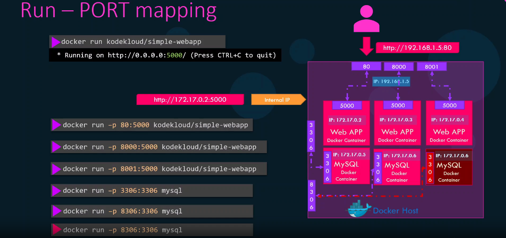 <br>
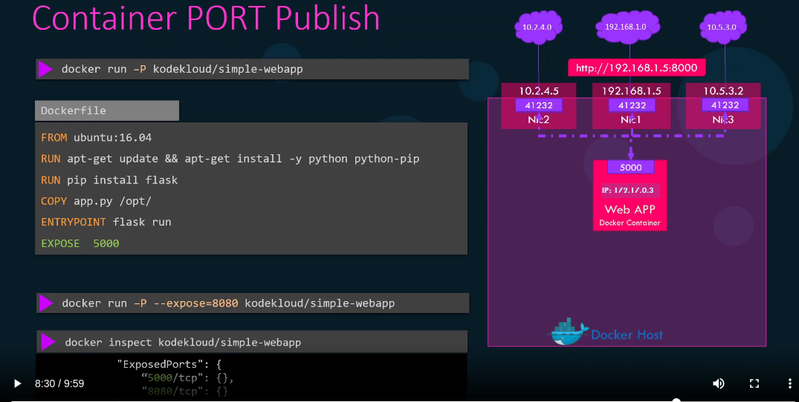 <br>

#### How does docker map a port? 
Using IpTables Rules: <br>
Ip Tables Rules: used to manage packet filtering rules and NAT rules in the Linux kernel firewall. <br>
`$ iptables -t nat -L -n`
`$ iptables -t nat -S DOCKER` <br>

#### Docker container part2:
`docker container run -itd --name=testcontainer --rm ubuntu` used in CICD pipeline, when many containers are created and destroyed simultaneously. <br> 

The main difference between docker name and hostname is that the name is used to identify the container in the docker host, while the hostname is used to identify the container in the network. docker name must be unique but hostname can be the same for multiple containers <br>

**exploring --restart 4 cases**
`$ docker container run -itd --name=caseone --restart=no ubuntu` <br>
`$ docker container run -itd --name=casetwo --restart=on-failure ubuntu` <br> // in this situation, the container will restart if it exits with it non-zero exit status
`$ docker container run -itd --name=casethree --restart=always ubuntu` <br> // restart if docker daemon restart
`$ docker container run -itd --name=casefour --restart=unless-stopped ubuntu` <br>
In this case: docker container will NOT restart even though docker daemon is restart

`$ ls -lrt /var/lib/docker/containers/` <br> // list all the containers in the docker host <br>


## Docker Image Management

 [Kapeli Dockerfile Guide](https://kapeli.com/cheat_sheets/Dockerfile.docset/Contents/Resources/Documents/index/ )

docker login docker.io <br>
docker pull ubuntu:latest <br>
#### image retagging and pushing
`$ docker tag httpd:alpine httpd:customv1` <br>
`$ docker push myrepo/httpd:customv1` <br>
`$ docker push privaterepo.com/myrepo/httpd:customv1` <br>  push the image to the private repository <br>
`$ docker system df` <br> will display the actual size of different object

docker image history <image> <br> // display the history of the image or image layers <br>

**Images inspect -with format**
`$ docker image inspect httpd -f '{{.Os}}'` <br>  print the os of the image <br>
`$ docker image inspect httpd -f '{{.Architecture}}'`  
`$ docker image inspect httpd -f '{{.Architecture}} {{.Os}}'`  

Image Save and Load: <br>
`$ docker image save alpine:latest -o alpine.tar`
`$ docker image load -i httpd.tar` <br>

`$ docker image tag httpd:alpine httpd:test1` //
`$ docker system df` // verify actual size of the docker images

`$ docker image save httpd:latest -o httpd.tar `<br>
`$ docker image load -i httpd.tar` <br> // this approach is used to save the image and load the image in the different docker host if the internet is not available

`$ docker export test > httpd.tar`  export the container to the tar file to create images
`$ docker image import httpd.tar httpd:lates`

#### Create docker images
`$ docker build . -f Dockerfile -t tuhinal/my-app:latest` <br>
`$ docker push tuhinal/my-app:latest`

ls -lrt

## Docker Security

#### Docker Daemon Security: 
What is the problem if someone gets access to the docker daemon? <br>
* Can delete existing containers hosting application
* Delete volumes storing data
* Run container to run their application (i.e bitcoin mining)
* Gain root access to the host system by running a previleged container.
* Target the other systems in the network.

By Default Docker exposes the docker daemon service within the host only one UNIX Socket. That's prevent anyone  outside the host preventing accessing the docker daemon 

The first level of security that must think about is securing the daocker host itself from unwanted access.
usual security best practices:
* Controlling root user
* Disabling unused ports
* Disabled password based authentication
* Enable SSH key based authentication
* Determin users who needs acess to the server

If your host has a public facing interface

we also discussed about configuring external access to the docker daemon by enabling the TCP socket. <br>
`$ dockerd --host tcp://192.168.0.1:2375` <br>
`$ export DOCKER_HOST="tcp://192.168.0.1:2375"` <br>

at some time we may really have to allow access to the docker daemon from the another management host. say a user laptop. it need when it absolulately nessecary. <br>

`/etc/var/docker/daemon.json` <br>
`{
    "hosts": [tcp://192.168.0.1:2375]

}` <br>

Now, enables access to the docker daemon from outside the docker host through an interface on our host.<br>
`$ systemctl restart docker` <br>

now, If you have to do this make sure you have exposed the docker daemon on interface, that is private and only accessible from within your organization. <br>
If your host have a public facing interface, make sure the daemon is not exposed on those interface <br>

by allowing external access, we must also secure the communication with TLS Cerficate <br>
so for this we can configure certificate authority (`cacert.pem`), server certificate (`server.pem`) and server key (`server-key.pem`) and we place this on the docker host and configure the `daemon.json` file<br>

`$ dockerd --tlsverify --tlscacert=ca.pem --tlscert=server-cert.pem --tlskey=server-key

**TLS Encryption:** <br>
`/etc/var/docker/daemon.json` <br>
`{
    "hosts": [tcp://192.168.0.1:**2376**] **its important to change 2375 to 2376**
    "tls": true,
    "tlscacert": "/var/docker/tls/server.pem",
    "tlscert": "/var/docker/tls/server-key.pem",

}` <br>

With this anyone outside the docker host can access the docker daemon only if they have the client certificate and key and can access the API and target it docker commands by simply setting the docker host environment variable to point to this host <br>

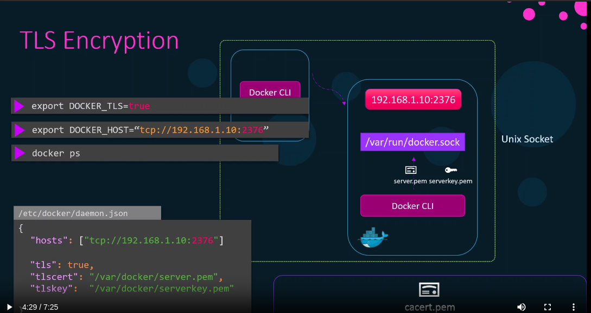 <br>

`$ export DOCKER_TLS=true` // enable secure connection
`$ export DOCKER_HOST="tcp://192.168.0.1:2376" ` <br>
`$ docker ps` <br>


But there still no authentication mechanism in place. meaning that anyone will knows that the docker daemon is being exposed on port 2376 on this host can still access docker daemon by simply setting docker daemon TLS environment variable to true and pointing the docker host environment variable to our host. and they can start deploying ocontainer on our host or delete existing container <br>


Next step is to enable certificate based Authentication: for this we copy the `cacert.pem` to the docker daemon server side and configure `tlscacert` parameter and `tlsverify` in the `daemon.json` file to true.

**TLS Authentication:** <br>
`/etc/var/docker/daemon.json` <br>
`{
    "hosts": [tcp://192.168.0.1:2376"],
    "tls": true,
    "tlscacert": "/var/docker/tls/ca.pem", // to use verify the client certificate
    "tlscert": "/var/docker/tls/server-cert.pem",
    "tlskey": "/var/docker/tls/server-key.pem",
    "tlsverify": true //enables the client certificate authentication
}` <br>

`$ systemctl restart docker` <br>

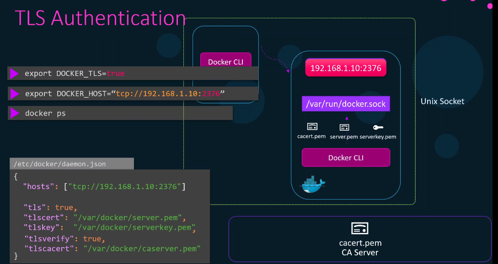 <br>

So, we genenrate certificate for our client call `client.pem` `clientkey.pem` ensures that securely with the Client server that wants to connect to the host along with the cacert.pem- the certificate of the CA. 

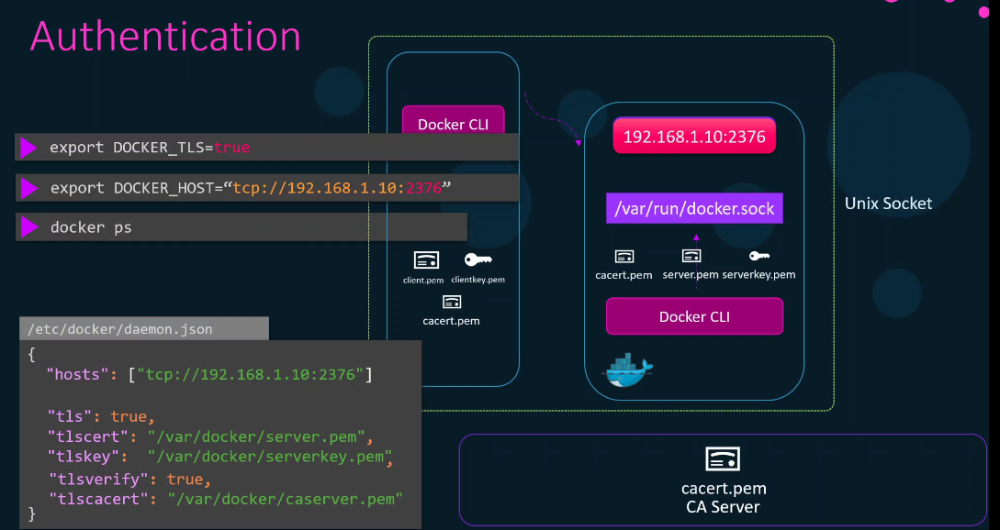 <br>

on the client side we set the docker tls verify to true adn then we either passing client certificate to the command line parameter or we drop the certificate into to the `~/.docker` directory under the /user/home directory, from there the docker command automatically pick-up this  certificate. and now only clients with sign certificate from CA server can access the docker daemon. <br>
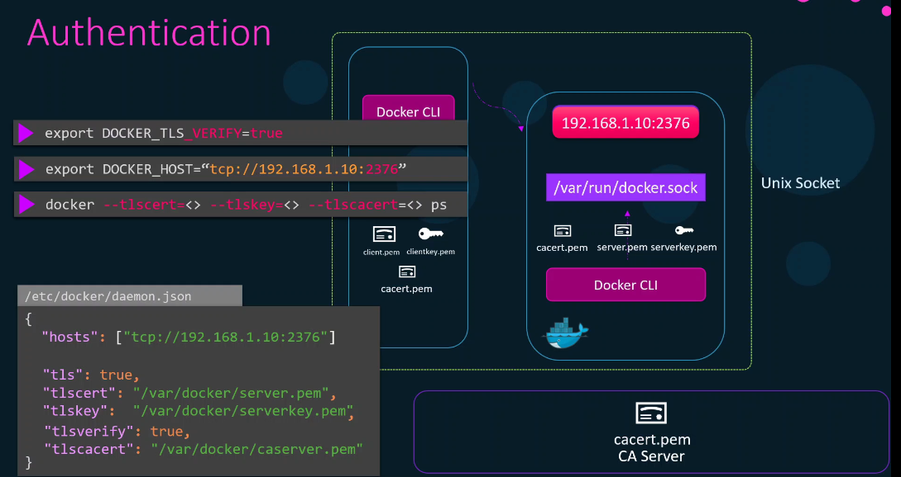 <br>

So remember the TLS option `"tls": true,` alone does not authenticate the client. it only encrypts the communication between the client and the server. <br>
`"tlsverify" :` option is what enabled the client authentication. <br>

#### Summary:

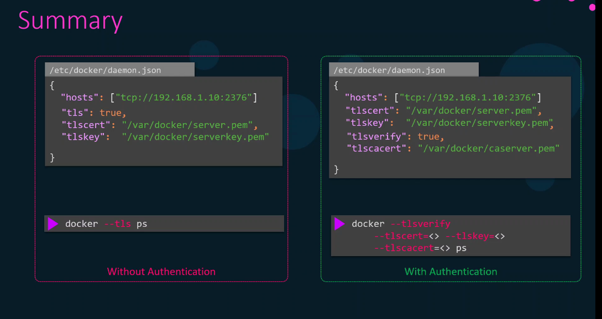 <br>

## Namespaces:
There is no hard isolation between the containers and the underlying host. <br>

Namespace is a feature of the Linux kernel that provides process isolation. It allows multiple processes to run on the same host without interfering with each other. <br>
Docker containers use namespaces to provide process isolation. Each container runs in its own namespace, which isolates it from other containers and the host system. <br>
Namespaces provide the following types of isolation: <br>
1. **PID Namespace**: Each container has its own PID namespace, which isolates the container's processes from the host system and other containers. This allows each container to have its own process tree, with its own init process and PID 1. <br>
2. **Network Namespace**: Each container has its own network namespace, which isolates the container's network interfaces, routing tables, and firewall rules from the host system and other containers. This allows each container to have its own network stack, with its own IP addresses and network configuration. <br>
3. **Mount Namespace**: Each container has its own mount namespace, which isolates the container's filesystem from the host system and other containers. This allows each container to have its own filesystem tree, with its own root directory and mount points. <br>
4. **UTS Namespace**: Each container has its own UTS namespace, which isolates the container's hostname and domain name from the host system and other containers. This allows each container to have its own hostname and domain name. <br>
5. **IPC Namespace**: Each container has its own IPC namespace, which isolates the container's inter-process communication (IPC) mechanisms from the host system and other containers. This allows each container to have its own shared memory segments, message queues, and semaphores. <br>
6. **User Namespace**: Each container has its own user namespace, which isolates the container's user and group IDs from the host system and other containers. This allows each container to have its own set of user and group IDs, which are mapped to different IDs on the host system. <br>
7. **Cgroup Namespace**: Each container has its own cgroup namespace, which isolates the container's control groups (cgroups) from the host system and other containers. This allows each container to have its own cgroup hierarchy, with its own resource limits and accounting. <br>
8. **Time Namespace**: Each container has its own time namespace, which isolates the container's timekeeping from the host system and other containers. This allows each container to have its own clock source and time zone. <br>

CGroups: Control Groups (cgroups) is a feature of the Linux kernel that allows you to limit and monitor the resource usage of a group of processes. Cgroups provide a way to control the CPU, memory, disk I/O, and network bandwidth usage of processes. <br>

Resource Limits CPU, Memory, Disk I/O, Network Bandwidth. It Restrics the resource consumption by the container. <br>
By default there are no restrictions on the resource usage of a container. <br> if require a container can consume all the resources of the host system. <br>

When the kernel detect that a container is consuming all resources, it will start killing the processes in the container to free up resources. <br>
Its important to understand the impact of the containers on resources available on the host. <br>

Forground Process: 
Background Process: `dockerd &` <br> background process is used to run the docker daemon in the background. <br>

**Linux- CPU Sharing:** <br>
CPU Shares: CPU shares are used to allocate CPU resources to containers. By default, all containers have the same number of CPU shares, which means they have equal access to CPU resources. <br>

CFS (Completely Fair Scheduler): The Completely Fair Scheduler (CFS) is the default process scheduler in the Linux kernel. It provides fair CPU scheduling for all processes running on the system. <br>

Real-time Scheduling: Real-time scheduling is a feature of the Linux kernel that allows processes to have guaranteed access to CPU resources. Real-time processes have higher priority than normal processes and are scheduled before them. <br>

Contianer can use 62% of the CPU resources. 

## Docker Network:

Default Networks:
**Bridge Network:** <br>
    Bridge is private internal network created by docker on the host and they create an internal IP address usually 172.17 series. Containers can access each other using this internal IP if required. <br>

**Host Network:** <br>
    Host network is used when you want to use the host network stack for the container. This means that the container shares the network stack with the host system and does not have its own network namespace. <br>
    drawback: You cannot run multiple containers on the same host port. <br>

**None Network:** The containers are not attached to any network and doesn't have any access to the external network or other containers. They run in a isolated network. <br>

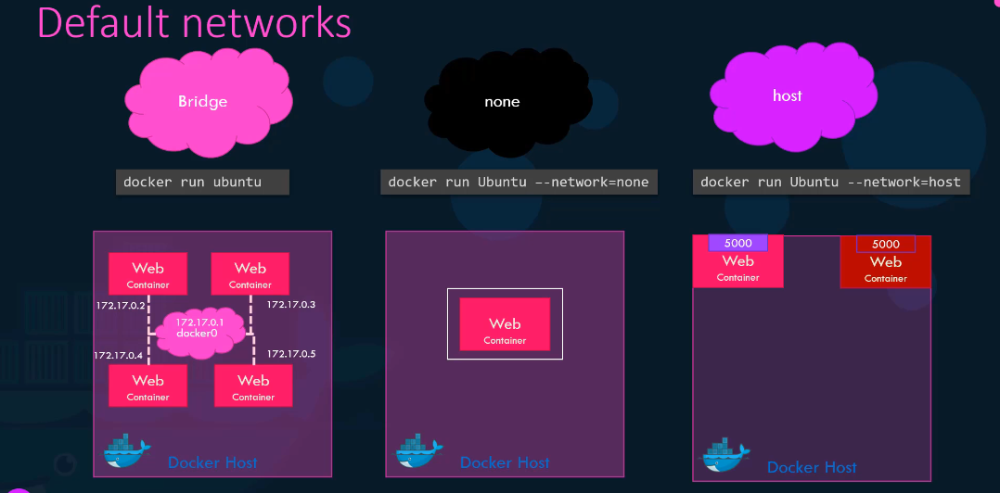 <br>
Isolate the container from the external network. <br>
suppose, web-1(172.17.0.2) and web-2(172.17.0.4) are the containers and they are running on the same network 172.17.0.0   and application-1(182.18.0.3) and application-2 (182.18.0.2) are in another network()182.18.0.0  <br>
`$ docker run -d --name web-1 nginx` <br>
`$ docker run -d --name web-2 nginx` <br>
`$ docker exec -it web-1 ping web-2` <br>
`$ docker exec -it web-1 ping
We could create own internal network and attach the containers to the network. <br>


``` 
$ docker network create \
--driver bridge \
--subnet 182.18.0.0/16 \
custom-isolated-network 

```
<br>
$ docker network ls

Inspect Network: <br>
`$ docker network inspect custom-isolated-network` <br>

Embeded DNS Server: <br>
Docker has an embedded DNS server that provides name resolution for containers. This allows containers to communicate with each other using their container names. <br>
`$ docker exec -it web-1 ping web-2` <br>

Scenario: Suppose my backend application have a database container running on the same node.
How can I get my web server to access the database on the database container. one think I could dl is to use the IP address of the database container. but this is not a good practice because the IP address of the container can change if the container is restarted/rebuilds.

The right wayto do it is to use container_name. All container in docker host can resolve usign the container name. <br>
`$ docker exec -it web-1 ping database` <br>
Docker has the in-build DNS server that helps the container to resolve each other using the cotainer name. <br>
note that build in DNS server always run on 127.0.0.11 

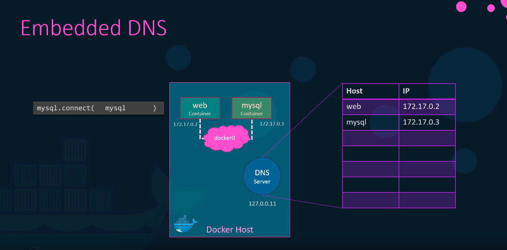 <br>

So how does docker implement docker networking? what is the technology behind it? <br>
How are the containers isolated within the host? <br>
Ans: Docker uses Network Namespaces that creates a separate namespace for each container (to provide network isolation for containers). It then uses virtual Ethernet pairs to connect the containers together/to the host network. <br>

Network Namespaces are a feature of the Linux kernel that allows you to create multiple isolated network stacks on a single host. Each container runs in its own network namespace, which isolates its network interfaces, routing tables, and firewall rules from the host system and other containers. This allows each container to have its own network stack, with its own IP addresses and network configuration. <br>

Custom Network Connection: <br>
`$ docker network connect custom-isolated-network my-container` <br>
`$ docker network disconnect custom-isolated-network my-container` <br>
`$ docker network rm custom-isolated-network` <br>
`$ docker network prune` <br>

Lab: create a container Container-ONE and another Container-TWO, ping Container-ONE from Container-TWO <br>
`$ docker exec -it first ping second` <br>
**It will not work because Embedded DNS Server won't working withe the default `bridge` network.** <br>
**Lab:** 
* create two containers (`first`, `second`) from default network and ping each other. <br>
* create two containers (`custom-first`, `custom-second`) from custom network and ping each other. <br>
    `$ docker network create --driver bridge --subnet=192.168.10.0/24 tuhin-custom-network`
    `$ docker exec -it customfirst ping customsecond`
* ping the container `custom-first` from `first`
* attacj the `first` container to the custom network and ping the container `custom-first` from `first` <br>
* ping the container from the host <br>
* ping the container from the host using the container name <br>
* ping the container from the host using the container IP <br>
* read the `/etc/hosts` file of the container <br>
* read embeded DNS server of the container <br>
    `$ docker exec -it customsecond cat /etc/resolv.conf` and check the nameserver <br>

Create a Docker Network: <br>
`$ docker network create --driver bridge --subnet=192.168.10.0/24 tuhin-custom-network` <br>
`$ docker container stop $(docker container ls -q)` <br> // -aq for all the containers 
`$ docker container rm $(docker container ls -q)` <br>
`$ docker network ls` <br>
`$ docker network inspect tuhin-custom-network` <br>
`$ docker container inspect second|more ` <br>

Docker Networks Namespaces: 

It is used for Isolate the network. as we know containers are isolated from underlying host using namespaces.
what is namespaces: If your house is a computer/host, then namespaces are like rooms in the house. Each room has its own purpose and is isolated from the other rooms. I'm assingin every room my childs. the rooms helps in providing privacy  to each child, each child can only see whats within in his/her room, they can't see what happening outside their room. But as a parent, there is a visibility into all the room. <br>

Process Namespace: Each container has its own process namespace, which isolates the container's processes from the host system and other containers. This allows each container to have its own process tree, with its own init process and PID 1.  When we create a container you want to make sure that it is isolated, it doesn't see any other processes on the host or any other containers, so we create a special room for It on our host using a namespace, as far as the container is concerned it only sees the process run by it, and thinks that it in on its own host. but the underlying host, however has visibility into all of the processes including those running inside the containers <br>
this can be seen by running the `ps -ef` or `ps aux`(on the container/host) command on the host. <br>

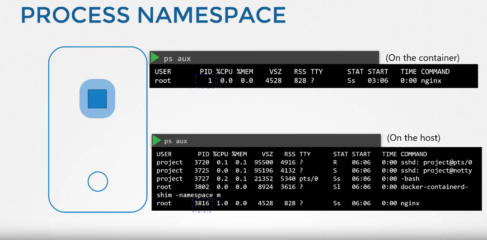 <br>

Network Namespace: Each container has its own network namespace, which isolates the container's network interfaces, routing tables, and firewall rules from the host system and other containers. This allows each container to have its own network stack, with its own IP addresses and network configuration. <br>
When we create a container we want to make sure that it is isolated from the network, it doesn't see any other network interfaces on the host or any other containers, so we create a special room for it on our host using a namespace, as far as the container is concerned it only sees the network interfaces that are part of its namespace, and thinks that it is on its own network. but the underlying host, however, has visibility into all of the network interfaces including those used by the containers. <br>

when comes to networking, our host has its own interfaces that connected to the local area network, our host has its own routing and ARP table with information about rest of the network. we want to seal all of those details from the container. when the container is created, we create a network namespace for it that way it has no visibility to any network related information on the host. within its namespace the container can have its own virtual interfaces, routing and ARP table. the container has its own interfaces.

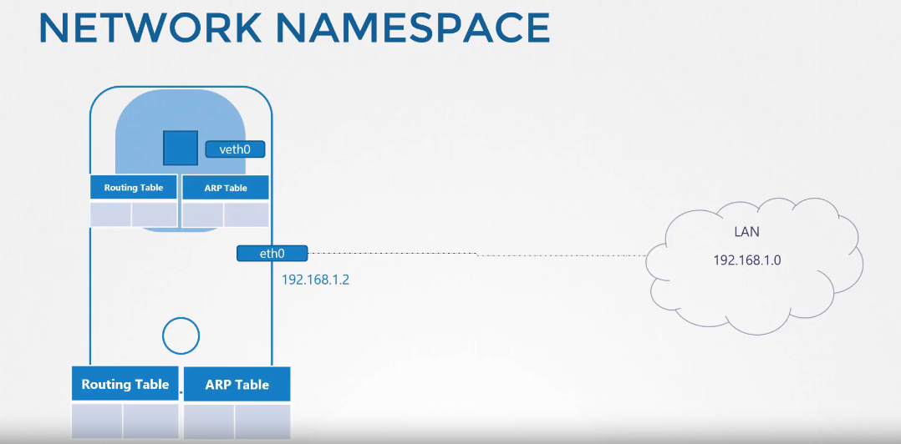 <br>

To create a new network interface on alinux host run `ip netns add mynamespace` <br>

`$ ip netns add mynamespace` <br>
`$ ip netns list` <br>

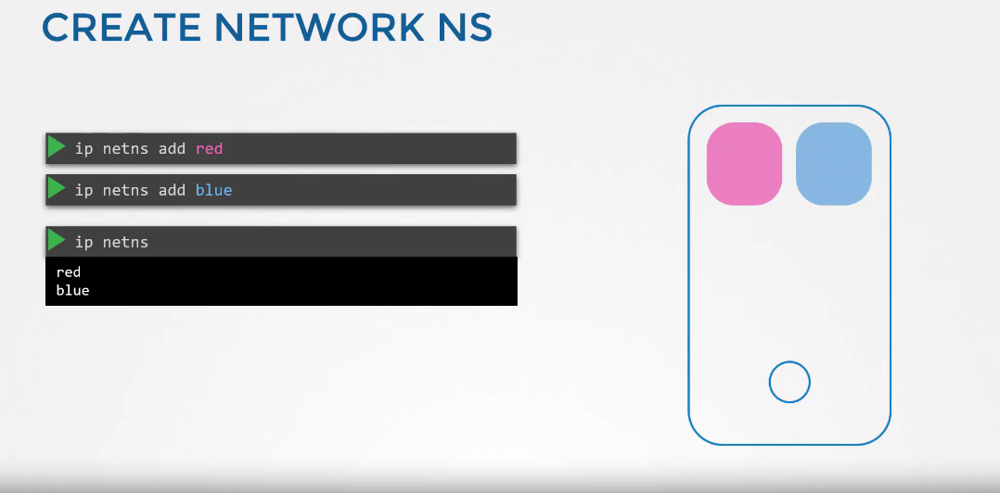 <br>

To list interfaces on my host run `ip link` <br> This is from host.
`$ ip link` <br>
`$ ip link set dev lo up` <br>

but how do we view the same within the network namespace that we created? <br>
`$ ip netns exec mynamespace ip link` <br> // here we are running the `ip link` command within the network namespace `mynamespace` <br>
`$ ip netns exec mynamespace ip addr add `
another way is 
`$ ip -n red link`

both are same, but remember only works if you intended to run the IP command within the network namespace. as you can see  it only least the loopback interface, you can't see the 80 interface on the host. so with namespaces we have successfully prevent that the container  from seeing the host interface <br>     

<!--  <br> -->

`$ arp`\
`$ ip netns exec red arp` <br>
and its same for routing table
`$ ip netns exec red route` <br>
as of now, these network namespaces have no network connectivity. they have no interfaces of their own, they cannot see the underlying host network.  lets first look at  establising connectivity between namespaces themself.<br>

you can connect two namespaces together using a virtual ethernet pair or virtual cable, is often refered as a pipe. but we would like to call it a virtual cable with two interfaces on either ends.
to create the tableL:
`$ ip link add **veth-red** type veth peer name **veth-blue**` <br>
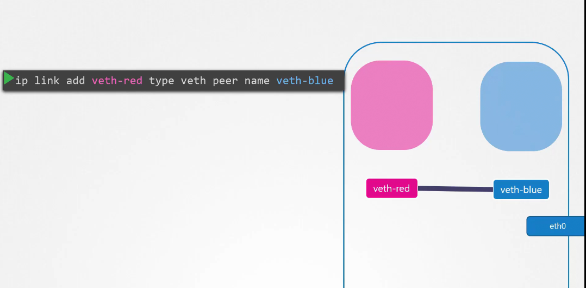 <br> 
The next step is to attach each interface to the appropriate namespace. <br>
`$ ip link set **veth-red** netns red` <br>
`$ ip link set **veth-blue** netns blue` <br>

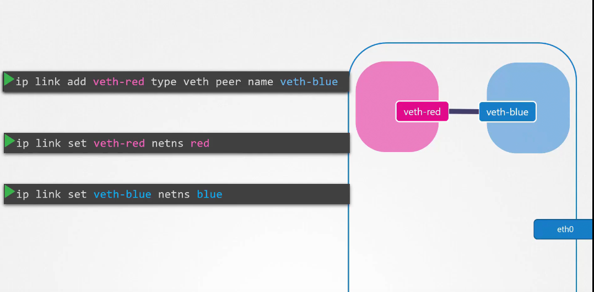 <br>

we can then assign IP address to each of these namespaces. <br>
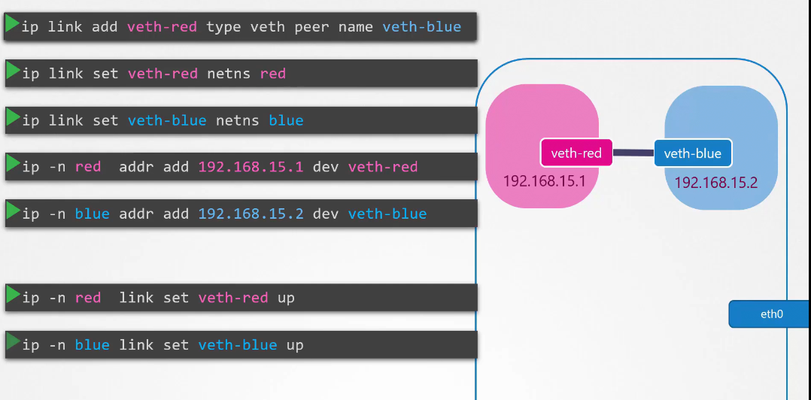 <br>

now the links are up, we can ping from one namespace to another. <br>
`$ ip netns exec red ping 192.168.15.2` <br>
`$ ip netns exec blue ping 192.168.15.1` <br>

Now, If we look into the ARP table on the `red` namespace we can see the MAC address of the `blue` namespace. <br>
`$ ip netns exec red arp` <br>
`$ ip netns exec blue arp` <br>

If we comapre this with the ARP table of the host, we see that the host ARP table has no idea about new namespaces. and no idea about the interfaces created in them.
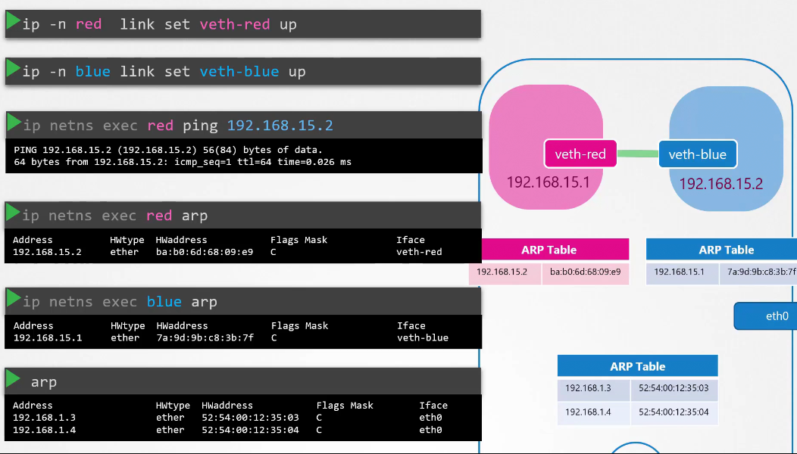 <br>

Now we have two namespaces, what you do when you have more namespaces? <br> how do you enable all of them to communicate each other? <br> Its just like a physical worlds, we create a virtual network inside my host. To create a network we need a **Switch**. To create a virtual network, we need  a virtual switch. So you create a vurtual swtich within our host and connect the namespace to it. So how do you create a virtual switch within our host?
Ans: Linux Bridge. <br>

To create an internal Linux bridge network we add a new interface to the host using `ip link add` command with the `type` set to `bridge` 
we name it `v-net-0` <br>
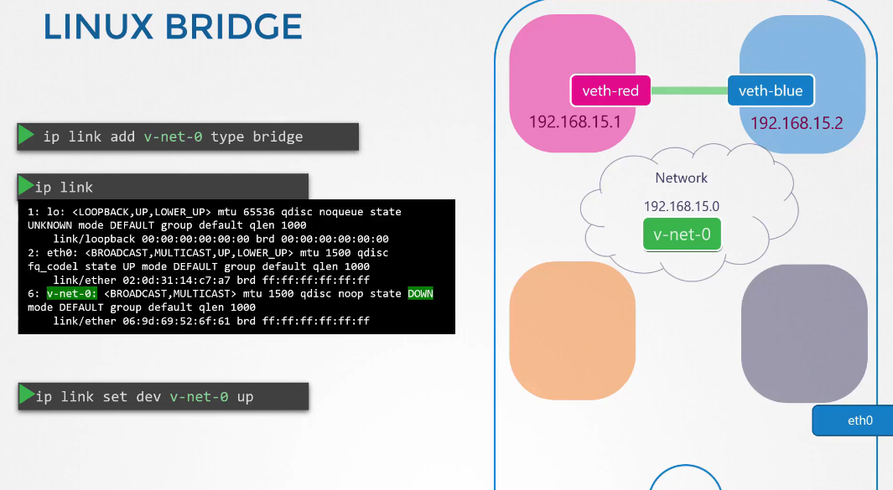 <br>
It appears to the output of `ip link` command output. Its currently down. <br>
`$ ip link set dev v-net-0 up` <br>

Now for the namespaces, this interface is like a switch that it can connect to. so think of it as an interface for the host and switch for the namespaces<br>
 <br>
 so the next step is connect the namespaces to the this new virtual network switch. earlier, we created the cables, each pair (veth-red, veth-blue). <br>
 because we wanted to connect two namespaces directly. now we'll connecting all namespaces to the bridge network, so we need new cables for that purpose. these cables doesn't make sense anymore, so we will get rid of it. 

 use the `ip link del` command we can delete the cable. <br>
 `$ ip -n red link del veth-red` <br>

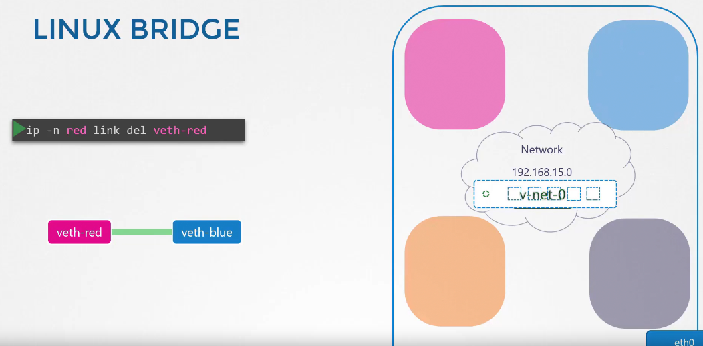 <br>

when you delete the link with one-end the other end gets deleted automatically, since they are pair <br>
lets creates new cables to connect the namespaces to the bridge.  
`$ ip link add veth-red type veth peer name veth-red-br` // -br for as it is connect to the bridge network <br>
`$ ip link add veth-blue type veth peer name veth-blue-br` <br>


this naming convention can easily identify the interfaces that associated to the red namespaces.  <br>
Similarly create a cable to connect the blue namespace to the bridge network. <br>
`$ ip link set veth-red-br netns red` <br>
`$ ip link set veth-blue-br netns blue` <br>
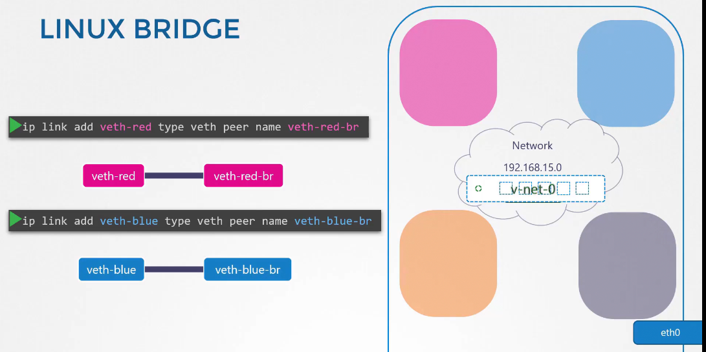 <br>

Now, we have the cable ready, Its time to get them connected to the namespaces. to attach one end of the interface to the red namespace run
`$ ip link set veth-red netns red` <br>
to attach the other end to the bridge network run
`$ ip link set veth-red-br master v-net-0` <br>
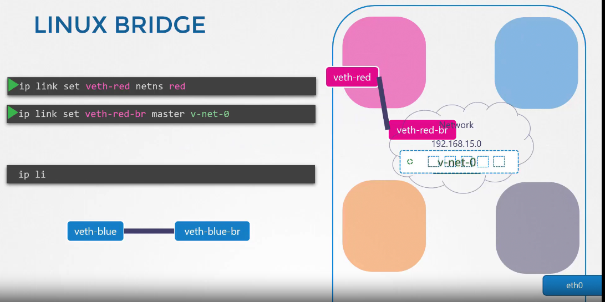 <br>
Now same for blue network:
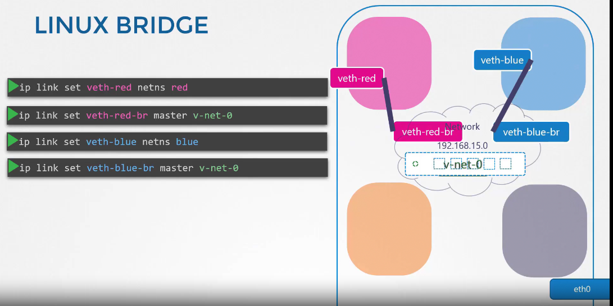 <br>

Let us now set IP address for this link  and turn them up:
`$ ip -n red addr add 192.168.15.1 dev veth-red` <br>
<!-- `$ ip -n red link set dev veth-red up` <br> -->
`$ ip -n blue addr add 192.168.15.2 dev veth-blue` <br>
<!-- `$ ip -n blue link set dev veth-blue up` <br> -->
Now turn the devices UP:
`$ ip -n red link set dev veth-red up` <br>
`$ ip -n blue link set dev veth-blue up` <br>

Now the container reach each other over the network.
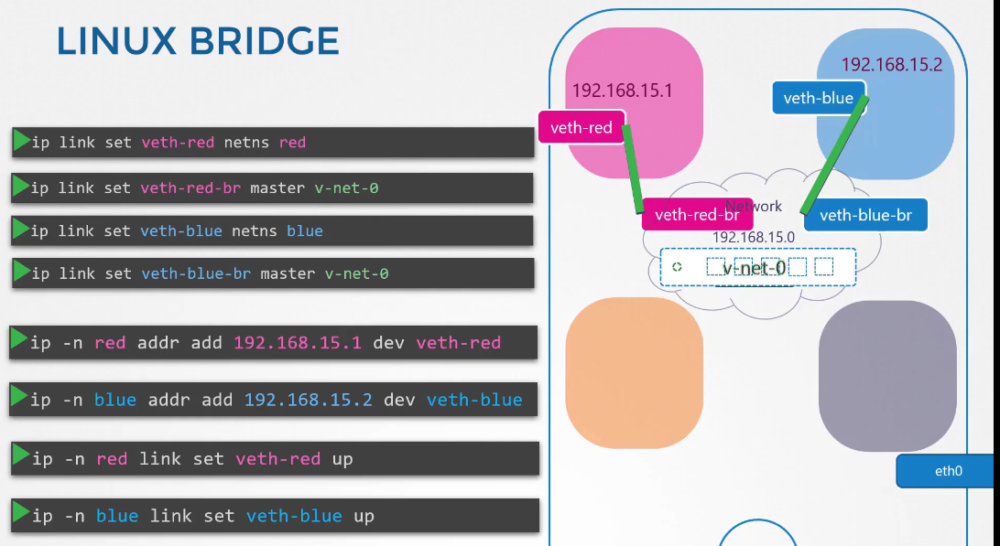 <br>

we will follow the same procedure to connect the remaining namespaces to the network. they all will be able to communicate with each other. we now all four namespaces connected they can all coommunicate with each other. <br>
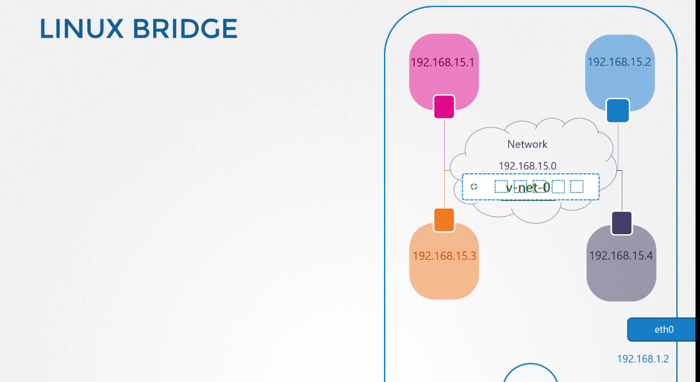 <br>
and remember we assign our host to IP 192.168.1.2 and now `ping 192.168.15.1`, will it work? **NO** because my host in one network(192.168.1.0) and the namespaces are another network(192.168.15.0).
but what if I really want to establish connectivity between my host and these namespaces? <br>
Remember, we said that the bridge switch actually an interface for the host, so we do have an interface on the 192.168.15.0 network on our host. Since this just another interface, all we need to do is assign an IP address to it. so we can reach the interfaces through it. now run
`$ ip addr add 192.168.15.5/24 dev v-net-0` <br>
and ping the red namespaces from our localhost:<br>
` ping 192.168.15.1`

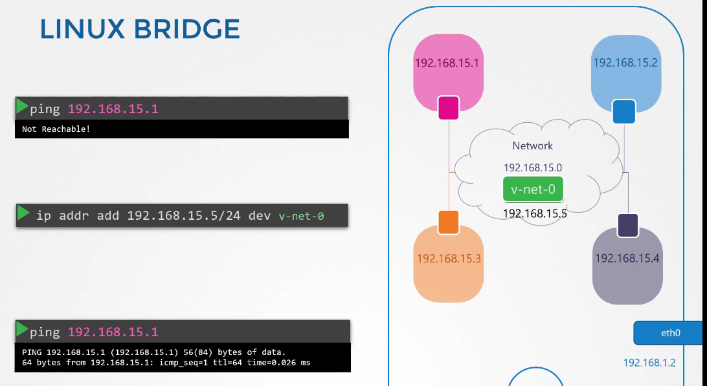 <br>

Now remember, this entire network is still private and restricted within the host, from within the namespaces you cant reach the outside world nor can anyone outside the world reach the services/application hosted inside, the only door to the outside world is the **ethernet port on the host**. so how do we configure this bridge to reach the line network througt the ethernet port? say there is another host attached to our LAN network with address 192.168.1.3

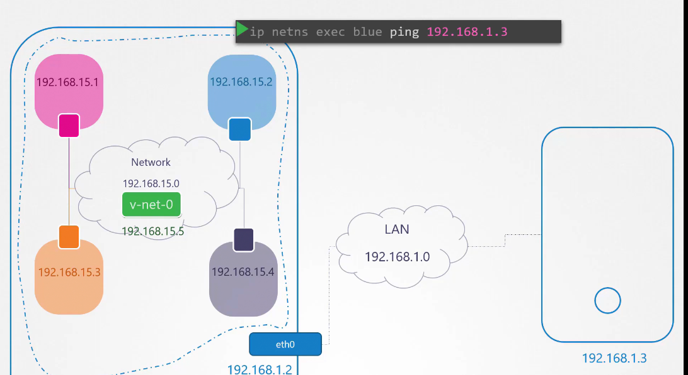 <br>
How can we reach this port from within my namespaces. what happer if I try to ping this host from my blue namespaces?
`$ ip netns exec blue ping 192.168.1.3`
The blue namespaces sees that I'm trying to reach a network **192.168.1.0** which is different from my current network(**192.168.15.0**). so its look its routing table to find that network. the routing table has no information about other network. so it comes back saying that the network is unreachable. <br>
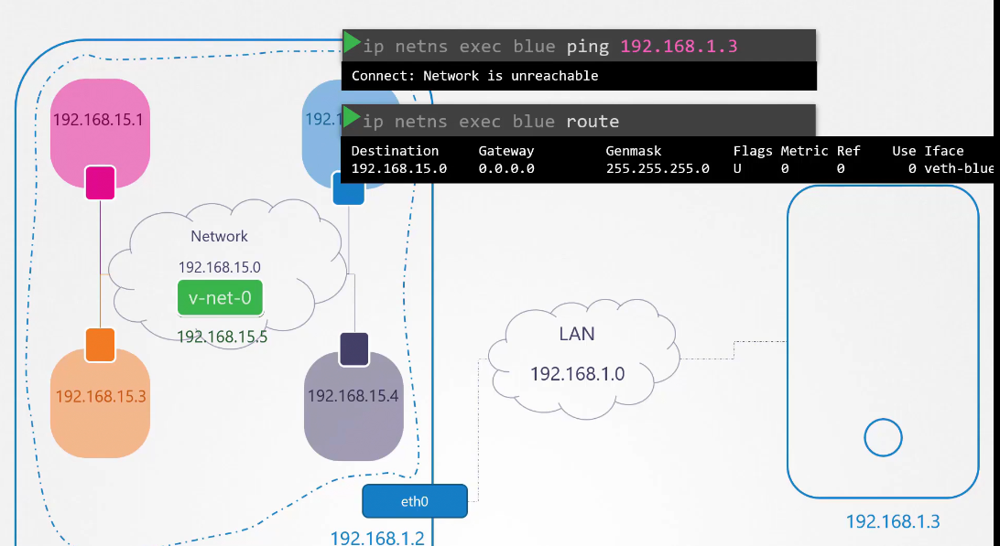 <br>

So, we need to add an entry into routing table to provide a gateway or a door to the outside world. so how do we find that gateway? A door/gateway is a system  on the local network that connects to the other network. so what is a system that has one interface on the network **LOCAL** to the **blue** namespace which is 192.168.15.0 network and also connected to the outside LAN network. here is the logical view: <br>

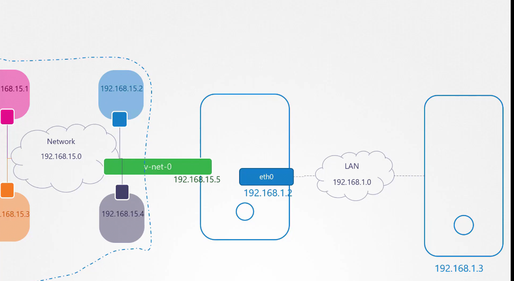 <br>

Its the localhost that have all this namespaces on, so you can ping the namespaces. remember our localhost has an interface to attach the private networks. so you can ping the namespaces, so our localhost is the gateway that connects the two networks together. we can now add a **route** entry in the blue namespace to say route all traffic 192.168.1.0/24 network throuth the gateway at 192.168.15.5. 

`$ ip netns exec blue ip route add 192.168.1.0/24 via 192.168.15.5` <br>

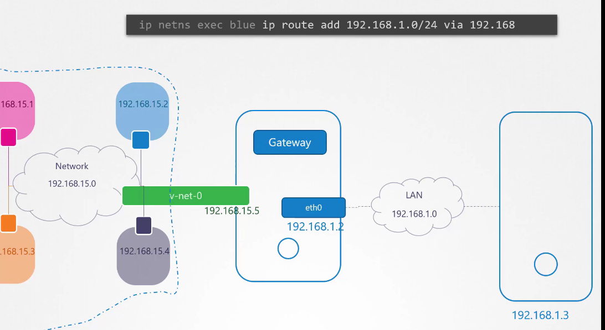 <br>
now remember our host has two IP Address one in the brifge network 192.168.15.5 and another on the external network 192.168.1.2, can we use any in the route? **NO** because the blue namespace  can only reach the gateway is in local network at 192.168.15.5, the default gateway should be reachable from your namespace when it added to your route. when you try to ping now no longer get the error unreachable message but it still not get response back from the ping. what might be the problem? <br>
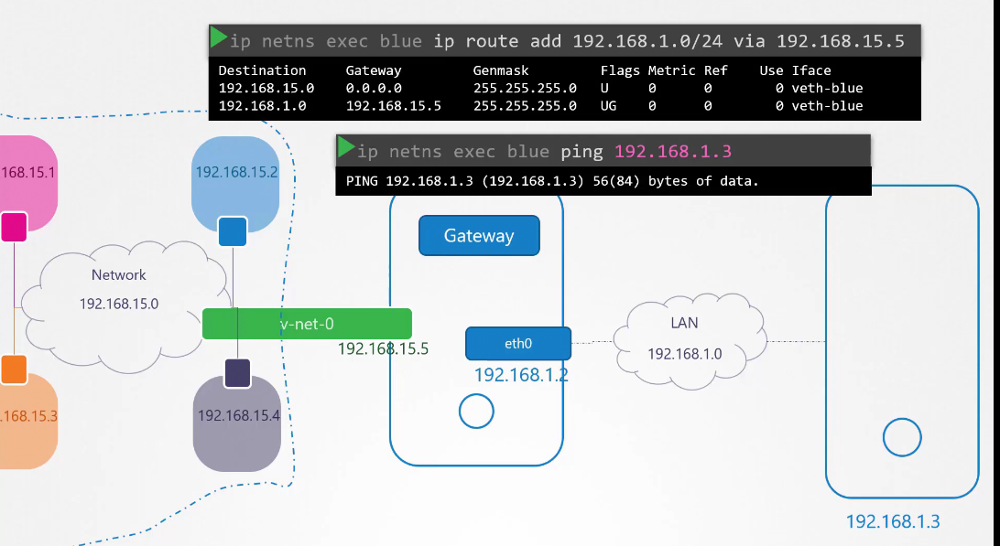 <br>

We talked about a similar situation in on of our earlier lecture, where from our home network we try to reach the external internet through our router, our home network has internal private IP adresses that the destination network dont know about, so they cannot reach back. for this we need NAT enable on our host, acting as a gateway here. so that it can sent the messages to the LAN in its own name and with its own address.

How do we add NAT functionality? we can use the `iptables` command to add NAT rules. <br>
`$ iptables -t nat -A POSTROUTING -s 192.168.15.0/24 -j MASQUERADE` <br>
`$ iptables -t nat -L` <br>

That way anyone receiving this packet outside the network will thing that the packet is coming from the host not from the within the namespaces. when we trying to ping now we are able to reach the outside world<br>

`$ ip netns exec blue ping 192.168.1.3` <br>

Finally LAN is cconnected to the internet, we want the namespaces reach the internet, so we try to ping a server in the internet at
`$ ip netns exec blue ping google.com` <br>
`$ ip netns exec blue ping 8.8.8.8` <br> it gives us 'Network is unreachable' <br>
we dont know why that is happening. now we will check the routing table
`$ ip netns exec blue route` <br>a

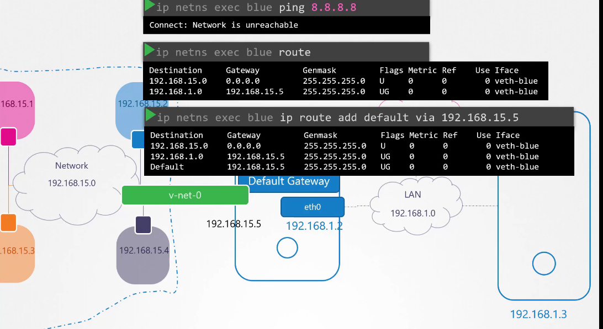 <br>

now, we need to add a default gateway. we can say that to reach any external network talk to our host. so we add a default gateeway specifying our host. we should now be able to reach outside world from within this namespaces:
`$ ip netns exec blue ping 8.8.8.8` <br> 
Now, what about the conncectivity from outside world to inside the namespaces. In order to make this communication, we have two options:
i) add a port forwarding roles using iptables to say any traffic comming to port 80 on the localhost is to be forwarded to port 80 on the ip assign to the blue namespace<br>
`$ iptables -t nat -A PREROUTING -dport 80 --to-destination 192.168.15.2:80 -j DNAT` <br>

 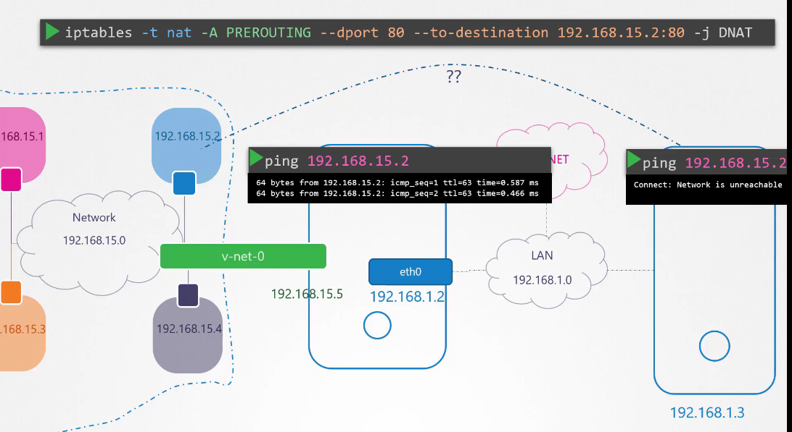 <br>