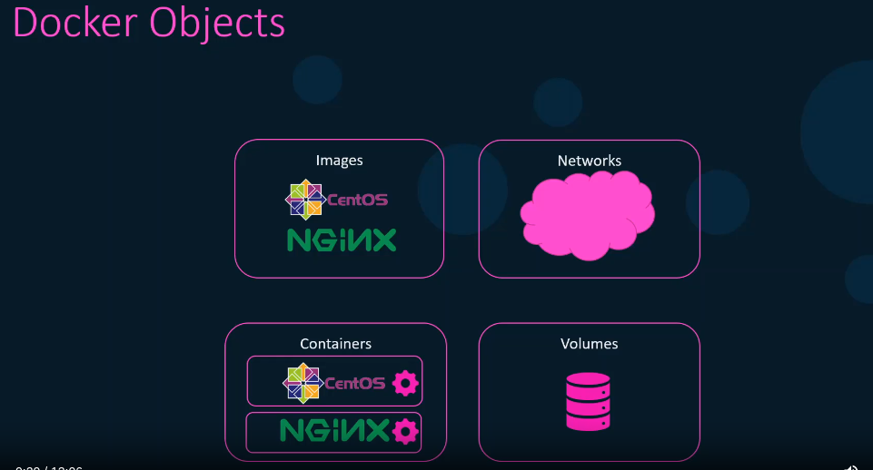

Docker Container Lifecycle: A container is a self-contained, isolated environment that encapsulates a set of processes and their dependencies. Containers only lives as long as the process is running. Once the process stops, the container automatically stops.

1. Container Creation: docker run <image>
2. Container Start: docker start <container>
3. Container Stop: docker stop <container>
4. Container Pause: docker pause <container>
5. Container Unpause: docker unpause <container>
6. Container Kill: docker kill <container>
7. Container Delete: docker rm <container>
8. Container Run: docker run -d -p 80:80 --name my-nginx nginx 
9. Container Exec: docker exec -it my-nginx bash
docker exec container_id cat /etc/hosts : to print the hosts file content 

run attached mode: docker run -d -p 80:80 --name my-nginx nginx
run detached mode: docker run -d -p 80:80 --name my-nginx nginx

Ports Mapping:
1. Host to Container: docker run -d -p 80:80 --name my-nginx nginx
2. Container to Host: docker run -d -p 80:80 --name my-nginx nginx
3. Container to Container: docker run -d --name my-nginx1 nginx


Volume Mapping:
Volume Mapping: Volume mapping is a mechanism to mount a host directory into a container. It allows you to share files between the host and the container. This is useful when you want to share data between the host and the container, such as configuration files or data files. 

Volume mapping read only mode: docker run -d -p 80:80 -v /var/www/html:/var/www/html:ro --name my-nginx nginx

1. Host to Container: docker run -d -p 80:80 -v /var/www/html:/var/www/html --name my-nginx nginx
2. Container to Host: docker run -d -p 80:80 -v /var/www/html:/var/www/html --name my-nginx nginx
3. Container to Container: docker run -d -v /var/www/html:/var/www/html --name my-nginx1 nginx

Docker Image Lifecycle:
1. Image Creation
2. Image Push
3. Image Pull
4. Image Delete

Docker Volume Lifecycle:
1. Volume Creation
2. Volume Mount
3. Volume Unmount
4. Volume Delete

Docker Network Lifecycle:
1. Network Creation
2. Network Connect
3. Network Disconnect
4. Network Delete

Docker Service Lifecycle:
1. Service Creation
2. Service Start
3. Service Stop
4. Service Delete

Docker Swarm Lifecycle:
1. Swarm Init
2. Swarm Join
3. Swarm Leave
4. Swarm Unlock
5. Swarm Lock
6. Swarm Unlock
7. Swarm Unlock
8. Swarm Unlock

Docker Compose Lifecycle:
1. Compose Create
2. Compose Start
3. Compose Stop
4. Compose Remove

Docker Registry Lifecycle:
1. Registry Creation
2. Registry Push
3. Registry Pull
4. Registry Delete

Docker Stack Lifecycle:
1. Stack Create
2. Stack Start
3. Stack Stop
4. Stack Remove

Docker Machine Lifecycle:
1. Machine Create
2. Machine Start
3. Machine Stop
4. Machine Remove

Docker Plugin Lifecycle:
1. Plugin Install
2. Plugin Uninstall

Docker Secret Lifecycle:
1. Secret Create
2. Secret Remove

Docker Config Lifecycle:
1. Config Create
2. Config Remove

Docker Network Driver Lifecycle:
1. Network Driver Create
2. Network Driver Remove

Docker Volume Driver Lifecycle:
1. Volume Driver Create
2. Volume Driver Remove


2. Network Driver Remove

Docker Volume Driver Lifecycle:
1. Volume Driver Create
2. Volume Driver Remove


### Docker Engine

Docker Engine is the core component of Docker, responsible for creating and running containers. It consists of three main components:
1. **Docker Daemon**: The background service running on the host that manages Docker containers.
2. **Docker Client**: The command-line interface (CLI) that allows users to interact with the Docker Daemon.
3. **REST API**: An API that allows programs to communicate with the Docker Daemon.

### Docker Service configuration

Check docker

### Docker Service configuration

Check docker service status: `systemctl status docker` <br>

when a docker daemon run its listen on a **Unix Socket**. The default location for the Unix socket is `/var/run/docker.sock`. <br>
Uinix Socket is an IPC (Inter-Process Communication) mechanism that allows communication between processes on the same host. <br> Docker daemon is accessible only from the host where it is running. <br> becuase it is only listening on the Unix socket. <br> we could make docker daemon listen on a TCP Interface on the docker host by adding host opttion.

`
dockerd --debug \ 
        --host tcp://192.168.1.10:2375 \
`

now the docker daemon is accessible from the remote host using the IP  192.168.1.10<br>

Other host can connect to the docker daemon by setting an environment variable: <br>
export DOCKER_HOST="tcp://192.168.1.10:2375" <br>

you must be extreamly careful when exposing the docker daemon over the network because the default configuration does not have any **authentication or encryption**
By default docker daemon serve unencrypted traffic over the network. <br>

Question: what if we need to establish a connection to the Docker daemon from a remote host? <br>
Ans: **TCP Socket** : To allow remote connections to the Docker daemon, you need to enable the TCP socket. This can be done by modifying the Docker daemon configuration file. <br>


**TLS Encryption:** To secure the communication between the Docker client and the Docker daemon, you can enable TLS encryption. This requires generating TLS certificates and configuring the Docker daemon to use them. <br>

To enable TLS encryption, you must first create a pair of TLS certificate and the TLS flag true, pass in the path to the certificate and key files. To enable TLS, the standard port is 2376 instead of 2375. <br>

```docker --debug \
       --host=tcp://192.168.1.10:2376 \
       --tls=true \
       --tlscert=/var/docker/tls/server-cert.pem \
       --tlskey=/var/docker/tls/server-key.pem \
```

as of now, this command could be moved to configuration file `/etc/docker.daemon.json` <br>

`{
    "debug": true,
    "hosts": ["tcp://192.168.1.10:2376"], // support multiple listeners
    "tls": true,
    "tlscert": "/var/docker/tls/server-cert.pem",
    "tlskey": "/var/docker/tls/server-key.pem"
}
`

#### Basic contianer operations




`$ docker <docker-object> <subcommand> <options> <arguments/Commands>`

all images and container exist in the docker host `/var/lib/docker/` 

#### Docker container basic operations
 * Create a container: `docker create <image>`
    * Start a container: `docker start <container>`
    * Stop a container: `docker stop <container>`
    * Pause a container: `docker pause <container>`
    * Unpause a container: `docker unpause <container>`
    * Kill a container: `docker kill <container>`
    * Delete a container: `docker rm <container>`
    * Run a container: `docker run <image>`
    * Execute a command in a running container: `docker exec <container> <command>`
    * Attach to a running container: `docker attach <container>`
    * Inspect a container: `docker inspect <container>`
    * List running containers: `docker ps`
    * List all containers: `docker ps -a`
    * List container logs: `docker logs <container>`
    * List container processes: `docker top <container>`
    * Copy files to/from a container: `docker cp <source> <destination>`
    * Export a container: `docker export <container>`
    * Import a container: `docker import <file>`
    * Rename a container: `docker rename <container> <new-name>`
    * Update a container: `docker update <container>`
    * Wait for a container to exit: `docker wait <container>`
    * Resize a container's TTY: `docker resize <container>`
    * Inspect changes to a container's filesystem: `docker diff <container>`

    


Forground Process: 
Background Process: `dockerd &` <br> background process is used to run the docker daemon in the background. <br>