## HPA
Why do we need HPA?

Let's use an analogy. Okay, so we have a factory. Factory has a steady team that meets everyday production needs, ticking along nicely, producing work day in and day out. Everything is smooth sailing because the workload is predictable. They produce a fixed number of units, they don't really change anything. But then what happens when things change? How does a factory handle changes in demand? <br>

Let's find out what happens next. So there's an increase in demand. The sudden the factory suddenly gets a rush of custom orders, or maybe it experiences some kind of seasonal demand spike. It is right after Christmas in 2025.<br>

So the usual workforce just can't keep up with this need. They are not able to handle it. And this is very similar to our experience when our apps are experiencing a customer spike due to user activity, demand surges unexpectedly, and we need to wait a handle it efficiently.<br>

How do we correct this? So the factory, by the way, is tracking some metrics, right? Because the factory keeps an eye on some crucial metrics.

For example, they track order volume and processing stock levels, custom order requirements, and they use this to decide right when they need to bring in more workers.<br>

 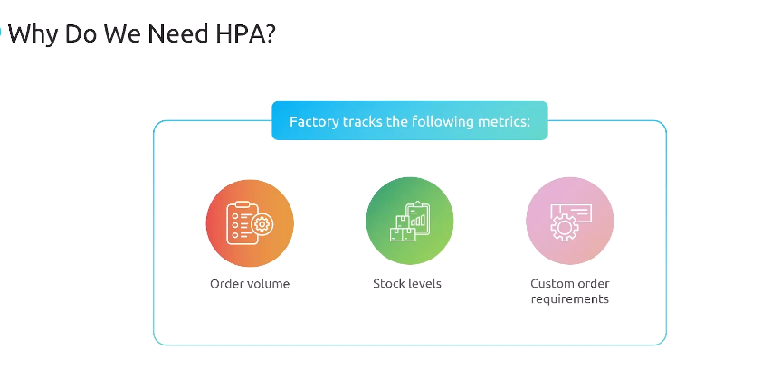 <br><br>

Similarly, in a tech environment, we do the same thing, right? We have metrics. For example, if a product stock falls below a certain threshold due to high demand, then we know that, you know, we need to basically bring in more staff.<br>

If customer orders are requiring more handling than usual, then we're gonna have to bring in more staff. So we basically have to increase our team, right?

The number of workers we have in order to process this additional load. Now, this is exactly what the horizontal pod autoscaler does.

The horizontal PO autoscaler, the tech world equivalent of the factory's Smart work assessment or smart Workforce management system, think of the HPA as your system that monitors key metrics like CPU, memory, right? And it basically adjusts requests in your cloud resources like your pods. In this particular case, much like you would add more workers to your factory.<br>

 Now the magic of HPA lies in its ability to respond dynamically to changes automatically without your with minimal manual intervention, ensuring efficiency and reliability.<br>
 
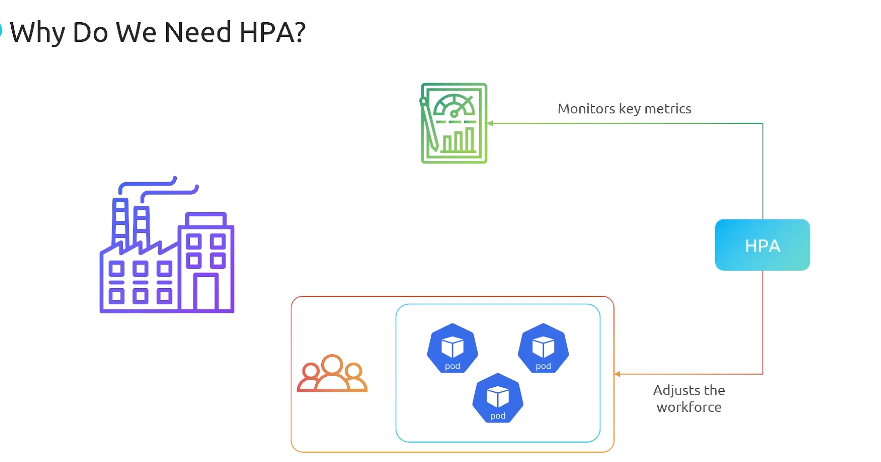 <br><br>
 
So how does the HPA do this? What does that look like? Well, the HPA is like a very vigilant supervisor. It observes metrics such as CPU usage like our factory keeps an eye on, you know, stock volumes and pieces like that. So when demand surges beyond a threshold at a certain interval, the HPA steps in and it adds pods much like hiring extra workers to handle a rush. And it's all about maintaining balance.<br>

HPA is gonna scale up aggressively when necessary and scale down conservatively once things comes down. So it's trying to maintain some balances and through some thresholds that you can track multiple metrics if you need to.<br>

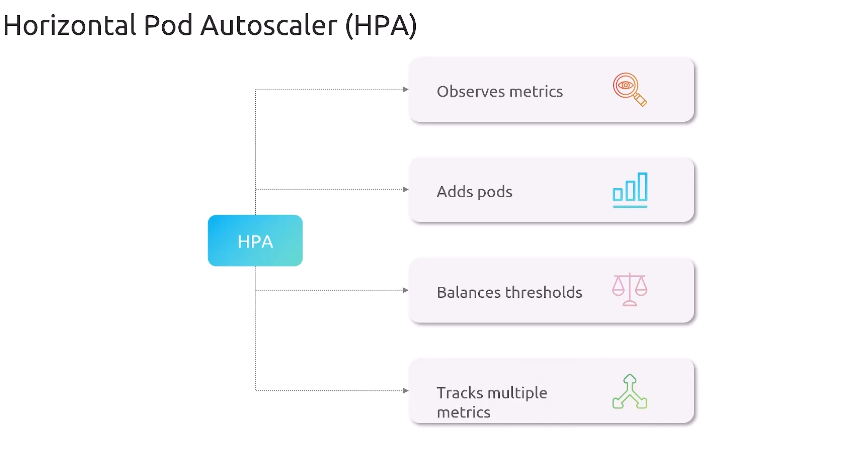 <br><br>

But this is how the HPA stays responsive to your application needs because you can track the metrics you need. We'll mention that by default, the HPA tracks some very basic metrics, but you can't expand that if you need to.<br>

This is basically the horizontal pod autoscaler. It is a supervisor for the capacity of your application, and it adds more instances of the application as needed to make sure it stays in alignment with thresholds to metrics that you define. So we're gonna talk more about the HPA.

## Horizontal Pod Autoscaler architecture and workflow

Okay, so at its core, HPA is all about dynamically adjusting the number of like pod replicas in a deployment. Replica set, It could be a Statefulset also, so it’s not just limited to the deployment workload, it could be any workload. So imagining, you know, you're adjusting basically the number of application instances inside these types of workloads. So it could be a Deployment, it could be a Statefulset, could be a straight up replica set, which is rarely manipulated. Now we usually do that through a deployment, but that's the idea, right? <br>

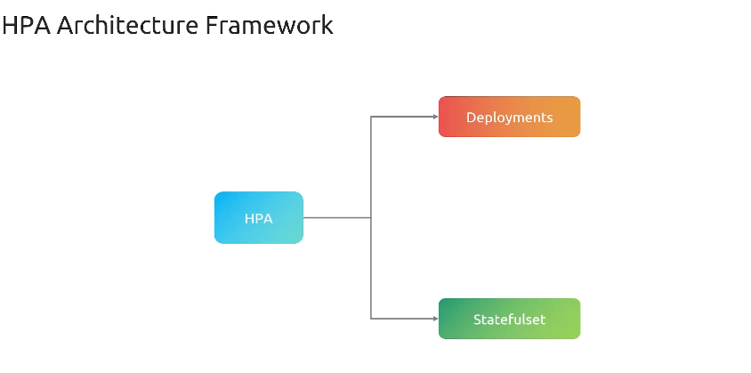 <br><br>

So traditionally, HPA has relied on two primary metrics to basically know whether you need more instances of your applications. Think of these as the kind of native heartbeats of your system monitoring. These are gonna help you keep things in peak condition. <br>

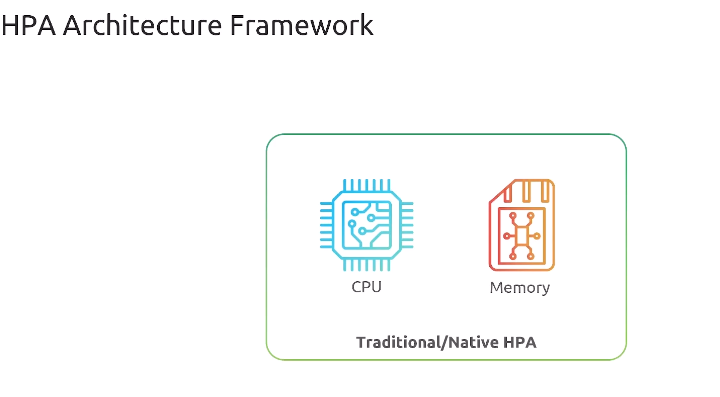 <br><br>

Does your application have enough CPU? Is it over storm threshold? Does your application have enough memory? <br>

But what if it needs more than just monitoring? Like the basics? What if it needs more than just traditional kind of native HPA? What if you need to track how many users are active or how many orders are being processed? That's where custom and external metrics come into play that they really give us the flexibility to tailor scaling to our specific needs.<br>

So let's explore that. So advanced HPA could require us to use those custom and external metrics that we were just talking about. Now, HPA, by the way, has a few components. First, we have the HPA resource definition. This is gonna outline the target workloads, the scaling rules, and then there's the metrics collection source, right? So we have to be able to talk about where our metrics are available. We have to talk in some cases to a metrics API, right? Which this is gonna ensure, by the way, metrics can be query through the correct API channels. And we might actually need adapters, particularly if we are using a custom or external metrics if we're using the native metrics. Metric adapters are not really necessary. <br>

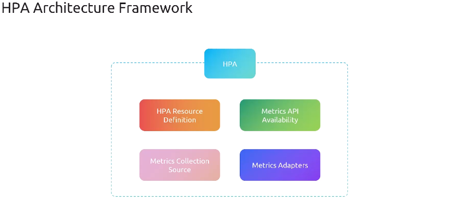 <br><br>

So let's talk with the **1. HPA resource definition first**. Okay, so this is the blueprint by the way, where scaling is laid out. It specifies the workload deployment defines how scaling should occur, right? And so if we look at the YAML file here, right, you'll notice that we're talking about the kind of workload in this case, a deployment, right?<br> 

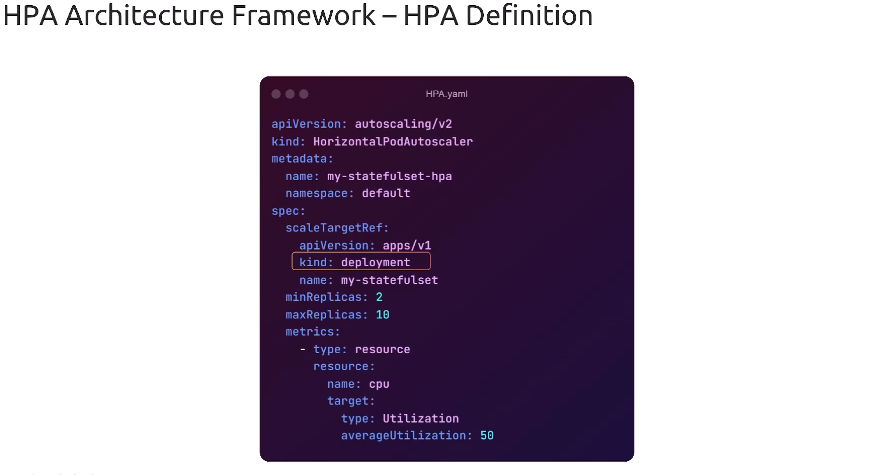 <br><br>

The kind of object really, but this case, it's a deployment. We're also specifying the minimum and maximum number of application copies, also known as replicas (*minReplicas, maxReplicas*) that we're willing to run.<br>

So we’ll go down to a minimum of two, but we want a max of 10. Think of this as the rules of engagement for your application. Scaling mixed up.<br>

We’ve got the metrics collection source. Now in this case, we’re just talking about a native HPA resource. In this case, it’s CPU utilization with an average utilization of 50% across the time that the metric is submitted. And that HPA checks that, which by default is every 15 seconds. So this is a vigilant guarding who’s gonna, guardian, who’s gonna be watching the system to make sure that CPU utilization for our applications does average around 50%. So this is important. <br>

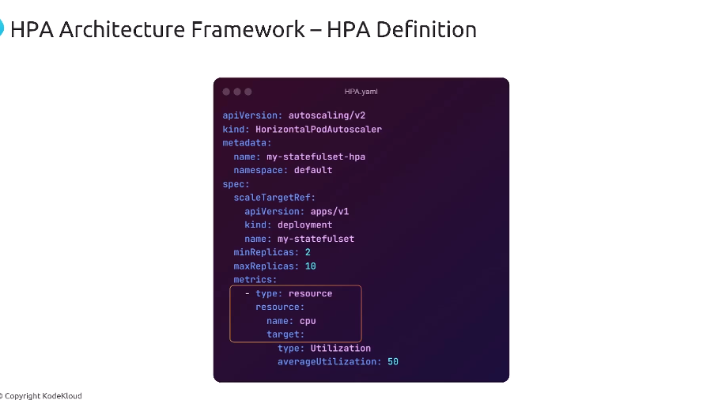 <br><br>

Now that’s the resource definition.<br><br>

**2. Metric Collection Source:**
What about the metric collection source? What about that? So within the Kubernetes cluster, these sources are critical because whether they're internal to the cluster, internal to a pod inside the cluster or external to the cluster, the metrics collection is pivotal because this is the data, this is the number that's gonna determine whether we scale or not. So you've got the Kube API, and by default you have to have a metric server for HPA to function. And so it's gonna use the metric servers to get CPU and memory from the workloads, and it's gonna get those details. And so the HPA definition is gonna be looking at those thresholds and it's going to basically adjust the number of deployment workloads.<br>

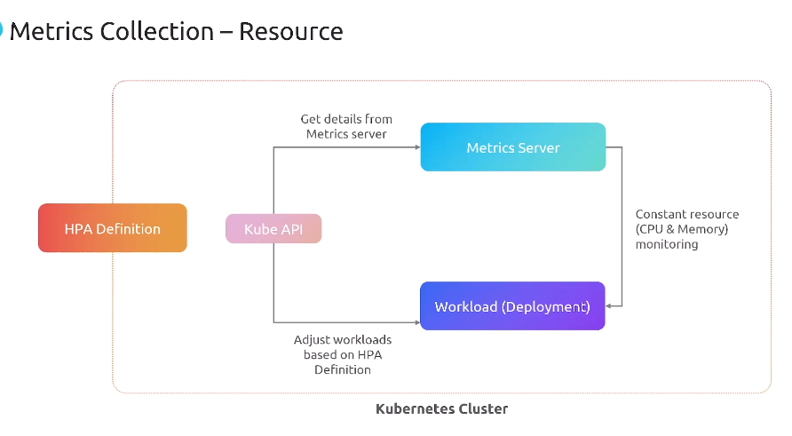 <br><br>

It's gonna adjust the number of pods, the replicas inside that deployment based on what it's getting from the API, which is talking to the metrics server. So this is important because we're sourcing this inside the cluster, and these are pretty much natively available. <br>

Now if we shift this, let's talk about what happens when we have a deployment. We've got a replica set, we've got a resources CPUs, we got all this set, <br>

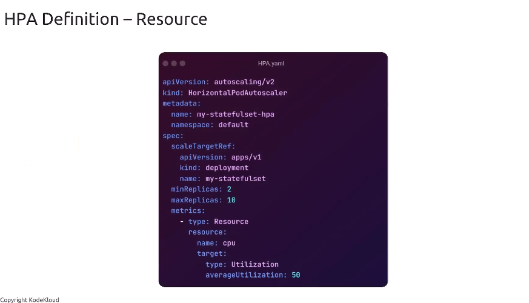 <br><br>

and we're now shifting to custom metrics. So this was an example of just the standard resource definition that we saw before.

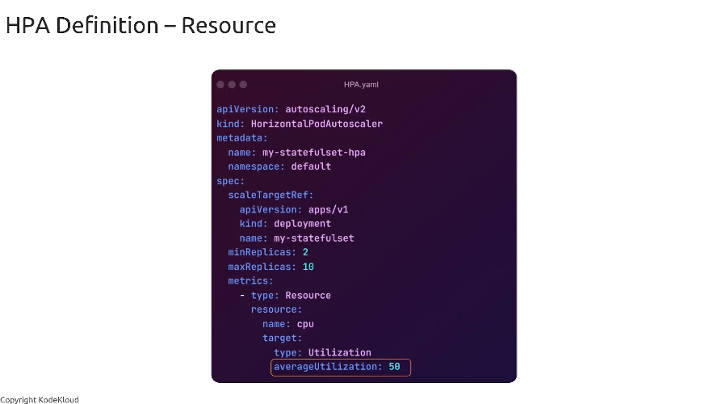 <br><br>

 What happens when we're pulling metrics from a custom source? Now this is a little misleading because custom sources actually still act inside the cluster, meaning that the custom metrics adapter that we're looking at is actually scraping metrics from another pod or another object inside the Kubernetes cluster. <br>

So you know, this is `custom.metrics.k8s.io` as far as the URL. And what's gonna happen here is that it's actually maybe scraping another pod for the number of users or active orders inside the cluster. So don't be fooled. <br>

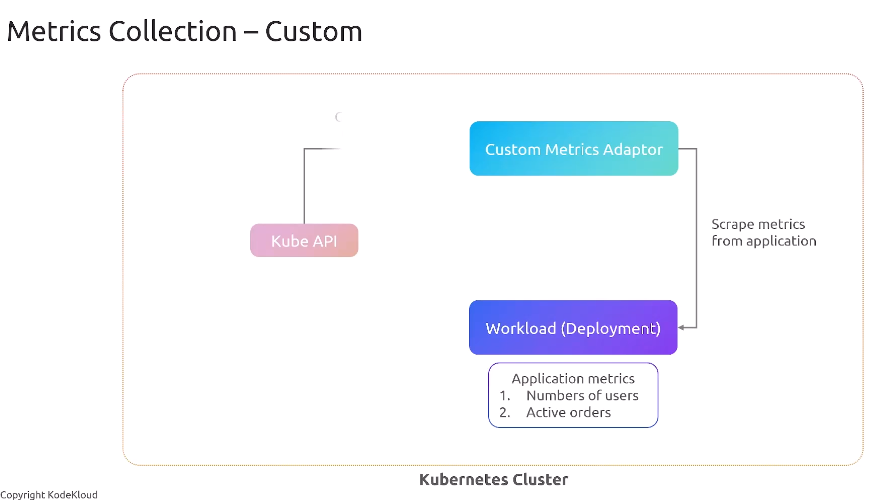 <br><br>

Custom metrics are pulling metrics from another application or another object inside the cluster. So the Kube API is gonna get details from the metrics server or the, in this case, this custom metrics adapter and HPA is gonna look at that and it's gonna adjust the workload based on what it sees through that API call through that number.<br>

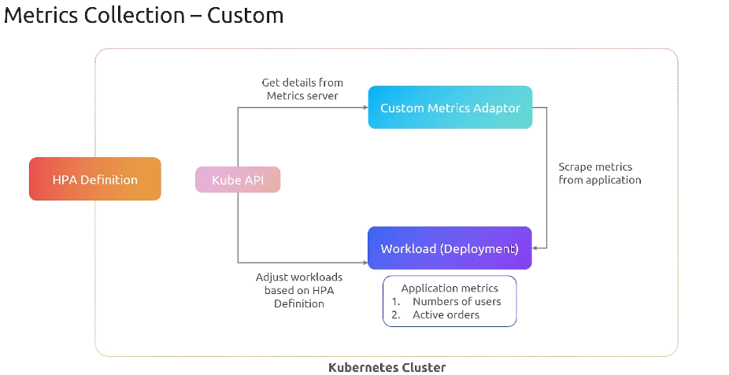 <br><br>

Now you get to set those thresholds. So this isn't just arbitrary, you actually set this up, but the key takeaway here is that custom metrics are still inside the cluster. They're just not necessarily a native object inside the cluster. In this case, we could be pulling from pods. Now in this particular case, you usually either see pods or you could actually say, see another type here called `in container`. But notice the kind doesn't change. In this case it's a deployment.

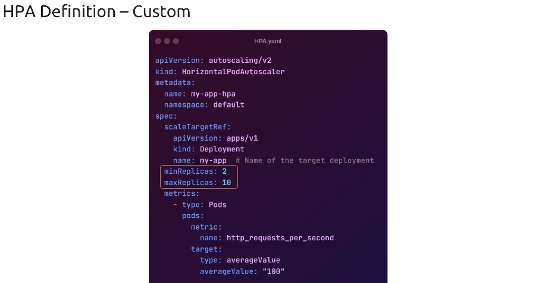 <br><br>

Replicas and minimum max both remain the same, but the type here is what shifts.<br>

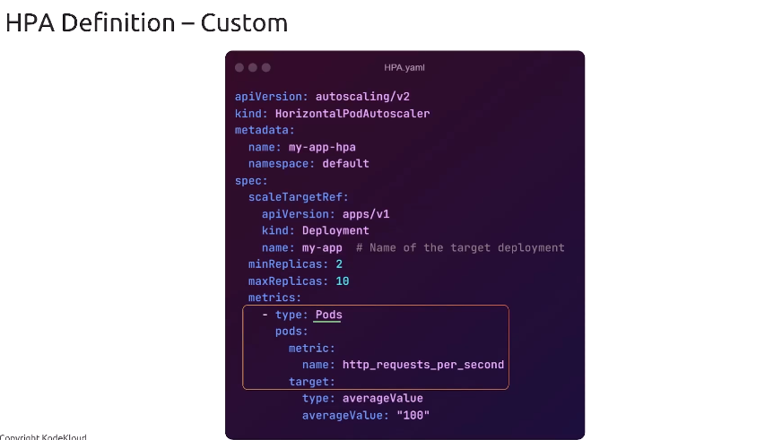 <br><br>

Now notice in this case, we're actually talking about an in-cluster metric that's being surfaced through an adapter. We're actually pulling it from another pod. We could also pull it from a specific container in a pod. That's another type that could be there called `in container`.<br>

Notice here that we're looking at the HTTP request per second, and we're looking at the average value of a hundred. So if that exceeds that or it's not close to that average, it's gonna, the HPA is gonna act at that point in time.<br><br>

Reminder, custom metrics are still inside the cluster. Okay, so then what about the third type? Because we've talked about native in a sense by using CPU, memory,<br>

we've talked about custom metrics, right? And now we're talking about external metrics. What's the distinction? Well, external metrics are actually pretty straightforward. They're external to the cluster, but you get to them through the Kube API, through an external adapter. And that adapter is actually talking to an external data source. Now that could be a variety of different things, so don’t be fooled. You could be talking to a cloud provider, you could be talking to, uh, an application in another cluster. You could be talking to any kind of API calls or web hooks, right? And so HPA, just like it did with custom and just like it did with just straight up metrics, is actually gonna look at the thresholds you defined, look at the numbers, and then reconcile the number of replicas in the workloads based on your HPA definition, So, nothing really special here, except the metrix are external to the cluster. <br>

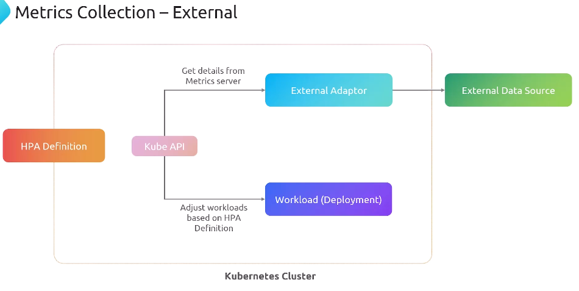 <br><br>

By the way, this could pull from Datadog or Dynatrace or some other external logging system. It doesn't even necessarily have to be inside your infrastructure as long as the cluster can get to it. So here, notice that the type is set to external.<br>

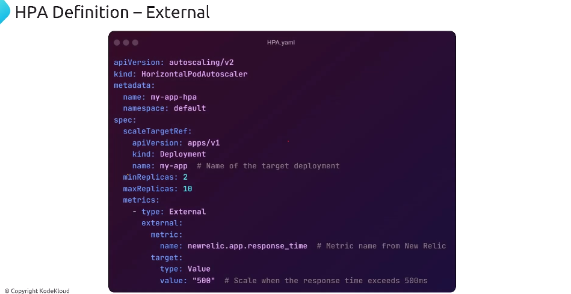 <br><br>


So this is, notice the type here is set to external. So deployments the same replicas are the same. But notice that this changes, and look at this. They're actually talking to New Relic. <br>

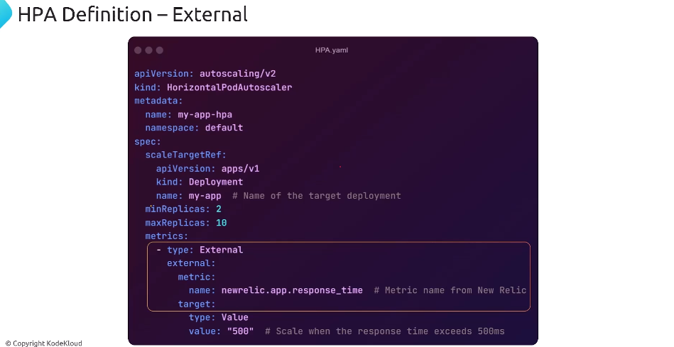 <br><br>

Now I wanna be clear that an adapter object is installed inside the cluster that makes this name make sense. This name New Relic is actually linked to an adapter that's installed into the Kubernetes framework, so that when HPA goes and looks for that metric, it’s actually talking to an adapter that is pulling that information. Notice, by the way, if the response time the value is 500, in this case it’s milliseconds. If it exceeds 500 milliseconds, then HPA is gonna scale. 500 milliseconds That's generous. <br><br>


what about **3. Metrics API availability**? So one thing to note is that `metrics.k8s.io` refers to the metrics server. And it refers to, that's where you're gonna get the CPU and memory metrics. So that's where you, this is your default.<br>


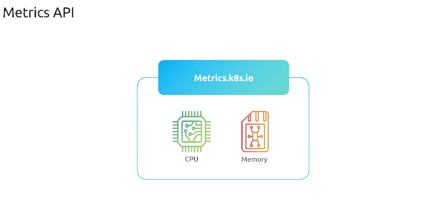 <br><br>

Now, if we talk about `custom.metrics.k8s.io`, notice that's a pre-end to the metrics case io. We were just looking at, that's for custom metrics. These are applications generated. So they're us, they are inside the cluster, either exposed by the pod or in a specific container in a pod. So this is within the cluster. And then there's external metrics. And these are externally generated. <br>

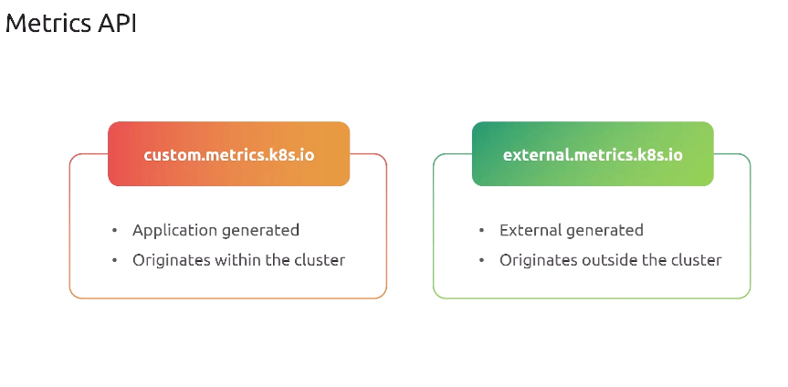 <br><br>

They originate outside the cluster, but they are linked into the Kubernetes framework through the metrics adapter that you install. so that the metrics server that talks to HPA can actually pull them straight from the metrics, The Kubernetes API. So that's why it's linked to `external.metrics.k8s.io` or `custom.metrics.k8s.io`, right?<br>

**Metrics Adapter:**
So the metrics adapter, which I referred to several times, is a piece of software that gets installed into Kubernetes and it acts as a bridge to either external sources outside the cluster or a bridge to internal data sources. And so they're crucial for bridging the metric sources so that they can run natively in Kubernetes. The metric adapters are gonna allow the HPA to utilize metrics that they are normally not available to it. Think of them as interpreters, translators, sourcer, you know, data sources if you will <br><br>

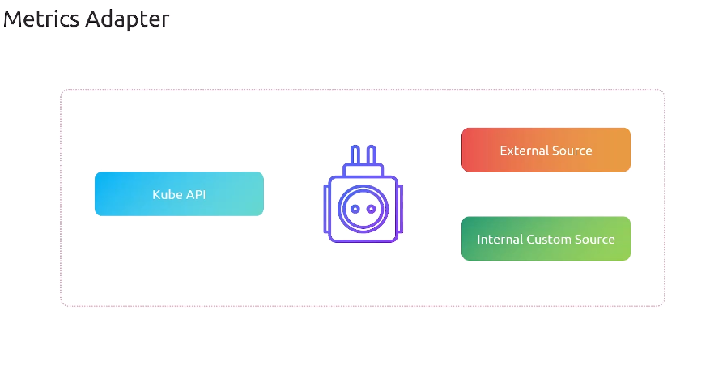 <br><br>

So the difference here around these metrics is that external metrics are sourced from external systems. Custom metrics are actually inside the cluster and they're either an object in the cluster or they’re an application in the cluster. <br>

Notice that externals reside outside, customs reside in the cluster, both require some kind of metrics adapter, but one requires an external adapter and the other requires some kind of custom metric adapter, like in this case, the Prometheus adapter, right? You could pull custom metrics from Prometheus, which looks like an object inside your cluster. Notice that the external API is `external.metrics.k8s.io` . The custom one is `custom.metrics.k8s.io`. So number of use cases here. But basically you can service all kinds of metrics with both external metrics outside the cluster and custom metrics inside the cluster.<br>

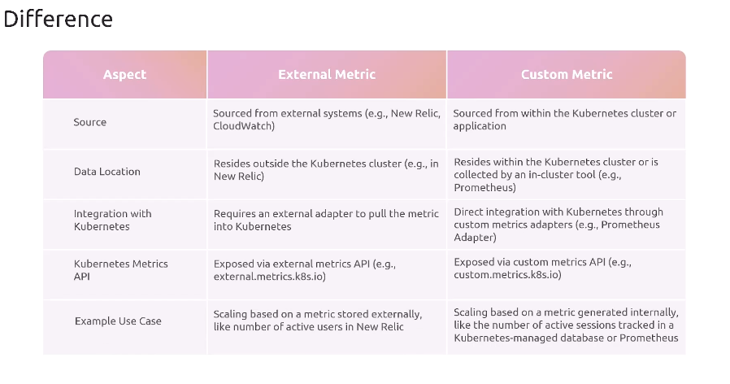 <br><br>


There are some considerations here when thinking about this. 

1. There is a control loop, right? So every 15 seconds, HPA is gonna use a loop to basically check against the thresholds and targets that are defined in the system. You can change this by the way, and so at that time, it's gonna make decisions about updating the number of replicas or upgrading the workload, right? <br>

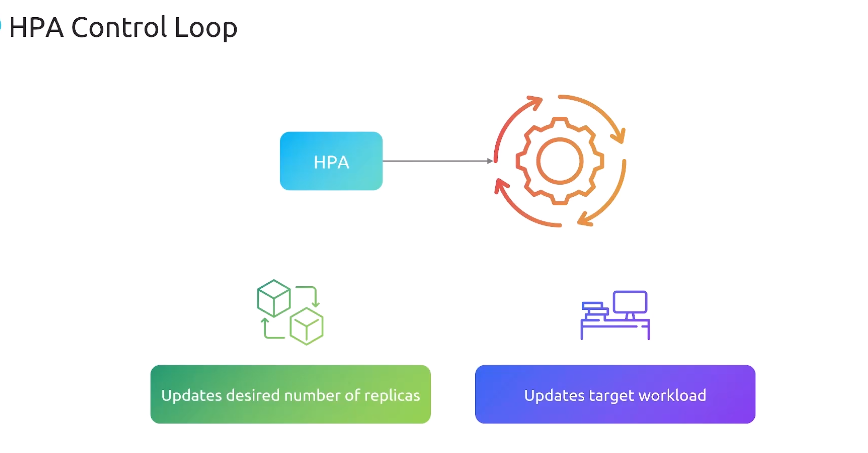 <br><br>

It's, it's gonna do that every 15 seconds. It's gonna check those metrics and it's gonna make a decision. So it's gonna constantly be checking and adjusting the environment as needed.<br><br>


So, HPA operations flow is that first thing it’s gonna do is it's gonna retrieve metrics. It's gonna evaluate the metrics. It's gonna basically scale if it needs to based on whether or not the threshold has been compromised or not. And then it's gonna update the deployment in the workload. So these are the four steps that the HPA is gonna take when it runs its control loop. Every 15 seconds, it's gonna retrieve some metrics, evaluate the metrics against the thresholds. If the thresholds are violated, it's gonna do a scaling calculation and then it's gonna update the deployment with the scaling recommendation.<br><br>

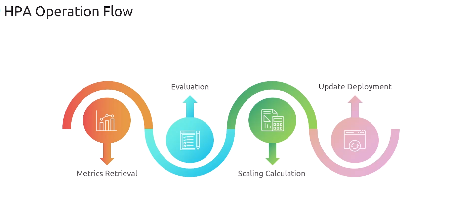 <br><br>

Now, how does it scale? Well, we're gonna talk about that, but basically you get to control it. That's the main thing to know.<br> 

Other considerations is that you do have to have a metrics server, right? You, the metric server does have to be running inside Kubernetes. It is not always installed by default. You do have to have some way to evaluate the metrics. So make sure that you've got metrics available, right? Whether custom, external or internal. And then you are gonna have to define some level of scaling behavior. Do you want it to scale a certain number of replicas at a time? Do you want it to grow a 100% or 50% every time it crosses the threshold? You want to think about how you want to scale and you can't actually set multiple types of scaling behavior. So you're not doing, you're not limited. Okay, well, that is all of the details around architecture for the horizontal pod autoscaler. We will do some labs and get hands on with this, but that should give you a better understanding of how the HPA functions. 

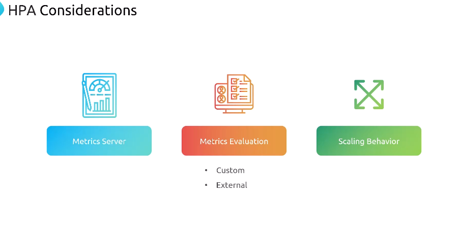 <br><br>


**Lab - Installation Metric Server - 1**
folder: `HPALab1`

**Lab - Installation Metric Server - 2**
`There are times to stay put, and what you want will come to you, and there are times to go out into the world and find such a thing for yourself.`

folder: `HPALab2`
skooner: https://31654-node01-port-r2uflfduagf2ev34.labs.kodekloud.com/ <br>
token:

```
eyJhbGciOiJSUzI1NiIsImtpZCI6IjN5ZzEydk5vUHZ0cjVIQlk2elR5Z05rc3NTQmZPUV80bmlfN0pFV240cGsifQ.eyJhdWQiOlsiaHR0cHM6Ly9rdWJlcm5ldGVzLmRlZmF1bHQuc3ZjLmNsdXN0ZXIubG9jYWwiXSwiZXhwIjoxNzM5NzY5MjcyLCJpYXQiOjE3Mzk3NjU2NzIsImlzcyI6Imh0dHBzOi8va3ViZXJuZXRlcy5kZWZhdWx0LnN2Yy5jbHVzdGVyLmxvY2FsIiwianRpIjoiYjNjMjNjMTMtOGMzNi00MTgyLThmYmQtY2E4MDY5OWJiNDRkIiwia3ViZXJuZXRlcy5pbyI6eyJuYW1lc3BhY2UiOiJrdWJlLXN5c3RlbSIsInNlcnZpY2VhY2NvdW50Ijp7Im5hbWUiOiJza29vbmVyLXNhIiwidWlkIjoiYTljYjZmNGQtY2QwOC00MGY4LWFkYzEtYmQ1YjlhOGI3NzMwIn19LCJuYmYiOjE3Mzk3NjU2NzIsInN1YiI6InN5c3RlbTpzZXJ2aWNlYWNjb3VudDprdWJlLXN5c3RlbTpza29vbmVyLXNhIn0.CEEcH2qfnGniBt2kSCXvzk6LerO9dLJNTL2of4gQq5KTpThkS1XGyJ3FkVj0Vnx50zQSrMhsiCHalZ0pVLWYc_wCs-PYXGruXMH090jPAQV4RF9Z-1N1-h8MbFocMd0-SJXSKLZAm1KhynBfURzbVxr309mY7qPjOpu9d8r_t_ArLsCu_lzzSZsAfiCRZ46JiANWFq0c-6SZUAr4xvIpZ6yQWTytlKl-pmiw7HIhDqnr0iHGp0gIL8I8XmFWHnrJ3xGB-ex4p-UOX8KeId-3BBPigrtbXGCLhJ7LtWrlYp4hl4gSw3hr3OI4f6lO73kt-iWnNdPo9_XmiJO_kfdRow
```

question-3: manifest file:
`cat /root/autoscale.yml`

```
apiVersion: autoscaling/v1
kind: HorizontalPodAutoscaler
metadata:
  creationTimestamp: null
  name: nginx-deployment
spec:
  maxReplicas: 3
  scaleTargetRef:
    apiVersion: apps/v1
    kind: Deployment
    name: nginx-deployment
  targetCPUUtilizationPercentage: 80
status:
  currentReplicas: 0
  desiredReplicas: 0
  ```


  ## Custom Metrics and Mechanism of It

So we've mentioned the native metrics already. So let's talk about how custom metrics work, because these are a little different.

One, we know that custom metrics exist and that the HPA can talk to them, just like it can talk to native metrics, which in this case are CPU and memory, or it can talk to external metrics, which we’ll talk about here in the future.<br>

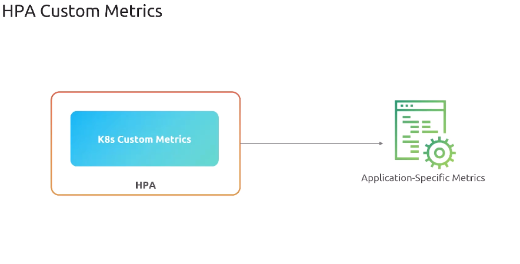 <br><br>

These are application specific metrics that are inside the cluster. So the idea here is that using custom metrics can enhance scaling, based on, for example, your application's performance indicators. So you might actually surface your application’s metrics such as latency, the number of items, the queue depth, any of that, and scale based on your application. This could be a variety of different things. The request rate, the latency of your application queue links. It's not just an arbitrary number. There are crucial indicators of your app's performance.

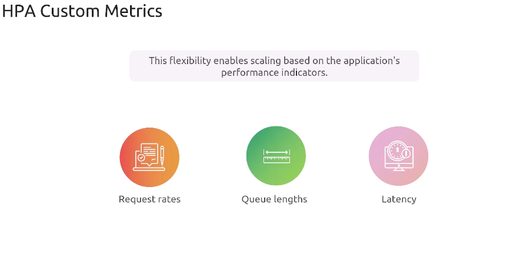 <br><br>

 And so this can help you both increase your app's performance and therefore keep customer satisfaction high. <br> <br>
 
 
So how do we bring these metrics into picture for HPA? Let’s look at the components that make this happen. So here we are, we're gonna look at the components, right, and the workflow that brings custom metrics to life in Kubernetes. Now, it's a bit like a relay race. First, your application needs to expose the desired custom metrics. This is often done through some kind of monitoring library. Then for example, a monitoring system, for example, like Prometheus will have some kind of agent that collects these metrics. And then what it does is it’s gonna run through the adapter and put the metrics into some kind of system or API. <br><br>

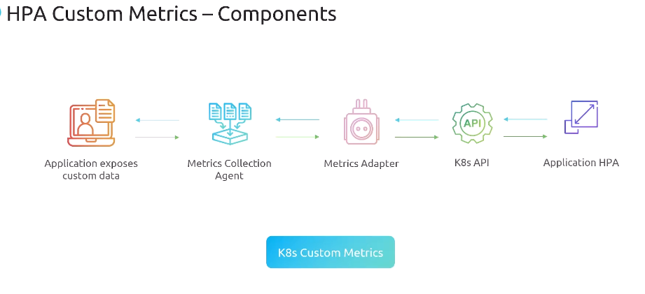 <br><br>


Now it collects the metrics and the metrics adapter basically is gonna make it so that the K8s API can talk to either the collection agent and the collection database, to translate these metrics into a language that Kubernetes can understand. And HPA is gonna talk to the Kubernetes API, I know that sounds weird, but the applications are gonna expose the data. The metrics collection agent is gonna collect it both through agent and data store. <br><br>

The metrics adapter is gonna make the Kate’s API able to talk to Prometheus, and then the application HPA is gonna talk through the API and get the metrics that it’s need. So the HPA is gonna use this data to adjust the number of pod replicas based on the current needs. Does it sound like a lot? Well, hold on, let's break it down a little further. 


Okay, so you do need the metrics server, by the way. So here's the problem though, is that the default Kubernetes metrics server doesn’t support custom metrics. So this is for example, why you might put Prometheus in here, which is its own metrics server. So you gotta make sure that your monitoring system and your agents can collect and expose the metrics in a format that the adapter can understand. Now, the adapter an installed piece of software. <br><br>

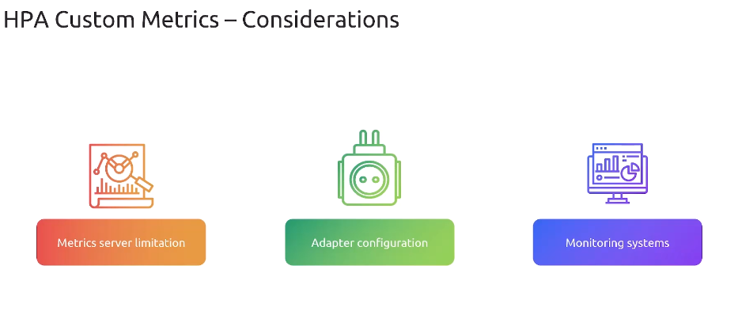 <br><br>

So like Prometheus has an adapter, for example, that gets installed so that you can talk through Kubernetes to the Prometheus server. And so these monitoring systems and adapters and agents all work together so that Prometheus can make metrics available to HPA, which is only gonna talk to Kubernetes. So the idea here is that you need the agent, the collector, the adapter configuration, because HPA is only gonna talk to K8s, but reminder that for custom and external metrics, the native metrics server does not actually expose custom metrics. So when we talk about custom metrics, we're really talking about in cluster customs data sources. <br><br>

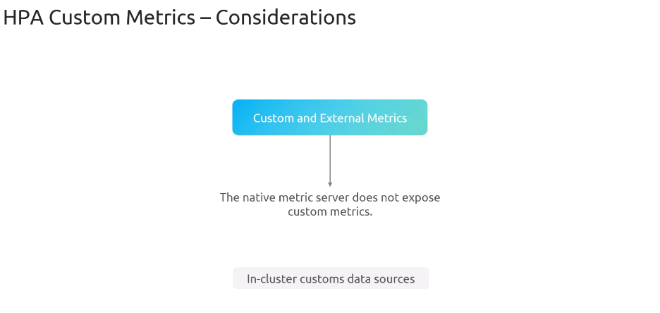 <br><br>

And this could be Prometheus, this could be other metric servers, but that’s the whole idea, is that custom is talking to something that's not the native metrics server.<br><br>


**Lab - HPA Custom Metrics - 1**
folder : `HPALab3`

**Lab - HPA Custom Metrics - 2**
folder : `HPALab4`
[HINT- Question-4 ](https://github.com/dipinthomas/k8s-autoscaling/blob/master/020-025/prometheus-adapter-values-active-session.yaml)

Regret for the time wasted can become a power of good in the time that remains.

– Arthur Brisbane