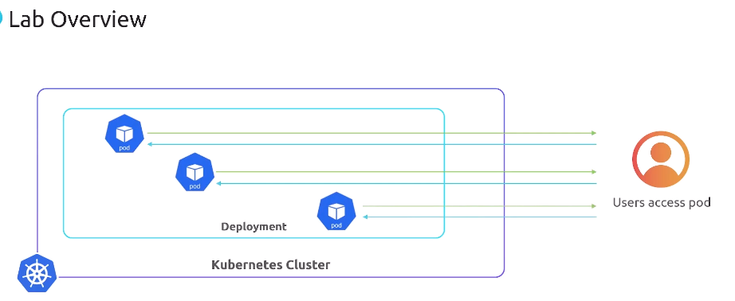

# Kubernetes Autoscaling
## HPA (Horizontal Pod Autoscaler) (actullay application scaling)
## VPA (Vertical Pod Autoscaler)
## CPA (Cluster Proportional Autoscaler)
## KEDA (Kubernetes-based Event-Driven Autoscaling)
## CA (Cluster Autoscaler)
Expand the number of Nodes.
### Course Content:
 <br><br>
 <br><br>
 <br><br>

#### Why Autoscaling?
Autoscaling is kind of embodies, which is electricity. Autoscaling gonna help your system with stand failure by distributing load, ensuring basically that if there is a failure, you can wither recover quickly or not even see the failure. You are simplifying your operation overhead by creating a system that automatically scales up and down with minimum manual intervention. <br>
- To handle the load
- To save cost
- To save resources
- Improve application availability for smooth user experience
- To handle the load spikes
- Efficient resource utilization
- Striking a balance between cost and performance (not too much resources, not too less resources) <br>
- Fault tolerance  and recovery <br>
- Seamless load management <br>
- Simplified Management <br>

 <br><br>
 <br><br>

### Scaling in Kubernetes
How does scaling work include Kubernetes. primarily Two aspects of scaling in Kubernetes:
1. **Cluster Scaling:** actully expanding the nodes, that VM that are hosting the pods or the containerize applications. <br>
2. **Pod Scaling:** Its focus on the application level, ensuring we have the right number of copies of you application like your web servers, app servers, etc. to handle the load<br>
 <br><br>

### Cluster Scaling
Cluster scaling involves shifting the number nodes of worker nodes that exist inside the cluster.
A distinction here of CPA (Cluster Proportional Autoscaler) and CA (Cluster Autoscaler). <br>
A Cluster autoscaler allows you to expand the worker nodes, which are often virtual machines that are inside your cluster.
and this expands total capacity CPU, Memory, Disc, etc even GPU if you have attach to your virtual machines. Think of this as a lower level of virtual machine scaling, which is what the worker nodes represnent. Its not application scaling, Think of this as operating system scaling.
 <br><br>

### Pod Scaling
Pod scaling is about scaling the application, the actual containers that are running inside the cluster. <br>
Within one or more name spaces having a certain number application running, and they deserve very distinct purposes. 
Here we are doing is we are expanding either using HPA, VPA, KEDA
 <br><br>

### Why do we need different strategies?

C**luster autoscaling** is all about scaling nodes, making sure the cluster stays up and making sure the capacity of the cluster is expanded. Remember, your applications sit on top of this cluster of virtual machines. 

So then when we talk about pod scaling, we're not talking about expanding the number of operating systems we have in our cluster. We're talking about the applications that's sitting on top of this cluster. And so this is gonna increase application availability, application efficiency, there's a bunch of components here. And so this is why we need different strategies because one increases the capacity of the cluster and the pod scaling increases the capacity of the applications inside the cluster. So pod scaling works at the workload level. Cluster scaling works at the base level of the cluster. <br>
 <br><br>

So they work hand in hand to make sure to optimize your Kubernetes environment. They're gonna ensure it adapts to change while maintaining cost efficiency, resource availability, fall tolerance, all the things that we talked about. 
<br><br>
So let's consider the broader strategies here. In conclusion, the classification of scaling strategies in Kubernetes is fundamental for maintaining a balanced, efficient, and resilient environment. <br>

 <br><br>

 So cluster scaling is gonna ensure that your infrastructure is up to the task, while pod scaling is gonna guarantee the application is up to the task. <br><br>

  <br><br>

 So both of these work together to make sure that your Kubernetes cluster both has the capacity that it needs and that the applications have the capacity that it needs. So I hope this session has shed some light on the importance of mechanics of auto scaling and Kubernetes.


 ## Manual HPA (Horizontal Pod Autoscaler)

  <br><br>

 So what's the objective then of this lab? Like Michael, why are you talking about pods and applications and about user access? Okay, the objective is actually pretty straightforward. We're gonna manually scale basically how a deployment affects the application behavior, right? <br>
 
Basically how all it also, you could have a a host name change, right? We're gonna basically show you what happens when we scale manually a pod on a replica of pods inside Kubernetes, right? Think of it like we're gonna give our neighborhood more houses and we're gonna see has the community grows, there's gonna be some changes so we can adapt to that.
<br><br>

Second is that we're gonna show the impact of doing that kind of duplication, also known as replication or replicas, right? We're gonna take a look at that behavior. So we're gonna basically show you how scaling a pod changes the application's output. That's the objective of this lab. <br><br>

 <br><br>


 So here we're basically scaling our `flask web app` up to three replicas. 
 
 ```
 kubectl scale deployment flask-web-app --replicas=3
 ```

 We're basically saying, I want, I need you to scale up. And the reason that's significant is that if we go in and look at the pods, 'cause we've manually scaled it, what will happen is that you'll see now that there's three pods and they have this unique name. <br><br>
 
  <br><br>

 Now we're doing that manually. This simply tells Kubernetes, by the way, to add more houses to our neighborhood, in this case, more applications to our deployment. Think of the deployment as our neighborhood, right? So deployment's gonna scale. and the new pods are gonna start. And so in this case, we actually scaled the deployment to three replicas or three pods. <br><br>
 
 And so we looked at it and this is now what we see. So this is what we're trying to do basically, is we're precisely trying to show you what happens when we add another pod manually. What changes, how does that change the user access? Does it change the name of the pods? What happens? <br><br>

  <br><br>

  Because we want you to show you how to do it manually before we show you later how to do it automated, right? <br><br>
  
  
  
  So here's some key takeaways, right? One, scaling deployments by increasing replicas is like basically expanding our neighborhood with more homes. So we're adding more applications to the deployment That's what replicas are, is they are copies, right? Of pods that basically have applications in them. And so our deployment has a certain number of pods in it. It we are scaling that up and down. <br><br>
  
  Second, you'll notice that every pod, which by the way, every pod contains an application, it contains a container that has an application. It's got a unique host name, and that changes when we redeploy the pod. So this can affect the output of applications if we're trying to access it through host name, that's not typically what we do, by the way. And if you know Kubernetes, you know that we don't typically go after pod host names, but they can change. <br><br>
  
 <br><br>

  And last is that scaling will change the capacity of applications, right? And so for example, if your application is dependent upon the host name, that can change things. If you have sticky sessions and it's a web server that can change things So typically stateless is the application behavior that we want to see in our applications. 
  
  So because you're gonna scale up and down, these pods are gonna be ephemeral. And so if you need persistent data, typically what we do is we externalize it, either external to the Kubernetes cluster or we use staple sets and we have very persistent pods that maintain naming conventions. But for our purposes today, we just wanted you to see what manual scaling from a horizontal pod autoscaler perspective, what that would look like if you just did it yourself. So thanks for watching. Understanding these concepts is absolutely crucial for understanding how HPA functions. Thank you for being attentive.

```I am experienced enough to do this. I am knowledgeable enough to do this. I am prepared enough to do this. I am mature enough to do this. I am brave enough to do this.```

## Manual VPA

So let's talk about this overview. First and foremost, picture this. We got a cluster, we've got deployments on the cluster, right? This cluster's ready at our fingertips ready to be orchestrated. And what we're gonna do is we're gonna deploy a flask application, a single replica mind you, and experience firsthand how users can access the flask application inside the container. Inside the pod. <br>

 <br><br>

Yes, I did say that. The application that's inside the container, inside the pod. So we're gonna consider what happens if we need to have more resources for that single replica. Alright? <br>

```kubectl apply -f flask-web-app.yaml``` <br>


So we're gonna apply deployment and we're gonna see our, you know, flask app be configured, right? And then we're not gonna mess necessarily with a service, but by applying the deployment files, something interesting is going to happen. 'cause we're gonna go out there and we're gonna get our pod information and we're gonna notice that it looks like its changed, right? <br>
 <br><br>

 It's gonna look like something different is happening where all of a sudden a pod is starting and another one is terminating. Notice Three minutes and 13 seconds on that second pod.<br>
 
  <br><br>

  So that's what we're doing for our lab, is that we're actually upsizing the single pod that we have in our deployment. 
  <br><br>


  And so what's gonna happen is it's gonna go from whatever size it's at to a bigger size <br>
  
   <br><br>

   and the old one's gonna go away.<br>
   
    <br><br>

   This is the vertical pod autoscaler. It makes the applications capacity bigger. That's what it does. 
   <br><br>
   
   
   And so that's gonna be the focus of this lab, right, is that we're going to basically resize our existing application into a larger like capacity set. So as a reminder, the VPA are dynamically just pod resources in sizing based on observed usage. We're gonna do that manually so you can understand what it would take. So think about how doing this in an automated fashion can be a game changer in Kubernetes. <br><br>

```The best way to guarantee a loss is to quit.```