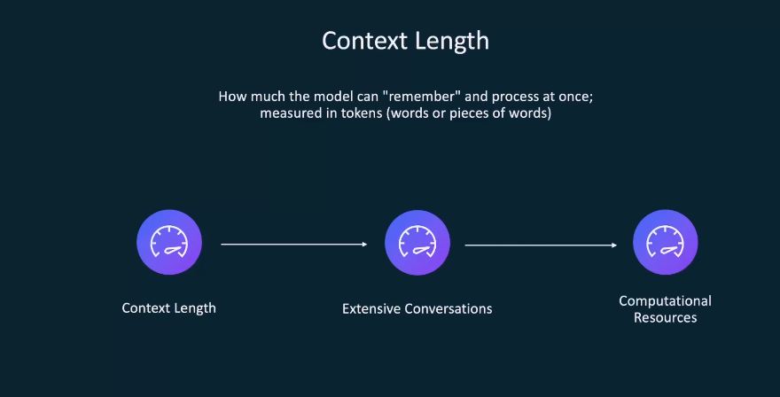
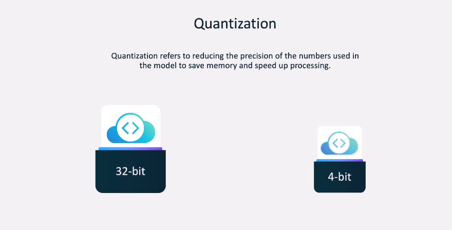
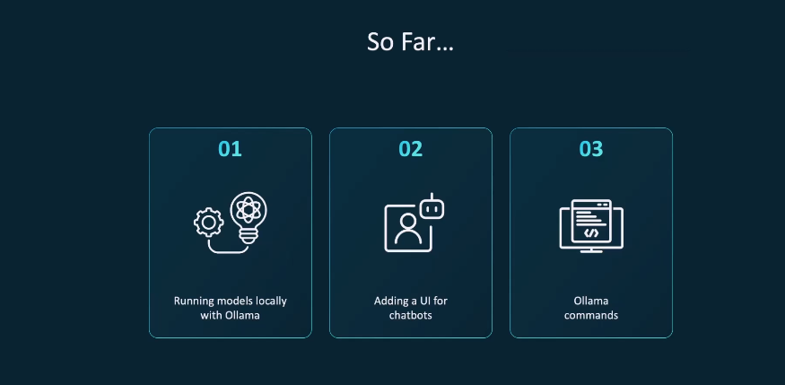

# Running Local LLM With Ollama
## Prerequisites
 <br><br>
 <br><br>
 <br><br>
 <br><br>
 <br><br>
 <br><br>
 <br><br>

## Getting Started With Ollama
 <br><br>
 <br><br>
 <br><br>
 <br><br>
 <br><br>
 <br><br>
 <br><br>
 <br><br>
 <br><br>
 <br><br>
 <br><br>
 <br><br>
 <br><br>
 <br><br>
 <br><br>

**Installing Ollama**
```
curl -fsSL https://ollama.com/install.sh | sh

```
**Installing Model**
```
https://ollama.com/search
```
```
ollama run llama3.2
``` 

<br><br>
 <br><br>
 <br><br>
 <br><br>
 <br><br>

## Useful Links
For more information, visit the [Ollama Documentation](https://github.com/ollama/ollama/blob/main/docs/api.md).

```
/? 
```
for all commands

### Models and Model Parameters

 <br><br>
 <br><br>
 <br><br>
 <br><br>
 <br><br>
 <br><br>
 <br><br>
 <br><br>
weight is from 0 to 1
 <br><br>
 <br><br>
 <br><br>
 <br><br>
 <br><br>
 <br><br>
 <br><br>
 <br><br>
 <br><br>
 <br><br>
 <br><br>

### Essentials Ollama CLI Commands
 <br><br>

* Ollama run MODEL_NAME <br>
* Ollama rm MODEL_NAME <br>
* Ollama pull MODEL_NAME <br>
* Ollama show MODEL_NAME <br>
* ollama list <br>
* ollama stop <br>
* ollama ps <br>

 <br><br>

### Ollama - Community Integration
 <br><br>

I will use Open WebUI to run the model.<br>

```
$ docker run -d -p 3000:8080 --add-host=host.docker.internal:host-gateway -v open-webui:/app/backend/data --name open-webui --restart always ghcr.io/open-webui/open-webui:main

```

Will developed a chatbot using Ollama and Open WebUI.<br>

# Building AI Applications with Ollama
 <br><br>
 <br><br>

### Ollama REST API Introduction
 <br><br>
 <br><br>
 <br><br>
 <br><br>

Ollama Serve - introduction <br><br>

 <br><br>
 <br><br>
 <br><br>

```
curl http://localhost:11434/api/generate -d '{
  "model": "qwen:0.5b",
  "prompt": "Who invented computing?"
  "stream": false
}' | jq .
```

<br><br>

 <br><br>
 <br><br>
 <br><br>

The **"/api/generate"** endpoint is used to generate text from a given prompt. <br><br>

 <br><br>
 <br><br>
 <br><br>
 <br><br>
 <br><br>
 <br><br>

For more information, visit the [API Docs](https://github.com/ollama/ollama/blob/main/docs/api.md) <br><br>


```
import os
from flask import Flask, request, render_template_string
from openai import OpenAI
from dotenv import load_dotenv

load_dotenv()  # take environment variables from .env

app = Flask(__name__)

client = OpenAI(
    api_key=os.environ.get("OPENAI_API_KEY"),
    base_url=os.environ.get("LLM_ENDPOINT")
)

HTML_TEMPLATE = """
<!DOCTYPE html>
<html lang="en">
<head>
    <meta charset="UTF-8">
    <meta name="viewport" content="width=device-width, initial-scale=1.0">
    <title>AI-Generated Poem</title>
    <style>
        body {
            font-family: Arial, sans-serif;
            margin: 20px;
            padding: 20px;
            background-color: #f8f9fa;
        }
    .container {
    max-width: 600px;
    margin: auto;
    padding: 20px;
    background-color: #ffffff;
    border: 1px solid #ddd;
    border-radius: 5px;
    box-shadow: 0 0 10px rgba(0, 0, 0, 0.1);
}
h1 {
    color: #333;
}
form {
    margin-bottom: 20px;
}
textarea {
    width: 100%;
    height: 100px;
    margin-bottom: 10px;
    padding: 10px;
    border: 1px solid #ddd;
    border-radius: 5px;
}
    
    button {
    padding: 10px 20px;
    background-color: #007bff;
    color: white;
    border: none;
    border-radius: 5px;
    cursor: pointer;
}
button:hover {
    background-color: #0056b3;
}
    
    pre {
        background-color: #f4f4f4;
        padding: 10px;
        border-radius: 5px;
        overflow-x: auto;
    }
</style>
</head>
<body>
    <div class="container">
        <h1>AI Poem Generator</h1>
        <form method="POST">
            <textarea name="input" placeholder="Enter your prompt here..."></textarea>
            <button type="submit">Generate Poem</button>
        </form>
        
        <h2>Your AI-Generated Poem</h2>
        <pre>{{ poem }}</pre>
        
    </div>
</body>
</html>
"""

@app.route("/", methods=["GET", "POST"])
def index():
    poem = None
    if request.method == "POST":
        try:
            input_message = request.form["input"]
            reponse = client.chat.completions.create(
                model=os.environ.get("MODEL"),
                messages=[
                    {"role": "system", "content": "You're an AI chatbot which specializes in writing poems"},
                    {"role": "user", "content": input_message}
                ]
            )
            poem = reponse.choices[0].message.content
        except Exception as e:
            print("Error: ", str(e))
            poem = "An error occurred when trying to fetch your poem"
    return render_template_string(HTML_TEMPLATE, poem=poem)
```

```
OPENAI_API_KEY=kodekloud
LLM_ENDPOINT="http://localhost:11434/v1"
# LLM_ENDPOINT="http://localhost:11434/v1"
MODEL=llama3.2
```


```
curl -X POST http://localhost:11434/api/generate -H "Content-Type: application/json" -d '{
  "model": "llama3.2",
  "prompt": "Compose a JSON object that describes a poetic story of an LLM exploring the universe of language.",
  "stream": false,
  "format": {
    "type": "object",
    "properties": {
      "title": {
        "type": "string"
      },
      "theme": {
        "type": "string"
      },
      "lines": {
        "type": "array",
        "items": {
          "type": "string"
        }
      }
    },
    "required": [
      "title",
      "theme",
      "lines"
    ]
  }
}'
```

```
curl http://localhost:11434/api/chat -d '{
  "model": "llama3.2",
  "messages": [
    {
      "role": "user",
      "content": "Compose a short poem about LLMs."
    },
    {
      "role": "assistant",
      "content": "In circuits vast, they find their spark, \nLanguage learned in the digital dark. \nTransforming text to art, \nLLMs ignite a brand-new start."
    },
    {
      "role": "user",
      "content": "Add alliteration to the poem for more impact."
    }
  ],
  "stream": false
}'

```


```
# copying a model
curl http://localhost:11434/api/copy -d '{
  "source": "llama3.2",
  "destination": "llama3-copy"
}'

# deleting a model
curl -X DELETE http://localhost:11434/api/delete -d '{
  "model": "llama3:13b"
}'

# pulling a new model from the ollama library
curl http://localhost:11434/api/pull -d '{
  "model": "llama3.2"
}'

```


### Leveraging Ollama Models

 <br><br>
 <br><br>
 <br><br>
 <br><br>

Interacting with the Ollama REST API and LLM using API <br><br>


### Deployment for production:

[Create an Account in OpenAI](https://platform.openai.com/) <br><br>
Go to **API Key** -> Create new secret key -> Copy the key <br><br>
```
# for production

OPENAI_API_KEY=youropenapikey
LLM_ENDPOINT="https://api.openai.com/v1"
MODEL=gpt-3.5-turbo
```

# Customizing Models with Ollama

 <br><br>

## Modelfile (create new modelas like docker)
Its like customize the model <br><br>
 <br><br>
 <br><br>
 <br><br>
 <br><br>
 <br><br>
 <br><br>
 <br><br>
 <br><br>
 <br><br>
 <br><br>
 <br><br>

### Customizing Model files
 <br><br>
 <br><br>
 <br><br>

```
ollama create NEW_NAME_OF_MODEL -f ./Modelfile
```

### Ollama Pull
Modelfile
```
FROM llama3.2

PARAMETER temperature 0.3

SYSTEM You are Harris, an AI assistant for the employees of an investment and portfolio management firm called Growmore. Your job is to assist the employees in managing client investments and portfolios. The currency you deal with is Indian Rupees (INR).
```
then run <br>

```
ollama create NEW_NAME_OF_MODEL -f ./Modelfile
ollama create NEW_NAME_OF_MODEL -f ./Modelfile
ollama run NEW_NAME_OF_MODEL
```

## Uploading custom models
 <br><br>
 <br><br>
 <br><br>
then run <br>

```
ollama push your_username/NEW_NAME_OF_MODEL
```

cat ~/.ollama/id_ed25519.pub <br>
and then copy the key and paste it in www.ollma.com  -> settngs -> ollama keys -> add ollama public key paste it and save it <br>

[Important lecture](https://learn.kodekloud.com/user/courses/running-local-llms-with-ollama/module/836a96fe-9951-42b6-83ba-a602299c87c9/lesson/1c40541c-995a-42a4-b393-e99e3cb97b17) <br>


[Important lecture](https://learn.kodekloud.com/user/courses/running-local-llms-with-ollama/module/8df2f2d5-d3c5-433d-b5f5-f553b040b2e7/lesson/f2bce596-2a70-46cd-838c-d3bb91586835) <br>

